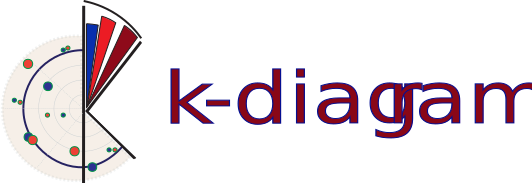

<div align="center">

  <!-- Centered Logo -->
  <br>

  <!-- Centered Title -->
  <h1>Polar Diagnostics for Forecast Uncertainty</h1>

  <!-- Centered Badges -->
<p>
    <a href="https://github.com/earthai-tech/k-diagram/actions/workflows/python-package-conda.yml"></a>
    <a href="https://k-diagram.readthedocs.io/en/latest/?badge=latest"></a>
    <a href="https://github.com/earthai-tech/k-diagram/blob/main/LICENSE"></a>
    <a href="https://github.com/psf/black"></a>
    <a href="https://github.com/earthai-tech/k-diagram/blob/main/CONTRIBUTING.md"></a>
    <a href="https://codecov.io/gh/earthai-tech/k-diagram"></a>
  </p>
  
  <!-- Centered Introduction -->
  <p>
    <em>k-diagram</em> provides polar diagnostic plots to evaluate
    forecast models with an emphasis on uncertainty. It helps you look
    beyond single metrics and understand <strong>where</strong> and <strong>why</strong> models
    behave as they do.
  </p>

</div>

-----------------------------------------------------

## ✨ Why k-diagram?

Key questions it helps answer:

- **Forecast uncertainty** — Are prediction intervals well calibrated?
- **Model drift** — Does performance degrade over time or horizon?
- **Anomalies** — Where do predictions miss, and by how much?
- **Patterns** — How does accuracy vary across conditions or locations?

The package is designed with applied settings in mind, including
environmental forecasting (subsidence, floods, climate impacts), but
is general enough for many time-series and geospatial tasks.

-----

## 📥 Installation

### From PyPI (recommended)

```bash
pip install k-diagram
````

This installs *k-diagram* and the scientific Python stack it depends
on (NumPy, Pandas, SciPy, Matplotlib, Seaborn, scikit-learn). Python
3.9+ is supported.

### Development install (editable)

If you plan to contribute or run tests and docs locally:

```bash
git clone https://github.com/earthai-tech/k-diagram.git
cd k-diagram
pip install -e .[dev]
```

The `[dev]` extra installs pytest, coverage, Sphinx, Ruff, Black, and
other developer tools defined in `pyproject.toml`.

### Reproducible dev environment via conda

We ship an `environment.yml` mirroring our CI setup. It includes
runtime deps plus test and docs tooling.

```bash
git clone https://github.com/earthai-tech/k-diagram.git
cd k-diagram
conda env create -f environment.yml
conda activate k-diagram-dev
python -m pip install . --no-deps --force-reinstall
```

> Tip: Prefer a virtual environment (either `venv` or `conda`) to keep
> project dependencies isolated.

-----

## ⚡ Quick Start

Generate an **Interval Width** plot colored by the median prediction
in just a few lines:

```python
import kdiagram as kd
import pandas as pd
import numpy as np

# 1. Create some sample data
np.random.seed(77)
n_points = 150
df = pd.DataFrame({
    'location': range(n_points),
    'elevation': np.linspace(100, 500, n_points), # For color
    'q10_val': np.random.rand(n_points) * 20
})
width = 5 + (df['elevation'] / 100) * np.random.uniform(0.5, 2, n_points)
df['q90_val'] = df['q10_val'] + width
df['q50_val'] = df['q10_val'] + width / 2

# 2. Generate the plot
ax = kd.plot_interval_width(
    df=df,
    q_cols=['q10_val', 'q90_val'],  # Lower and Upper quantiles
    z_col='q50_val',                # Color points by Q50 prediction
    title='Prediction Interval Width (Colored by Median)',
    cmap='plasma',
    s=35,
    cbar=True                       # Show color bar
)

# Plot is shown automatically (or use savefig='path/to/plot.png')
# import matplotlib.pyplot as plt
# plt.show() # Not needed if savefig is None
```
<p align="center">
    
</p>

-----
## 📚 Documentation

For detailed usage, API reference, and more examples, please 
visit the official documentation:

**[k-diagram.readthedocs.io](https://k-diagram.readthedocs.io/)** 

-----

## 💻 Using the CLI

`k-diagram` also provides a command-line interface for generating 
plots directly from CSV files.

**Check available commands:**

```bash
k-diagram --help
```

**Example: Generate a Coverage Diagnostic plot:**

```bash
k-diagram plot_coverage_diagnostic data.csv \
    --actual-col actual_obs \
    --q-cols q10_pred q90_pred \
    --title "Coverage for My Model" \
    --savefig coverage_plot.png
```

*(See `k-diagram <command> --help` for options specific to each plot type).*

-----

## 📊 Gallery Highlights

A small selection of plots. See the full gallery in the docs.

### 1. Coverage Diagnostic

**Insight:** Assess if your prediction intervals (e.g., 90% interval) 
are well-calibrated. Do they actually cover the observed values 
at the expected rate?

**Visualization:** Points plotted at radius 1 (covered) or 0 (not covered).
A reference line shows the overall empirical coverage rate.

```python
# Code Snippet
import kdiagram as kd
import pandas as pd
import numpy as np

# Dummy Data
N = 150
df = pd.DataFrame({
    'actual': np.random.normal(10, 2, N),
    'q10': 10 - np.random.uniform(1, 3, N),
    'q90': 10 + np.random.uniform(1, 3, N)
})

kd.plot_coverage_diagnostic(
    df,
    actual_col='actual',
    q_cols=['q10', 'q90'],
    title='Interval Coverage Check (Q10-Q90)',
    verbose=1
)
````

<p align="center">
    
</p>


### 2\. Uncertainty Drift Over Time

**Insight:** See how the width of prediction intervals (uncertainty) 
evolves across different time steps or forecast horizons. Identify locations 
where uncertainty grows rapidly.

**Visualization:** Concentric rings represent time steps. The radius/shape 
of each ring indicates the (normalized) interval width at each location/angle.

```python
# Code Snippet
import kdiagram as kd
# (Requires df with multiple qlow/qup cols like sample_data_drift_uncertainty)
# Example using dummy data generation:
import pandas as pd
import numpy as np
years = range(2021, 2025)
N=100
df_drift = pd.DataFrame({'id': range(N)})
qlow_cols, qup_cols = [], []
for i, year in enumerate(years):
   ql, qu = f'q10_{year}', f'q90_{year}'
   qlow_cols.append(ql); qup_cols.append(qu)
   base = np.random.rand(N)*5; width=(np.random.rand(N)+0.5)*(1+i)
   df_drift[ql] = base; df_drift[qu]=base+width

kd.plot_uncertainty_drift(
    df_drift,
    qlow_cols=qlow_cols,
    qup_cols=qup_cols,
    dt_labels=[str(y) for y in years],
    title='Uncertainty Drift (Interval Width)'
)
```

<p align="center">
    
</p>


### 3\. Actual vs. Predicted

**Insight:** Directly compare actual observed values against model predictions
 (e.g., median forecast) point-by-point in a circular layout.
 
**Visualization:** Two lines or sets of points representing actual and predicted
 values. Vertical lines connect corresponding points, showing the error magnitude.

```python
# Code Snippet
import kdiagram as kd
import pandas as pd
import numpy as np
# Example using dummy data generation:
N=120
df_avp = pd.DataFrame({
    'actual': 10+5*np.sin(np.linspace(0,4*np.pi,N))+np.random.randn(N),
    'pred': 10+5*np.sin(np.linspace(0,4*np.pi,N))+np.random.randn(N)*0.5+1
})

kd.plot_actual_vs_predicted(
    df_avp,
    actual_col='actual',
    pred_col='pred',
    title='Actual vs. Predicted Comparison'
)
```

<p align="center">
    
</p>

-----

More examples, including plots for interval consistency, velocity,
Taylor diagrams,feature fingerprints, etc are available in the documentation.

➡️ **See the [Complete Gallery](https://k-diagram.readthedocs.io/en/latest/gallery/index.html)**


## 🙌 Contributing

Contributions are welcome. Please:

1.  Check the **[Issues Tracker](https://github.com/earthai-tech/k-diagram/issues)** 
   for existing bugs or ideas.
2.  Fork the repository.
3.  Create a new branch for your feature or fix.
4.  Make your changes and add tests.
5.  Submit a Pull Request.

Please refer to the [CONTRIBUTING](https://k-diagram.readthedocs.io/en/latest/contributing.html) 
page or the contributing section in the documentation 
for more detailed guidelines.

-----

## 📜 License

`k-diagram` is distributed under the terms of the **Apache License 2.0**. 
See the [LICENSE](https://github.com/earthai-tech/k-diagram/blob/main/LICENSE) 
file for details.

-----

## 📞 Contact & Support

  * **Bug Reports & Feature Requests:** The best place to report issues,
    ask questions about usage, or request new features is the
    [**GitHub Issues**](https://github.com/earthai-tech/k-diagram/issues) page for the project.

  * **Author Contact:** For direct inquiries related to the project's
    origins or specific collaborations, you can reach the author:

      * **Name:** Laurent Kouadio
      * 📧 **Email:** [etanoyau@gmail.com](mailto:etanoyau@gmail.com)
      * 💼 **LinkedIn:** [linkedin.com/in/laurent-kouadio-483b2baa](https://linkedin.com/in/laurent-kouadio-483b2baa)
      * 🆔 **ORCID:** [0000-0001-7259-7254](https://orcid.org/0000-0001-7259-7254)

---

[badge-ci]: https://img.shields.io/github/actions/workflow/status/earthai-tech/k-diagram/python-package-conda.yml?branch=main&style=flat-square
[link-ci]: https://github.com/earthai-tech/k-diagram/actions/workflows/python-package-conda.yml
[badge-docs]: https://readthedocs.org/projects/k-diagram/badge/?version=latest&style=flat-square
[link-docs]: https://k-diagram.readthedocs.io/en/latest/?badge=latest
[badge-license]: https://img.shields.io/github/license/earthai-tech/k-diagram?style=flat-square&logo=apache&color=purple
[badge-black]: https://img.shields.io/badge/code%20style-Black-000000.svg?style=flat-square
[link-black]: https://github.com/psf/black
[badge-contrib]: https://img.shields.io/badge/Contributions-Welcome-brightgreen?style=flat-square
[link-contrib]: https://github.com/earthai-tech/k-diagram/blob/main/CONTRIBUTING.md
[badge-codecov]: https://codecov.io/gh/earthai-tech/k-diagram/branch/main/graph/badge.svg
[link-codecov]: https://codecov.io/gh/earthai-tech/k-diagram


