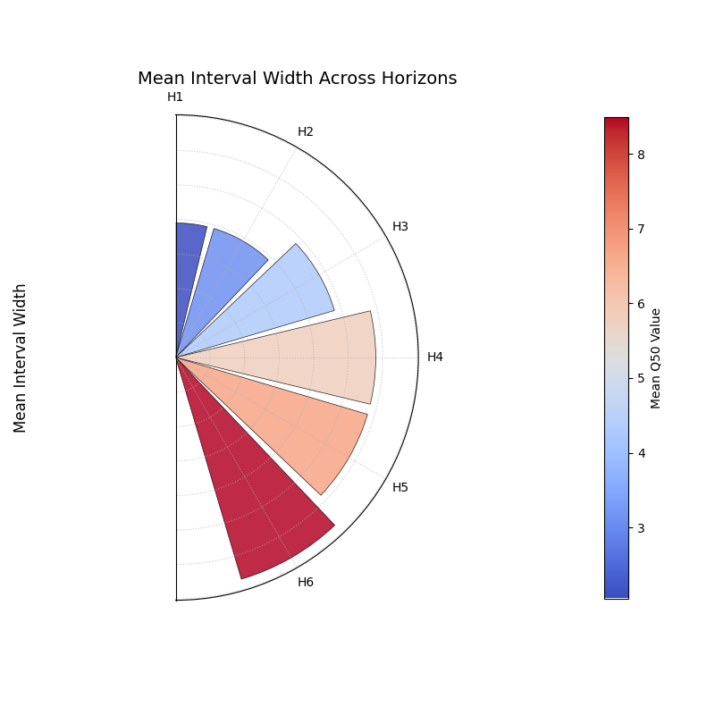

.. _gallery_comparison:

============================
Model Comparison Gallery
============================

This gallery page showcases plots from `k-diagram` designed for
comparing the performance of multiple models across various metrics,
primarily using radar charts.

.. note::
   You need to run the code snippets locally to generate the plot
   images referenced below (e.g., ``images/gallery_model_comparison.png``).
   Ensure the image paths in the ``.. image::`` directives match where
   you save the plots (likely an ``images`` subdirectory relative to
   this file).

.. _gallery_plot_model_comparison: 

--------------------------------
Multi-Metric Model Comparison
--------------------------------

Uses :func:`~kdiagram.plot.comparison.plot_model_comparison` to generate
a radar chart comparing multiple models across several performance
metrics (R2, MAE, RMSE, MAPE by default for regression) and includes
training time as an additional axis. Scores are normalized for visual
comparison.

.. code-block:: python
   :linenos:

   import kdiagram.plot.comparison as kdc
   import numpy as np
   import matplotlib.pyplot as plt

   # --- Data Generation ---
   np.random.seed(42)
   rng = np.random.default_rng(42)
   n_samples = 100
   y_true_reg = np.random.rand(n_samples) * 20 + 5 # True values
   # Model 1: Good fit
   y_pred_r1 = y_true_reg + np.random.normal(0, 2, n_samples)
   # Model 2: Slight bias, more noise
   y_pred_r2 = y_true_reg * 0.9 + 3 + np.random.normal(0, 3, n_samples)
   # Model 3: Less correlated
   y_pred_r3 = np.random.rand(n_samples) * 25 + rng.normal(0, 4, n_samples)

   times = [0.2, 0.8, 0.5] # Example training times
   names = ['Ridge', 'Lasso', 'Tree'] # Example model names

   # --- Plotting ---
   ax = kdc.plot_model_comparison(
       y_true_reg,
       y_pred_r1,
       y_pred_r2,
       y_pred_r3,
       train_times=times,
       names=names,
       # metrics=['r2', 'mae'] # Optionally specify metrics
       title="Gallery: Multi-Metric Model Comparison (Regression)",
       scale='norm', # Normalize scores to [0, 1] (higher is better)
       # Save the plot (adjust path relative to this file)
       savefig="images/gallery_model_comparison.png"
   )
   plt.close() # Close plot after saving

.. topic:: 🧠 Analysis and Interpretation
   :class: hint

   The **Multi-Metric Model Comparison** plot uses a radar chart to
   provide a holistic view of performance across several metrics for
   multiple models.

   **Analysis and Interpretation:**

   * **Axes:** Each axis represents a performance metric (e.g., R2,
     MAE, RMSE, MAPE, Train Time). Note that error metrics like MAE
     and time are internally inverted during normalization, so a
     **larger radius always indicates better performance** on that
     axis (higher R2, lower MAE, lower time).
   * **Polygons:** Each colored polygon represents a model.
   * **Performance Profile:** The shape and size of a model's
     polygon reveal its strengths and weaknesses. A large, balanced
     polygon generally indicates good overall performance. Comparing
     polygons shows relative performance across all chosen metrics.

   **🔍 Key Insights from this Example:**

   * We can directly compare 'Ridge', 'Lasso', and 'Tree' models.
   * Look at the 'r2' axis: the model whose polygon extends furthest
     has the highest R-squared value.
   * Look at the 'mae' axis: the model whose polygon extends furthest
     here had the *lowest* MAE (since lower error is better and was
     inverted during scaling).
   * Look at the 'Train Time (s)' axis: the model extending furthest
     was the *fastest* to train.
   * By examining the overall shape, we can identify trade-offs (e.g.,
     one model might have the best R2 but be the slowest).

   **💡 When to Use:**

   * **Model Selection:** When choosing between models based on multiple,
     potentially conflicting, performance criteria.
   * **Performance Summary:** To create a concise visual summary of
     comparative model performance for reports or presentations.
   * **Identifying Trade-offs:** Clearly visualize if improving one
     metric comes at the cost of another (e.g., accuracy vs. speed).
     
     
.. _gallery_plot_reliability:

-----------------------------------------
Model Reliability (Calibration) Diagram
-----------------------------------------

Uses :func:`~kdiagram.plot.comparison.plot_reliability_diagram` to
compare **predicted probabilities** to **observed frequencies** across
probability bins. A perfectly calibrated model lies on the
:math:`y=x` diagonal.

.. code-block:: python
   :linenos:

   import numpy as np
   import matplotlib.pyplot as plt
   import kdiagram.plot.comparison as kdc

   # --- Binary data generation (slightly miscalibrated vs. tighter) ---
   np.random.seed(0)
   n = 1000
   y = (np.random.rand(n) < 0.4).astype(int)

   # Model 1: wider/noisier probabilities around 0.4
   p1 = 0.4 * np.ones_like(y) + 0.15 * np.random.rand(n)
   # Model 2: tighter probabilities around 0.4
   p2 = 0.4 * np.ones_like(y) + 0.05 * np.random.rand(n)

   # --- Plotting ---
   ax, data = kdc.plot_reliability_diagram(
       y, p1, p2,
       names=["Wide", "Tight"],
       n_bins=12,
       strategy="quantile",      # quantile-based binning
       error_bars="wilson",      # 95% Wilson CIs per bin
       counts_panel="bottom",    # show counts histogram below
       show_ece=True,            # compute & display ECE
       show_brier=True,          # compute & display Brier score
       title="Gallery: Reliability Diagram (Quantile + Wilson CIs)",
       savefig="images/gallery_reliability_diagram.png",
       return_data=True,         # get per-bin stats back
   )
   plt.close()

.. image:: ../images/gallery_reliability_diagram.png
   :alt: Example Reliability (Calibration) Diagram
   :align: center
   :width: 75%

.. topic:: 🧠 Analysis and Interpretation
   :class: hint

   The **Reliability Diagram** assesses probability calibration by
   plotting per-bin **observed event frequency** against the **mean
   predicted probability**. The closer the curve is to the diagonal
   line :math:`y=x`, the better the calibration.

   **How to read it:**
   
   * **Diagonal (reference):** Perfect calibration. Points above the
     diagonal indicate the model is *under-confident* (events happen
     more often than predicted); points below indicate *over-confidence*.
   * **Markers & line:** Each marker is a bin; its x-position is the
     average predicted probability in that bin, its y-position is the
     observed fraction of positives in that bin.
   * **Error bars:** Per-bin uncertainty (e.g., Wilson intervals) for
     the observed frequency.
   * **Counts panel:** Shows how many samples fall into each bin (or the
     fraction, if normalized), helping diagnose data sparsity.

   **Reported metrics (optional):**
   
   * **ECE (Expected Calibration Error):**
   
     :math:`\mathrm{ECE} = \sum_{i} w_i \, \lvert \mathrm{acc}_i -
     \mathrm{conf}_i \rvert`, where :math:`\mathrm{acc}_i` is the
     observed frequency, :math:`\mathrm{conf}_i` is the mean predicted
     probability in bin :math:`i`, and :math:`w_i` is the bin weight
     (optionally sample-weighted).
     
   * **Brier score:** Mean squared error on probabilities
     :math:`\frac{1}{N}\sum_{j=1}^{N}(p_j - y_j)^2` (optionally
     weighted). Lower is better.

   **🔍 Key insights from this example:**
   
   * *Wide* shows larger deviations from the diagonal—more miscalibration.
   * *Tight* hugs the diagonal more closely—better calibrated.
   * The counts panel reveals how well the binning covers the probability
     range and whether any bins are data-sparse (wider error bars).

   **💡 When to use:**
   
   * **Probability calibration checks** for binary classifiers producing
     scores/probabilities.
   * **Comparing multiple models** (or post-calibration methods like
     Platt scaling/Isotonic regression) on the same dataset.
   * **Communicating** both calibration quality (curve vs. diagonal) and
     **data support** (counts per bin).

.. _gallery_plot_polar_reliability:

--------------------------------------------------
Polar Reliability Diagram (Calibration Spiral)
--------------------------------------------------

Provides a novel and intuitive visualization of model calibration by
mapping the traditional reliability diagram onto a polar coordinate
system. Perfect calibration is represented by a spiral, and the
model's performance is shown as a colored line that should follow
this spiral.

.. code-block:: python
   :linenos:

   import kdiagram as kd
   import numpy as np
   from scipy.stats import norm
   import matplotlib.pyplot as plt

   # --- Data Generation ---
   np.random.seed(0)
   n_samples = 2000
   # True probability of an event is 0.4
   y_true = (np.random.rand(n_samples) < 0.4).astype(int)

   # Model 1: Well-calibrated
   calibrated_preds = np.clip(0.4 + np.random.normal(
       0, 0.15, n_samples), 0, 1)

   # Model 2: Over-confident (pushes probabilities to extremes)
   overconfident_preds = np.clip(0.4 + np.random.normal(
       0, 0.3, n_samples), 0, 1)

   model_names = ["Well-Calibrated", "Over-Confident"]

   # --- Plotting ---
   kd.plot_polar_reliability(
       y_true,
       calibrated_preds,
       overconfident_preds,
       names=model_names,
       n_bins=15,
       cmap='plasma',
       savefig="gallery/images/gallery_polar_reliability_diagram.png"
   )
   plt.close()

.. topic:: 🧠 Analysis and Interpretation
   :class: hint

   The **Polar Reliability Diagram** transforms the standard
   calibration plot into an intuitive spiral, making it easier to
   diagnose the nature and location of miscalibrations.

   **Key Features:**

   * **Angle (θ):** Represents the **predicted probability**,
     sweeping from 0.0 at 0° to 1.0 at 90°.
   * **Radius (r):** Represents the **observed frequency** of the
     event in each probability bin.
   * **Perfect Calibration (Dashed Spiral):** This is the ideal
     line where predicted probability equals observed frequency.
   * **Diagnostic Coloring:** The model's line is colored based on
     the calibration error. In this example (using the 'plasma'
     colormap), yellow/orange indicates **over-confidence** (observed
     frequency < predicted probability), while purple/blue
     indicates **under-confidence**.

   **🔍 In this Example:**

   * **Well-Calibrated Model (Purple Spiral):** This model's line
     closely follows the dashed "Perfect Calibration" spiral. The
     dark purple color indicates that the calibration error is very
     close to zero across all probability bins.
   * **Over-Confident Model (Multi-colored Spiral):** This model's
     line deviates significantly. For low predicted probabilities
     (small angles), it is outside the reference spiral (under-confident,
     purple). For higher predicted probabilities (larger angles), it
     moves inside the reference spiral, and the color shifts to
     yellow/orange, clearly indicating **over-confidence**.

   **💡 When to Use:**

   * To get a more intuitive and visually engaging assessment of
     model calibration compared to a traditional Cartesian plot.
   * To quickly identify where a model is over- or under-confident
     across its range of predicted probabilities.
   * To effectively communicate the calibration performance of one or
     more models in a single, diagnostic-rich figure.

   
.. _gallery_plot_horizon_metrics:

-------------------------------------
Comparing Metrics Across Horizons
-------------------------------------

Uses :func:`~kdiagram.plot.comparison.plot_horizon_metrics` to create
a polar bar chart. This plot is designed to compare a primary metric
(like mean interval width) and an optional secondary metric (encoded
as color) across multiple distinct categories, such as forecast
horizons.

.. code-block:: python
   :linenos:

   import kdiagram.plot.comparison as kdc
   import pandas as pd
   import numpy as np
   import matplotlib.pyplot as plt

   # --- Data Generation ---

   # Create synthetic data where each row represents a forecast horizon.

   # The columns represent different samples (e.g., from different locations).

   horizons = ["H1", "H2", "H3", "H4", "H5", "H6"]
   df_horizons = pd.DataFrame({
    'q10_s1': [1, 2, 3, 4, 5, 6],
    'q10_s2': [1.2, 2.3, 3.4, 4.5, 5.6, 6.7],
    'q90_s1': [3, 4, 5.5, 7, 8, 9.5],
    'q90_s2': [3.1, 4.2, 5.7, 7.3, 8.4, 9.9],
    'q50_s1': [2, 3, 4.2, 5.7, 6.5, 8.2],
    'q50_s2': [2.1, 3.2, 4.4, 5.9, 6.9, 8.8],
   })

   q10_cols = ['q10_s1', 'q10_s2']
   q90_cols = ['q90_s1', 'q90_s2']
   q50_cols = ['q50_s1', 'q50_s2']

   # --- Plotting ---

   ax = kdc.plot_horizon_metrics(
   df=df_horizons,
   qlow_cols=q10_cols,
   qup_cols=q90_cols,
   q50_cols=q50_cols,
   title="Mean Interval Width Across Horizons",
   xtick_labels=horizons,
   show_value_labels=False,  # Hiding for a cleaner look
   r_label="Mean Interval Width",
   cbar_label="Mean Q50 Value",
   acov="half_circle",  # Use a 180-degree view
   # Save the plot (adjust path relative to this file)
   savefig="images/gallery_horizon_metrics.png"
   )
   plt.close()

.. topic:: 🧠 Analysis and Interpretation
    :class: hint

    The **Horizon Metrics Plot** provides a compact and intuitive way
    to compare how key metrics evolve across different categories,
    most commonly forecast time steps (horizons).

    **Analysis and Interpretation:**

    * **Angle (θ):** Each angular segment represents a distinct
      category or horizon (e.g., H1, H2, ...), corresponding to
      a row in the input DataFrame.
    * **Radius (r):** The height of each bar represents the
      **mean value of a primary metric**. In this case, it is the
      mean interval width (`Q90 - Q10`).
    * **Color:** The color of each bar visualizes a **secondary
      metric**, in this case the mean `Q50` value. This adds another
      layer of information to the comparison.

    **🔍 Key Insights from this Example:**

    * **Growing Uncertainty:** The bar height (radius) clearly
      increases from horizon H1 to H6. This indicates that the
      model's uncertainty, represented by the **mean interval width**,
      grows as it forecasts further into the future.
    * **Increasing Magnitude:** The color of the bars shifts from
      blue (lower values) to red (higher values). This shows that
      the **mean Q50 value** (the central prediction) is also
      trending upwards across the forecast horizons.
    * **Combined Insight:** By combining these two features, we can
      conclude that for this model, both the predicted value and its
      associated uncertainty increase steadily over the forecast
      period.

    **💡 When to Use:**

    * **Forecast Horizon Analysis:** Its primary use is to see how a
      model's uncertainty and central tendency change over time.
    * **Model Comparison:** You can create this plot for several
      different models and compare them side-by-side to see which
      one has more stable uncertainty estimates over time.
    * **Categorical Comparison:** The "horizons" don't have to be
      time-based. They can be different regions, model variants, or
      any distinct categories for which you want to compare aggregated
      metrics.

