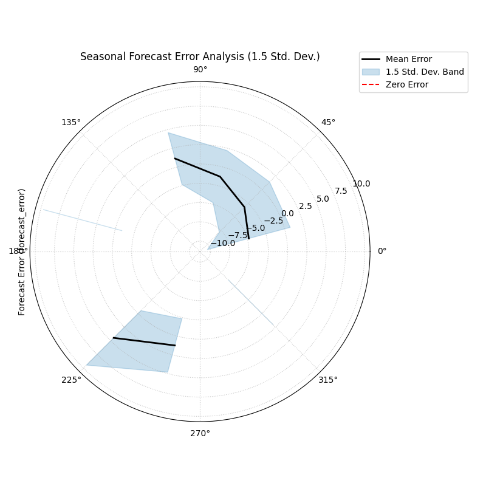
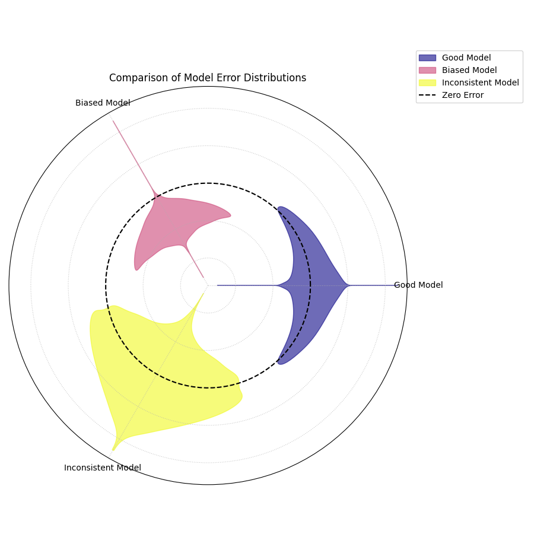
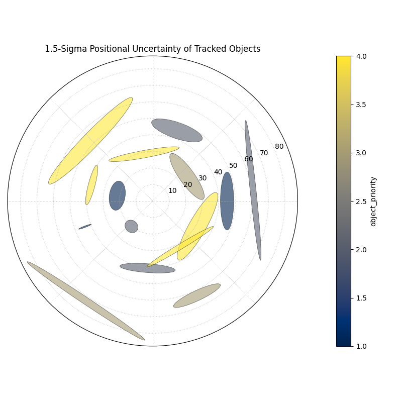

.. _gallery_errors:

======================
Error Visualizations
======================

Diagnosing and understanding forecast errors is a critical step in
model evaluation. This gallery showcases specialized polar plots
from the `k-diagram` package designed to visualize different aspects
of model errors, from systemic biases to multi-dimensional uncertainty.

.. note::
   You need to run the code snippets locally to generate the plot
   images referenced below. Ensure the image paths in the
   ``.. image::`` directives match where you save the plots (e.g.,
   ``images/gallery_plot_error_bands.png``).

.. _gallery_plot_error_bands:

------------------------
Polar Error Bands
------------------------

Aggregates forecast errors across bins of a cyclical or ordered
feature (like month or hour) to visualize mean error (bias) and
error variance (consistency).

.. code-block:: python
    :linenos:

    import kdiagram.plot.errors as kde
    import pandas as pd
    import numpy as np
    import matplotlib.pyplot as plt

    # --- Data Generation ---

    np.random.seed(42)
    n_points = 2000
    day_of_year = np.arange(n_points) % 365
    month = (day_of_year // 30) + 1

    # Create a seasonal error signal

    seasonal_bias = np.sin((day_of_year - 90) * np.pi / 180) * 5
    seasonal_noise = 2 + 2 * np.cos(day_of_year * np.pi / 180)**2
    errors = seasonal_bias + np.random.normal(0, seasonal_noise, n_points)

    df_seasonal_errors = pd.DataFrame({
    'month': month,
    'forecast_error': errors
    })

    # --- Plotting ---

    kde.plot_error_bands(
        df=df_seasonal_errors,
        error_col='forecast_error',
        theta_col='month',
        theta_period=12,
        theta_bins=12,
        n_std=1.5,
        title='Seasonal Forecast Error Analysis (1.5 Std. Dev.)',
        color='#2980B9',
        alpha=0.25,
        savefig="gallery/images/gallery_plot_error_bands.png"
    )
    plt.close()

.. topic:: 🧠 Analysis and Interpretation
    :class: hint

    The **Polar Error Band Plot** separates systemic error (bias) from
    random error (variance) as a function of an angular variable.

    **Key Features:**

    * **Angle (θ):** Represents a binned feature, like the month.
    * **Radius (r):** Represents the forecast error value. The red dashed
      circle indicates zero error.
    * **Mean Error (Black Line):** Shows the average error for each bin.
      If this line deviates from the zero-circle, it reveals a systemic bias.
    * **Error Band (Shaded Area):** Represents the standard deviation of
      the error. A wide band indicates high variance and inconsistent
      performance.

    **🔍 In this Example:**

    * **Systemic Bias:** The mean error line is clearly outside the zero-circle
      (positive error) for the top-right quadrant (spring/summer months) and
      inside the circle (negative error) for the bottom-left (autumn/winter),
      indicating a strong seasonal bias.
    * **Variable Consistency:** The shaded band is much wider in the
      bottom-left quadrant (winter) than in the top-right (summer),
      showing that the model's predictions are far more inconsistent and
      variable during the winter months.

    **💡 When to Use:**

    * To diagnose if a model has a systemic bias related to a cyclical
      feature (e.g., time of day, month of year).
    * To identify periods or conditions where a model's performance is
      less consistent (i.e., has higher error variance).

.. _gallery_plot_error_violins:

------------------------
Polar Error Violins
------------------------

Compares the full error distributions of multiple models on a single
polar plot, revealing differences in bias, variance, and shape.

.. code-block:: python
    :linenos:

    import kdiagram.plot.errors as kde
    import pandas as pd
    import numpy as np
    import matplotlib.pyplot as plt

    # --- Data Generation ---

    np.random.seed(0)
    n_points = 1000
    df_model_errors = pd.DataFrame({
    'Error (Model A)': np.random.normal(loc=0.5, scale=1.5, size=n_points),
    'Error (Model B)': np.random.normal(loc=-4.0, scale=1.5, size=n_points),
    'Error (Model C)': np.random.normal(loc=0, scale=4.0, size=n_points),
    })

    # --- Plotting ---

    kde.plot_error_violins(
        df_model_errors,
        'Error (Model A)',
        'Error (Model B)',
        'Error (Model C)',
        names=['Good Model', 'Biased Model', 'Inconsistent Model'],
        title='Comparison of Model Error Distributions',
        cmap='plasma',
        savefig="gallery/images/gallery_plot_error_violins.png"
    )
    plt.close()

.. topic:: 🧠 Analysis and Interpretation
    :class: hint

    The **Polar Error Violin Plot** provides a rich comparison of multiple
    error distributions.

    **Key Features:**

    * **Angle (θ):** Each angular sector is dedicated to a different model.
    * **Radius (r):** Represents the forecast error value. The black
      dashed circle is the zero-error reference line.
    * **Violin Shape:** The width of the violin at a given radius shows the
      density of errors at that value.

    **🔍 In this Example:**

    * **Good Model:** The blue violin is tightly centered around the zero-error
      line, indicating low bias and low variance.
    * **Biased Model:** The pink violin is shifted significantly inward from
      the zero-error line. Its peak density is around -4.0, revealing a
      strong negative bias (under-prediction).
    * **Inconsistent Model:** The yellow violin is centered on zero but is
      much wider and taller than the others, indicating it has a very high
      error variance and is therefore unreliable.

    **💡 When to Use:**

    * To directly compare the bias and consistency of several models at once.
    * To select a model based on the most desirable error profile (e.g.,
      low bias and low variance).

.. _gallery_plot_polar_error_ellipses:

------------------------
Polar Error Ellipses
------------------------

Visualizes two-dimensional uncertainty by drawing an ellipse for each
data point, where the ellipse's shape and orientation represent the
error (standard deviation) in both the radial and angular directions.

.. code-block:: python
    :linenos:

    import kdiagram.plot.errors as kde
    import pandas as pd
    import numpy as np
    import matplotlib.pyplot as plt

    # --- Data Generation ---

    np.random.seed(1)
    n_points = 15
    df_tracking = pd.DataFrame({
    'angle_deg': np.linspace(0, 360, n_points, endpoint=False),
    'distance_km': np.random.uniform(20, 80, n_points),
    'distance_std': np.random.uniform(2, 7, n_points),
    'angle_std_deg': np.random.uniform(3, 10, n_points),
    'object_priority': np.random.randint(1, 5, n_points)
    })

    # --- Plotting ---

    kde.plot_error_ellipses(
        df=df_tracking,
        r_col='distance_km',
        theta_col='angle_deg',
        r_std_col='distance_std',
        theta_std_col='angle_std_deg',
        color_col='object_priority',
        n_std=1.5,
        title='1.5-Sigma Positional Uncertainty of Tracked Objects',
        cmap='cividis',
        alpha=0.6,
        edgecolor='black',
        linewidth=0.5,
        savefig="gallery/images/gallery_plot_error_ellipses.png"
    )
    plt.close()

.. topic:: 🧠 Analysis and Interpretation
    :class: hint

    The **Polar Error Ellipse Plot** is used for visualizing 2D
    uncertainty, common in spatial or positional forecasting.

    **Key Features:**

    * **Ellipse Position:** The center of each ellipse is the mean
      predicted position (:math:`(r, \theta)`).
    * **Ellipse Shape:** The shape and size are determined by the
      standard deviations in the radial (`r_std_col`) and tangential
      (`theta_std_col`) directions. A long, thin ellipse indicates
      high uncertainty in one direction but low uncertainty in the other.
    * **Color:** Can be used to represent a third variable, such as the
      priority or type of the object being tracked.

    **🔍 In this Example:**

    * Each ellipse represents the 1.5-sigma uncertainty region for a
      tracked object.
    * We can see that some objects have highly elongated uncertainty (e.g.,
      the one near 135°), meaning their radial position is well-known,
      but their angular position is not.
    * Other objects have more circular uncertainty regions, indicating
      similar error magnitudes in both directions.

    **💡 When to Use:**

    * For spatial forecasting problems, such as tracking objects,
      predicting storm paths, or modeling animal movements.
    * When you need to visualize and understand the magnitude and
      anisotropy (directionality) of two-dimensional errors.
