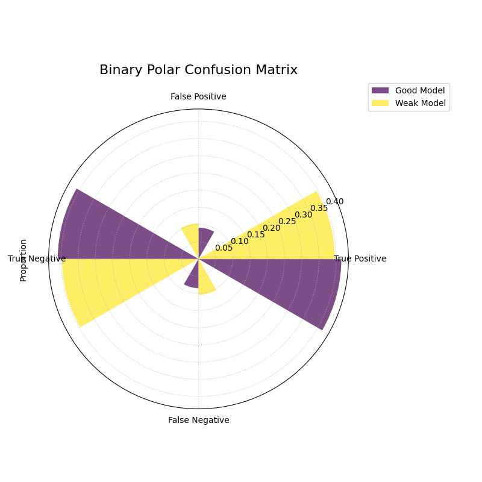

.. _gallery_evaluation:

============================
Model Evaluation Gallery
============================

This gallery page showcases plots from the `k-diagram` package
designed for the evaluation of classification models. It features
novel polar adaptations of standard, powerful diagnostic tools like
the ROC curve and the Precision-Recall curve.

These visualizations provide an intuitive and aesthetically engaging
way to compare the performance of multiple models, assess their
discriminative power, and understand their behavior, especially on
imbalanced datasets.

.. note::
   You need to run the code snippets locally to generate the plot
   images referenced below. Ensure the image paths in the
   ``.. image::`` directives match where you save the plots.

.. _gallery_plot_polar_pr_curve:

----------------------------------
Polar Precision-Recall Curve
----------------------------------

Visualizes the trade-off between Precision and Recall for one or
more binary classifiers. This plot is particularly useful for
evaluating models on imbalanced datasets where ROC curves can be
misleading.

.. code-block:: python
   :linenos:

   import kdiagram as kd
   import numpy as np
   from sklearn.datasets import make_classification
   import matplotlib.pyplot as plt

   # --- Data Generation (Imbalanced) ---
   X, y_true = make_classification(
       n_samples=1000,
       n_classes=2,
       weights=[0.9, 0.1], # 10% positive class
       flip_y=0.1,
       random_state=42
   )

   # Simulate predictions from two models
   y_pred_good = y_true * 0.6 + np.random.rand(1000) * 0.4
   y_pred_bad = np.random.rand(1000)

   # --- Plotting ---
   kd.plot_polar_pr_curve(
       y_true,
       y_pred_good,
       y_pred_bad,
       names=["Good Model", "Weak Model"],
       title="Polar Precision-Recall Curve Comparison",
       savefig="gallery/images/gallery_evaluation_plot_polar_pr_curve.png"
   )
   plt.close()

.. topic:: 🧠 Analysis and Interpretation
   :class: hint

   The **Polar Precision-Recall (PR) Curve** provides a powerful
   diagnostic for classifier performance, especially when the
   positive class is rare.

   **Key Features:**

   * **Angle (θ):** Represents **Recall**, sweeping from 0 at 0°
     to 1 at 90°. A wider angular sweep is better.
   * **Radius (r):** Represents **Precision**, with 0 at the
     center and 1 at the edge. A larger radius is better.
   * **No-Skill Line (Dashed Circle):** Represents a random
     classifier. A good model's curve should be far outside this
     circle.

   **🔍 In this Example:**

   * **Good Model (Purple):** This model's curve bows out towards
     the top-right, maintaining a high radius (high precision)
     even as the angle increases (higher recall). Its Average
     Precision (AP) score of 0.85 is significantly better than
     the no-skill baseline.
   * **Weak Model (Yellow):** This model's curve is much closer
     to the no-skill line, indicating a poorer balance between
     precision and recall.

   **💡 When to Use:**

   * When evaluating binary classifiers on **imbalanced datasets**.
   * To understand the trade-off between a model's ability to
     correctly identify positive cases (Recall) and its ability to
     avoid false alarms (Precision).
   * To compare models based on their Average Precision (AP) score,
     which is summarized by the area under the PR curve.

.. _gallery_plot_polar_roc:

----------------------------------
Polar ROC Curve
----------------------------------

Visualizes the performance of one or more binary classifiers using a
Receiver Operating Characteristic (ROC) curve adapted to a polar
coordinate system. It plots the True Positive Rate against the
False Positive Rate to assess a model's discriminative ability.

.. code-block:: python
   :linenos:

   import kdiagram as kd
   import numpy as np
   from sklearn.datasets import make_classification
   import matplotlib.pyplot as plt

   # --- Data Generation ---
   X, y_true = make_classification(
       n_samples=1000,
       n_classes=2,
       flip_y=0.2, # Add some noise
       random_state=42
   )

   # Simulate predictions from two models
   y_pred_good = y_true * 0.7 + np.random.rand(1000) * 0.4
   y_pred_weak = np.random.rand(1000)

   # --- Plotting ---
   kd.plot_polar_roc(
       y_true,
       y_pred_good,
       y_pred_weak,
       names=["Good Model", "Weak Model"],
       title="Polar ROC Curve Comparison",
       savefig="gallery/images/gallery_evaluation_plot_polar_roc.png"
   )
   plt.close()

.. topic:: 🧠 Analysis and Interpretation
   :class: hint

   The **Polar ROC Curve** provides a novel way to visualize the
   trade-off between a classifier's True Positive Rate (sensitivity)
   and False Positive Rate (1 - specificity).

   **Key Features:**

   * **Angle (θ):** Represents the **False Positive Rate (FPR)**,
     sweeping from 0 at 0° to 1 at 90°.
   * **Radius (r):** Represents the **True Positive Rate (TPR)**,
     with 0 at the center and 1 at the edge.
   * **No-Skill Spiral (Dashed Line):** This is the polar equivalent
     of the y=x diagonal in a standard ROC plot. A model with no
     discriminative power would lie on this line.
   * **Model Curve:** Each colored line represents a model. A better
     model will have a curve that bows outwards, maximizing the
     area under the curve (AUC).

   **🔍 In this Example:**

   * **Good Model (Blue):** This model's curve is far from the
     no-skill spiral, achieving a high True Positive Rate (large
     radius) for a low False Positive Rate (small angle). Its high
     AUC of 0.89 confirms its strong performance.
   * **Weak Model (Yellow):** This model's curve is much closer to
     the no-skill spiral, indicating poorer performance with an AUC
     of 0.85.

   **💡 When to Use:**

   * To evaluate and compare the overall discriminative power of
     binary classification models.
   * To select an optimal classification threshold based on the
     desired balance between the True Positive Rate and False
     Positive Rate.

.. _gallery_plot_polar_confusion_matrix:

-----------------------------
Polar Confusion Matrix
-----------------------------

Visualizes the components of a binary confusion matrix (True
Positives, False Positives, True Negatives, and False Negatives)
as bars on a polar plot, allowing for a direct comparison of
multiple models.

.. code-block:: python
   :linenos:

   import kdiagram as kd
   import numpy as np
   from sklearn.datasets import make_classification
   import matplotlib.pyplot as plt

   # --- Data Generation ---
   X, y_true = make_classification(
       n_samples=1000,
       n_classes=2,
       flip_y=0.2, # Add some noise
       random_state=42
   )

   # Simulate predictions from two models
   y_pred_good = y_true * 0.8 + np.random.rand(1000) * 0.3
   y_pred_weak = np.random.rand(1000)

   # --- Plotting ---
   kd.plot_polar_confusion_matrix(
       y_true,
       y_pred_good,
       y_pred_weak,
       names=["Good Model", "Weak Model"],
       title="Binary Polar Confusion Matrix",
       savefig="gallery/images/gallery_evaluation_plot_polar_confusion_matrix.png"
   )
   plt.close()

.. topic:: 🧠 Analysis and Interpretation
   :class: hint

   The **Polar Confusion Matrix** provides an intuitive, at-a-glance
   summary of a binary classifier's performance.

   **Key Features:**

   * **Angle (θ):** Each of the four angular sectors represents a
     component of the confusion matrix: True Positive (TP),
     False Positive (FP), True Negative (TN), and False Negative (FN).
   * **Radius (r):** The length of each bar represents the **proportion**
     (if normalized) or **count** of samples in that category.
   * **Model Comparison:** Different models are represented by different
     colored bars within each sector.

   **🔍 In this Example:**

   * **Good Model (Purple):** This model has long bars in the "True
     Positive" and "True Negative" sectors, indicating it correctly
     classifies many samples. Its bars in the "False Positive" and
     "False Negative" sectors are short, which is desirable.
   * **Weak Model (Yellow):** This model's bars are more evenly
     distributed, with significant lengths in the "False Positive" and
     "False Negative" sectors, indicating a high error rate. Its
     performance is much closer to that of a random classifier.

   **💡 When to Use:**

   * To get a quick, visual summary of a binary classifier's
     performance.
   * To directly compare the error types (False Positives vs. False
     Negatives) of multiple models.
   * To create a more visually engaging and intuitive representation
     of a confusion matrix for reports and presentations.

.. _gallery_plot_polar_confusion_matrix_in:

-----------------------------------
Multiclass Polar Confusion Matrix
-----------------------------------

Visualizes the performance of a multiclass classifier using a
grouped polar bar chart. Each angular sector represents a true
class, and the bars within it show the distribution of the model's
predictions for that class.

.. code-block:: python
   :linenos:

   import kdiagram as kd
   import numpy as np
   from sklearn.datasets import make_classification
   import matplotlib.pyplot as plt

   # --- Data Generation ---
   X, y_true = make_classification(
       n_samples=1000,
       n_features=20,
       n_informative=10,
       n_classes=4,
       n_clusters_per_class=1,
       flip_y=0.15, # Add some noise
       random_state=42
   )
   # Simulate predictions
   y_pred = y_true.copy()
   # Add some common confusions (e.g., confuse some 2s as 3s)
   mask = (y_true == 2) & (np.random.rand(1000) < 0.3)
   y_pred[mask] = 3

   # --- Plotting ---
   kd.plot_polar_confusion_matrix_in(
       y_true,
       y_pred,
       class_labels=["Class A", "Class B", "Class C", "Class D"],
       title="Multiclass Polar Confusion Matrix",
       savefig="gallery/images/gallery_evaluation_plot_polar_confusion_matrix_in.png"
   )
   plt.close()

.. topic:: 🧠 Analysis and Interpretation
   :class: hint

   The **Multiclass Polar Confusion Matrix** provides an intuitive
   visual breakdown of a classifier's performance on a per-class
   basis.

   **Key Features:**

   * **Angle (θ):** Each major angular sector represents a **True
     Class** (e.g., "True Class A").
   * **Bars:** Within each sector, the different colored bars show how
     the samples from that true class were **predicted**. The legend
     indicates which color corresponds to which predicted class.
   * **Radius (r):** The length of each bar represents the **proportion**
     (if normalized) or **count** of samples.

   **🔍 In this Example:**

   * **Good Classification:** In the "True Class C" sector, the green
     bar ("Predicted Class C") is very long, and the other bars are
     very short. This indicates that the model is excellent at
     correctly identifying Class C.
   * **Misclassification:** In the "True Class A" sector, the purple
     bar ("Predicted Class A") is the longest, but there are also
     visible bars for other predicted classes. This shows that while
     the model often gets Class A right, it also frequently confuses
     it with other classes.
   * **Specific Confusion:** By looking at the legend, you can identify
     the exact nature of the confusion. For example, if the yellow bar
     is tall in the "True Class A" sector, it means the model often
     mistakes Class A for Class D.

   **💡 When to Use:**

   * To get a detailed, visual summary of a multiclass classifier's
     performance.
   * To quickly identify which classes a model struggles with the most.
   * To understand the specific patterns of confusion between classes
     (e.g., "Is Class A more often confused with B or C?").

   
.. _gallery_plot_polar_classification_report:

--------------------------------
Polar Classification Report
--------------------------------

Visualizes the key performance metrics (Precision, Recall, and
F1-Score) for each class in a multiclass classification problem.
This provides a more detailed summary than a confusion matrix alone.

.. code-block:: python
   :linenos:

   import kdiagram as kd
   import numpy as np
   from sklearn.datasets import make_classification
   import matplotlib.pyplot as plt

   # --- Data Generation (Imbalanced) ---
   X, y_true = make_classification(
       n_samples=1000,
       n_features=20,
       n_informative=10,
       n_classes=3,
       n_clusters_per_class=1,
       weights=[0.5, 0.3, 0.2], # Imbalanced classes
       flip_y=0.15,
       random_state=42
   )
   # Simulate predictions
   y_pred = y_true.copy()
   # Add some errors, especially for the minority class
   mask = (y_true == 2) & (np.random.rand(1000) < 0.4)
   y_pred[mask] = 0

   # --- Plotting ---
   kd.plot_polar_classification_report(
       y_true,
       y_pred,
       class_labels=["Class Alpha", "Class Beta", "Class Gamma"],
       title="Per-Class Performance Report",
       cmap='Set2',
       savefig="gallery/images/gallery_evaluation_plot_polar_classification_report.png"
   )
   plt.close()

.. topic:: 🧠 Analysis and Interpretation
   :class: hint

   The **Polar Classification Report** provides a granular, per-class
   breakdown of a classifier's performance, making it easy to spot
   imbalances and trade-offs.

   **Key Features:**

   * **Angle (θ):** Each major angular sector represents a **True
     Class** (e.g., "Class Alpha").
   * **Bars:** Within each sector, the three colored bars represent
     the key metrics: **Precision**, **Recall**, and **F1-Score**.
   * **Radius (r):** The length of each bar represents the score for
     that metric, from 0 at the center to 1 at the edge.

   **🔍 In this Example:**

   * **Class Alpha:** This class has high scores across all three
     metrics, indicating the model performs very well on it.
   * **Class Beta:** This class shows a trade-off. It has high
     Precision (the light green bar is tall), but lower Recall (the
     lime green bar is shorter). This means when the model predicts
     "Class Beta," it's usually correct, but it fails to find all of
     the actual "Class Beta" samples.
   * **Class Gamma:** This class performs poorly, with low scores
     across all metrics, which is common for minority classes in an
     imbalanced dataset.

   **💡 When to Use:**

   * To get a detailed, per-class summary of a multiclass
     classifier's performance beyond a single accuracy score.
   * To diagnose the Precision vs. Recall trade-off for each class.
   * To identify which specific classes a model is struggling to
     predict correctly.

.. _gallery_plot_pinball_loss:

-----------------------------
Polar Pinball Loss
-----------------------------

Visualizes the per-quantile performance of a probabilistic
forecast using the Pinball Loss. This plot provides a granular
view of a model's accuracy across its entire predictive
distribution.

.. code-block:: python
   :linenos:

   import kdiagram as kd
   import numpy as np
   from scipy.stats import norm
   import matplotlib.pyplot as plt

   # --- Data Generation ---
   np.random.seed(0)
   n_samples = 1000
   y_true = np.random.normal(loc=50, scale=10, size=n_samples)
   quantiles = np.array([0.1, 0.25, 0.5, 0.75, 0.9])

   # Simulate a model that is good at the median, worse at the tails
   scales = np.array([12, 10, 8, 10, 12]) # Different scales per quantile
   y_preds = norm.ppf(
       quantiles, loc=y_true[:, np.newaxis], scale=scales
   )

   # --- Plotting ---
   kd.plot_pinball_loss(
       y_true,
       y_preds,
       quantiles,
       title="Pinball Loss per Quantile",
       savefig="gallery/images/gallery_evaluation_plot_pinball_loss.png"
   )
   plt.close()

.. topic:: 🧠 Analysis and Interpretation
   :class: hint

   The **Polar Pinball Loss Plot** provides a detailed breakdown of a
   probabilistic forecast's performance, showing its accuracy at
   predicting each specific quantile level.

   **Key Features:**

   * **Angle (θ):** Represents the **Quantile Level**, sweeping from
     0 to 1 around the circle.
   * **Radius (r):** The radial distance from the center represents the
     **Average Pinball Loss** for that quantile. A **smaller radius
     is better**, indicating a more accurate forecast for that
     specific quantile.

   **🔍 In this Example:**

   * The plot has a distinct "butterfly" or "bow-tie" shape.
   * The radius is smallest at the 0.5 quantile (bottom), indicating
     that the model is very accurate at predicting the **median** of
     the distribution.
   * The radius is largest at the tails (0.1 and 0.9 quantiles),
     showing that the model is much less accurate at predicting
     **extreme values**. This is a common characteristic of many
     forecasting models.

   **💡 When to Use:**

   * To get a granular, per-quantile view of a model's performance,
     which is more detailed than an overall score like the CRPS.
   * To diagnose if a model is better at predicting the center of a
     distribution versus its tails.
   * To compare the per-quantile performance of multiple models by
     overlaying their plots.
     
.. _gallery_plot_regression_performance:

-----------------------------
Polar Performance Chart
-----------------------------

Visualizes and compares multiple regression models across several
performance metrics simultaneously using a grouped polar bar chart.
All scores are normalized so that a **larger radius is always better**.

Default Metrics Example
~~~~~~~~~~~~~~~~~~~~~~~

This example shows the default behavior, comparing three models
across R², Mean Absolute Error (MAE), and Root Mean Squared Error
(RMSE). The ``metric_labels`` parameter is used to provide short,
clean labels for the plot axes.

.. code-block:: python
   :linenos:

   import kdiagram as kd
   import numpy as np
   import matplotlib.pyplot as plt

   # --- Data Generation ---
   np.random.seed(0)
   n_samples = 200
   y_true = np.random.rand(n_samples) * 50

   # Models with different performance profiles
   y_pred_good = y_true + np.random.normal(0, 5, n_samples)
   y_pred_biased = y_true - 10 + np.random.normal(0, 2, n_samples)
   y_pred_variance = y_true + np.random.normal(0, 15, n_samples)

   model_names = ["Good Model", "Biased Model", "High Variance"]

   # --- Plotting ---
   kd.plot_regression_performance(
       y_true,
       y_pred_good, y_pred_biased, y_pred_variance,
       names=model_names,
       title="Performance with Default Metrics",
       cmap='plasma',
       metric_labels={
           'r2': 'R²',
           'neg_mean_absolute_error': 'MAE',
           'neg_root_mean_squared_error': 'RMSE'
       },
       savefig="gallery/images/gallery_plot_regression_performance_default.png"
   )
   plt.close()

.. topic:: 🧠 Analysis and Interpretation
   :class: hint

   The **Polar Performance Chart** provides a holistic, multi-metric
   view of model performance, making it easy to identify trade-offs.

   **Key Features:**

   * **Angle (θ):** Each angular sector represents a different
     **evaluation metric** (e.g., R², MAE, RMSE).
   * **Bars:** Within each sector, the different colored bars represent
     the different models being compared.
   * **Radius (r):** The length of each bar represents the model's
     **normalized score** for that metric. The green circle at the edge
     is the "Best Performance" line (a score of 1), and the red dashed
     circle is the "Worst Performance" line (a score of 0).

   **🔍 In this Example:**

   * **Good Model (Dark Blue):** This model has the best (longest) bars for
     R² and RMSE, indicating strong overall performance. Its MAE score is
     good but not the best.
   * **Biased Model (Pink):** This model has the best MAE score, which
     is expected as it has low error variance. However, its significant
     bias severely penalizes its R² and RMSE scores, where its
     performance is the worst.
   * **High Variance Model (Yellow):** This model performs poorly across
     all metrics, with the shortest bars for R² and RMSE, confirming
     that its high error variance leads to a poor overall fit.

   **💡 When to Use:**

   * To get a quick, visual summary of how multiple models perform
     across a range of different metrics.
   * To identify the strengths and weaknesses of each model (e.g., "Is
     this model biased or just noisy?").
   * For model selection when you need to balance trade-offs between
     different performance criteria.

Custom and Added Metrics Example
~~~~~~~~~~~~~~~~~~~~~~~~~~~~~~~~

This example demonstrates how to add a custom metric (Median
Absolute Error) to the default set of metrics using the
``add_to_defaults=True`` parameter.

.. code-block:: python
   :linenos:

   import kdiagram as kd
   import numpy as np
   import matplotlib.pyplot as plt
   from sklearn.metrics import median_absolute_error

   # --- Data Generation (same as above) ---
   np.random.seed(0)
   n_samples = 200
   y_true = np.random.rand(n_samples) * 50
   y_pred_good = y_true + np.random.normal(0, 5, n_samples)
   y_pred_biased = y_true - 10 + np.random.normal(0, 2, n_samples)
   y_pred_variance = y_true + np.random.normal(0, 15, n_samples)
   model_names = ["Good Model", "Biased Model", "High Variance"]

   # A custom metric function (must return a score, not an error)
   def median_abs_error_scorer(y_true, y_pred):
       return -median_absolute_error(y_true, y_pred)

   # --- Plotting ---
   kd.plot_regression_performance(
       y_true,
       y_pred_good, y_pred_biased, y_pred_variance,
       names=model_names,
       metrics=[median_abs_error_scorer],
       add_to_defaults=True,
       title="Performance with Added Custom Metric",
       cmap='cividis',
       metric_labels={
           'r2': 'R²',
           'neg_mean_absolute_error': 'MAE',
           'neg_root_mean_squared_error': 'RMSE',
           'median_abs_error_scorer': 'MedAE'
       },
       savefig="gallery/images/gallery_plot_regression_performance_custom.png"
   )
   plt.close()

.. topic:: 🧠 Analysis and Interpretation
   :class: hint

   This plot demonstrates how to extend the default analysis with a
   custom metric, providing a more nuanced view of performance.

   **Key Features:**

   * **Custom Axis:** The plot now includes a fourth axis for the
     custom "MedAE" (Median Absolute Error) metric.
   * **Combined View:** The ``add_to_defaults=True`` parameter allows
     for a direct comparison of standard and custom metrics.

   **🔍 In this Example:**

   * The new **MedAE** metric reinforces the findings from the MAE. The
     "Biased Model" (gray) performs best on both MAE and MedAE. This
     is because both metrics are less sensitive to large outlier errors
     than RMSE, highlighting the model's low error variance despite its bias.
   * The "Good Model" (dark blue) remains the best performer on R² and RMSE,
     showcasing its superior overall fit.

   **💡 When to Use:**

   * When standard metrics don't fully capture the performance
     aspects you care about (e.g., robustness to outliers).
   * To create a comprehensive performance profile that includes both
     standard and domain-specific evaluation criteria.

Pre-calculated Metrics Example
~~~~~~~~~~~~~~~~~~~~~~~~~~~~~~

This example shows how to generate the plot directly from a
dictionary of pre-calculated scores using the ``metric_values``
parameter. This is useful when you have already computed the
metrics and just want to visualize them. The axis labels are
muted for a cleaner look.

.. code-block:: python
   :linenos:

   import kdiagram as kd
   import matplotlib.pyplot as plt

   # --- Pre-calculated Scores ---
   precalculated_scores = {
       'R²': [0.85, 0.55, 0.65],
       'MAE': [-4.0, -10.5, -12.0],
       'RMSE': [-5.0, -11.0, -15.0]
   }
   model_names = ["Good Model", "Biased Model", "High Variance"]

   # --- Plotting ---
   kd.plot_regression_performance(
       metric_values=precalculated_scores,
       names=model_names,
       title="Performance from Pre-calculated Scores",
       cmap='Set2',
       metric_labels=False, # Mute the axis labels
       savefig="gallery/images/gallery_plot_regression_performance_precalc.png"
   )
   plt.close()

.. topic:: 🧠 Analysis and Interpretation
   :class: hint

   This example showcases the flexibility of the function, allowing it
   to be used as a pure visualization tool for pre-calculated scores.

   **Key Features:**

   * **Data Agnostic:** The plot is generated directly from a dictionary
     of scores via the ``metric_values`` parameter, without needing the
     original ``y_true`` or ``y_pred`` data.
   * **Minimalist Display:** By setting ``metric_labels=False``, the
     angular axis labels are removed, creating a cleaner visual.

   **🔍 In this Example:**

   * The plot accurately reflects the provided scores, with the "Good Model"
     (purple) dominating on R² and RMSE, and the "Biased Model" (teal)
     showing the poorest performance on these metrics.
   * The absence of axis labels creates a less cluttered look, which can
     be effective for presentations or reports where the axes are
     explained in the main text or a caption.

   **💡 When to Use:**

   * When you have already computed performance metrics and simply need
     a powerful way to visualize them.
   * To create minimalist, presentation-ready graphics where detailed
     labels might be distracting.
     
Overriding Metric Behavior
~~~~~~~~~~~~~~~~~~~~~~~~~~~~

This example demonstrates how to use the ``higher_is_better``
parameter to give the function explicit instructions on how to
interpret a custom metric. This is crucial when your metric is an
error score (where lower is better) but does not have a name that
the function would automatically recognize as an error.

.. code-block:: python
   :linenos:

   import kdiagram as kd
   import numpy as np
   import matplotlib.pyplot as plt

   # --- Data Generation ---
   np.random.seed(0)
   n_samples = 200
   y_true = np.random.rand(n_samples) * 50
   y_pred_good = y_true + np.random.normal(0, 5, n_samples)
   y_pred_biased = y_true - 10 + np.random.normal(0, 2, n_samples)
   model_names = ["Good Model", "Biased Model"]

   # A custom error metric with a neutral name
   def my_custom_deviation(y_true, y_pred):
       return np.mean(np.abs(y_true - y_pred))

   # --- Plotting ---
   kd.plot_regression_performance(
       y_true,
       y_pred_good,
       y_pred_biased,
       names=model_names,
       metrics=['r2', my_custom_deviation],
       title="Performance with Overridden Metric Behavior",
       cmap='ocean',
       metric_labels={
           'r2': 'R²',
           'my_custom_deviation': 'Custom Deviation'
       },
       higher_is_better={
           'my_custom_deviation': False # Explicitly tell the function lower is better
       },
       savefig="gallery/images/gallery_plot_regression_performance_override.png"
   )
   plt.close()

.. topic:: 🧠 Analysis and Interpretation
   :class: hint

   This plot demonstrates the power of the ``higher_is_better``
   parameter for ensuring custom metrics are visualized correctly.

   **Key Features:**

   * **`higher_is_better` Parameter:** This dictionary allows you to
     manually specify whether a higher or lower score is better for
     any given metric, overriding the function's default behavior.
   * **Correct Normalization:** By setting
     ``'my_custom_deviation': False``, we tell the function that a
     *lower* score is better for this metric. The function then
     correctly inverts its score during normalization, so that the
     model with the lowest deviation gets the longest bar (best
     performance).

   **🔍 In this Example:**

   * The "Biased Model" has a lower error variance and therefore a
     lower (better) score on the "Custom Deviation" metric. Thanks
     to the ``higher_is_better`` override, it is correctly shown
     with the longest bar on that axis.
   * The "Good Model" has a much better R² score, and the plot
     clearly visualizes this trade-off.

   **💡 When to Use:**

   * When you are using a **custom error metric** whose name does
     not contain "error" or "loss".
   * When you want to ensure that your plot's normalization is
     unambiguous and correctly reflects the desired interpretation
     of each metric.
     
Controlling Normalization Strategies
~~~~~~~~~~~~~~~~~~~~~~~~~~~~~~~~~~~~

The ``norm`` parameter is a powerful feature that changes the
"perspective" of the plot. It controls how raw metric scores are
scaled to the radial axis, allowing you to switch between relative
comparisons and absolute benchmarks.

The following examples all use the same underlying data, generated once
to create two models with different error profiles.

**Data Generation**
^^^^^^^^^^^^^^^^^^^

.. code-block:: python
   :linenos:

   import kdiagram as kd
   import matplotlib.pyplot as plt

   # Define distinct profiles for a good model and a biased model
   model_profiles = {
       "Good Model": {"bias": 0.5, "noise_std": 4.0},
       "Biased Model": {"bias": -10.0, "noise_std": 2.0},
   }

   # Generate the dataset
   data = kd.datasets.make_regression_data(
       model_profiles=model_profiles,
       seed=42,
       as_frame=True
   )
   
   # Prepare data and labels for plotting
   y_true = data['y_true'].values
   y_pred_good = data['pred_Good_Model'].values
   y_pred_biased = data['pred_Biased_Model'].values
   model_names = ["Good", "Biased"]
   
   metric_labels = {
       'r2': 'R²',
       'neg_mean_absolute_error': 'MAE',
       'neg_root_mean_squared_error': 'RMSE',
   }

**1. Relative Comparison (`norm="per_metric"`)**
^^^^^^^^^^^^^^^^^^^^^^^^^^^^^^^^^^^^^^^^^^^^^^^^^^

This is the default behavior. It scales each metric independently to
the range [0, 1]. This perspective is best for answering the question:
*"Which of my models is relatively better or worse on each metric?"*

.. code-block:: python
   :linenos:

   kd.plot_regression_performance(
       y_true, y_pred_good, y_pred_biased,
       names=model_names,
       metric_labels=metric_labels,
       norm="per_metric",
       title="Regression Model Performance (Per-Metric Norm)",
       savefig="gallery/images/gallery_plot_regression_performance_per_metric.png"
   )
   plt.close()

.. topic:: 🧠 Analysis and Interpretation
   :class: hint

   * **Interpretation:** The plot shows a stark contrast. On R² and
     RMSE, the "Good" model is the best, so its bars reach the outer
     "Best Performance" ring (normalized score of 1.0). The "Biased"
     model is the worst, so its bars are at the inner "Worst
     Performance" ring (score of 0). The situation is reversed for
     MAE, where the low-variance "Biased" model is relatively better.
   * **When to Use:** This is the best general-purpose view for
     quickly identifying the relative strengths and weaknesses of each
     model.

**2. Absolute Benchmark (`norm="global"`)**
^^^^^^^^^^^^^^^^^^^^^^^^^^^^^^^^^^^^^^^^^^^

This mode compares models against a fixed, meaningful scale that you
define with ``global_bounds``. It's best for answering: *"Do my
models meet a predefined standard of 'good'?"*

.. code-block:: python
   :linenos:
   
   # Define a benchmark for what "good" and "bad" means for each metric
   global_bounds = {
       "r2": (0.0, 1.0),
       "neg_mean_absolute_error": (-15.0, 0.0),
       "neg_root_mean_squared_error": (-20.0, 0.0),
   }

   kd.plot_regression_performance(
       y_true, y_pred_good, y_pred_biased,
       names=model_names,
       metric_labels=metric_labels,
       norm="global",
       global_bounds=global_bounds,
       title="Regression Model Performance (Global Norm)",
       savefig="gallery/images/gallery_plot_regression_performance_global.png"
   )
   plt.close()

.. topic:: 🧠 Analysis and Interpretation
   :class: hint

   * **Interpretation:** The bars no longer necessarily touch the
     edges. The "Good" model has a high R², so its bar is long on the
     absolute 0-1 scale. However, its MAE and RMSE are not perfect,
     so their bars do not reach the outer ring. The "Biased" model's
     R² is very poor, resulting in a very short bar, accurately
     showing its poor performance against the absolute benchmark.
   * **When to Use:** When you have a specific performance target and
     want to see how close your models are to achieving it.

**3. Raw Scores (`norm="none"`)**
^^^^^^^^^^^^^^^^^^^^^^^^^^^^^^^^^

This mode is for experts who want to see the un-scaled metric values
directly. The radial axis is relabeled to show the raw scores.

.. code-block:: python
   :linenos:

   kd.plot_regression_performance(
       y_true, y_pred_good, y_pred_biased,
       names=model_names,
       metric_labels=metric_labels,
       norm="none",
       title="Regression Model Performance (No Norm)",
       savefig="gallery/images/gallery_plot_regression_performance_none.png"
   )
   plt.close()

.. topic:: 🧠 Analysis and Interpretation (Expert Mode)
   :class: hint

   This mode provides the most direct, unfiltered view of the raw
   performance scores. However, it's also the most complex to
   interpret because each metric exists on its own unique scale. The
   key is to **read each metric axis independently**, like separate
   bar charts radiating from the center.

   **How to Read This Plot:**

   1.  **Isolate a Single Metric:** Pick one metric to analyze, for
       example, **MAE**. Ignore the other axes for a moment.
   2.  **Read the Radial Axis for That Metric:** Look at the numbers
       on the grid lines. For MAE and RMSE, these are negative values,
       where scores closer to 0 are better. For R², the values are
       positive, where scores closer to 1 are better.
   3.  **Compare Models *Within* That Metric Only:**
   
       - For **MAE**, the "Good" model's bar (purple) reaches about
         **-4.8**. The "Biased" model's bar (yellow) only reaches about
         **-10**. Since -4.8 is a better (higher) score than -10, the
         "Good" model is the clear winner on this metric.
       - For **R²**, the "Good" model's bar reaches about **0.73**,
         while the "Biased" model's bar is extremely short, showing a
         very poor raw R² score.
         
   4.  **Repeat for Each Metric.**

   **⚠️ Critical Warning:**

   **Do not** visually compare the length of a bar for one metric to
   the length of a bar for another. For example, comparing the length
   of the **R²** bar to the **RMSE** bar is meaningless, as they
   represent completely different units and scales.

   **💡 When to Use:**

   * When you need to see the **exact numerical scores** on the plot
     itself without needing to consult a separate table.
   * To assess the **absolute magnitude** of your model's errors, not
     just its relative ranking compared to other models.
   * For technical reports aimed at audiences who understand that the
     axes have different units and can interpret multi-scale plots.