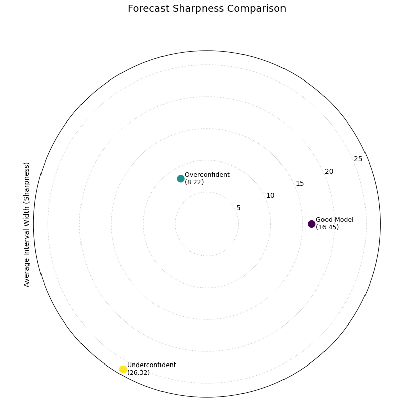
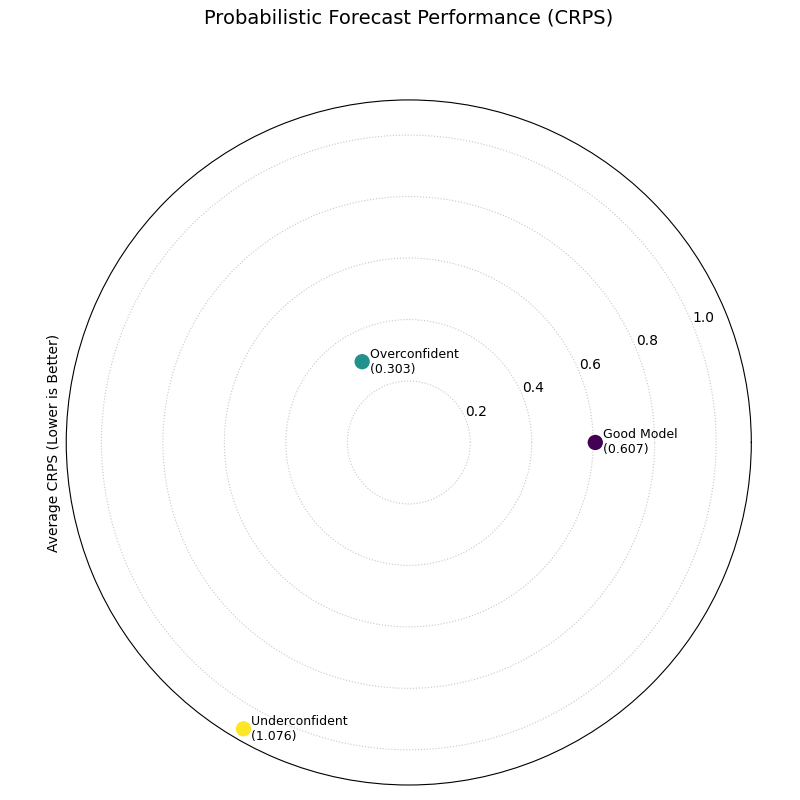
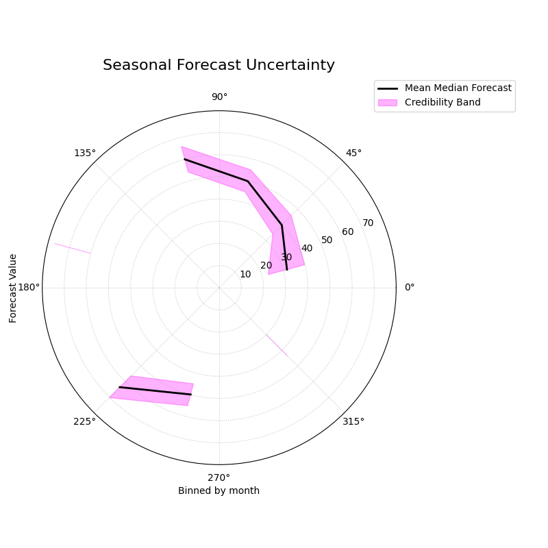
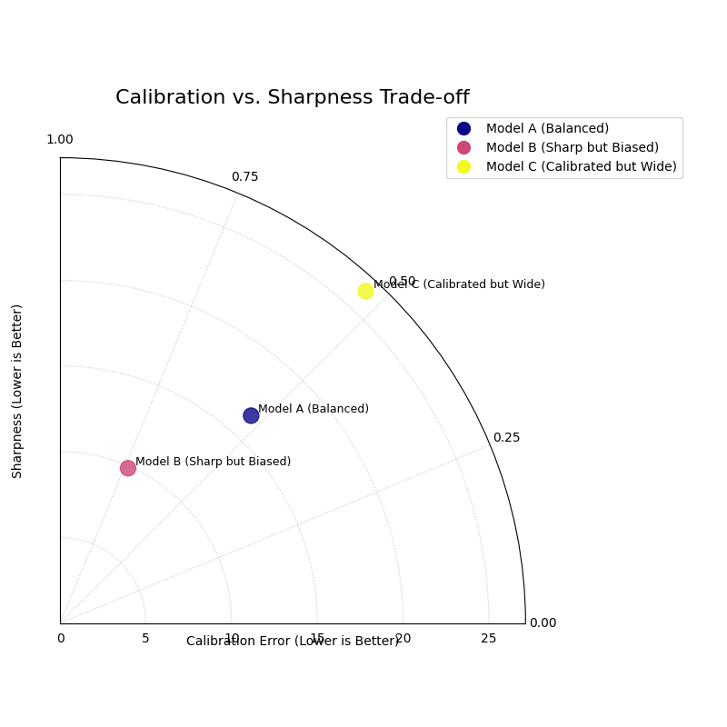

.. _gallery_probabilistic:

===================================
Probabilistic Diagnostics Gallery
===================================

This gallery page showcases plots from ``k-diagram`` designed for the
comprehensive evaluation of probabilistic forecasts. These visualizations
move beyond simple interval checks to assess the two key qualities of a
probabilistic forecast: **calibration** (is the forecast reliable?) and
**sharpness** (is the forecast precise?).

The plots provide intuitive diagnostics for PIT histograms, forecast
sharpness, overall performance (CRPS), and conditional uncertainty,
allowing for a deeper understanding of a model's predictive distributions.

.. note::
   You need to run the code snippets locally to generate the plot
   images referenced below. Ensure the image paths in the
   ``.. image::`` directives match where you save the plots.

.. _gallery_plot_pit_histogram:

-----------------------------
PIT Histogram (Calibration)
-----------------------------

Assesses the calibration of a probabilistic forecast using a Polar
Probability Integral Transform (PIT) histogram. For a perfectly
calibrated model, the histogram should be uniform, resulting in a
plot where the bars form a perfect circle.

.. code-block:: python
   :linenos:

   import kdiagram as kd
   import pandas as pd
   import numpy as np
   from scipy.stats import norm
   import matplotlib.pyplot as plt

   # --- Data Generation ---

   np.random.seed(42)
   n_samples = 1000
   y_true = np.random.normal(loc=10, scale=5, size=n_samples)
   quantiles = np.linspace(0.05, 0.95, 19)  # 19 quantiles from 5% to 95%

   # Model 1: Good model (well-calibrated)
   good_model_preds = norm.ppf(quantiles, loc=y_true[:, np.newaxis], scale=5)

   # Model 2: Overconfident model (too sharp, poorly calibrated)
   overconfident_preds = norm.ppf(quantiles, loc=y_true[:, np.newaxis], scale=2.5)

   # --- Plotting ---
   kd.plot_pit_histogram(
       y_true, good_model_preds, quantiles,
       title="PIT Histogram: Good Model",
       savefig="gallery/images/gallery_pit_histogram_good_model.png",
   )

   kd.plot_pit_histogram(
       y_true, overconfident_preds, quantiles,
       title="PIT Histogram: Overconfident Model",
       color="#E74C3C",
       savefig="gallery/images/gallery_pit_histogram_overconfident.png",
   )

   plt.close('all')

.. grid:: 1 2 2 2
   :gutter: 2

   .. grid-item-card::
      :shadow: none
      :class-card: sd-border-0

      .. image:: ../images/gallery_pit_histogram_good_model.png
         :alt: PIT Histogram for a well-calibrated model

   .. grid-item-card::
      :shadow: none
      :class-card: sd-border-0

      .. image:: ../images/gallery_pit_histogram_overconfident.png
         :alt: PIT Histogram for an overconfident model

.. topic:: 🧠 Analysis and Interpretation
   :class: hint

   The **Polar PIT Histogram** is a fundamental diagnostic for
   assessing the statistical calibration of a probabilistic forecast.

   **Key Features:**

   * **Angle (θ):** The angular axis is divided into bins representing
     the PIT values, typically from 0 to 1.
   * **Radius (r):** The radius of each bar shows the **frequency**
     (count) of PIT values that fall into that bin.
   * **Uniform Line (Red Dashed Circle):** This reference line shows
     the expected frequency for a perfectly calibrated forecast, where
     all bins would have the same count.

   **🔍 In these Examples:**

   * **Good Model (Left):** The blue bars are all very close to the
     red reference circle, indicating that the PIT values are uniformly
     distributed. This is the signature of a **well-calibrated** forecast.
   * **Overconfident Model (Right):** The histogram is **U-shaped**, with
     high frequencies in the lowest and highest PIT bins. This means the
     true observed values frequently fall outside the predicted range,
     a classic sign that the model's forecast distributions are too
     narrow and **overconfident**.

   **💡 When to Use:**

   * To get a detailed, visual assessment of a model's probabilistic
     calibration.
   * To diagnose specific types of miscalibration (e.g., U-shaped for
     overconfidence, hump-shaped for underconfidence, or sloped for bias).
   * To compare the calibration of different models before looking at
     other metrics like sharpness.

   
.. _gallery_plot_polar_sharpness:

--------------------------
Polar Sharpness Diagram
--------------------------

Assesses the **sharpness** (or precision) of one or more probabilistic
forecasts. A sharper forecast has narrower prediction intervals and is
represented by a point closer to the center of the plot.

.. code-block:: python
   :linenos:

   import kdiagram as kd
   import pandas as pd
   import numpy as np
   from scipy.stats import norm
   import matplotlib.pyplot as plt

   # --- Data Generation (using the same data as before) ---

   np.random.seed(42)
   n_samples = 1000
   y_true = np.random.normal(loc=10, scale=5, size=n_samples)
   quantiles = np.linspace(0.05, 0.95, 19)

   # Model 1: Good model (well-calibrated, decent sharpness)
   good_model_preds = norm.ppf(quantiles, loc=y_true[:, np.newaxis], scale=5)

   # Model 2: Overconfident model (too sharp)
   overconfident_preds = norm.ppf(quantiles, loc=y_true[:, np.newaxis], scale=2.5)

   # Model 3: Underconfident model (not sharp)
   underconfident_preds = norm.ppf(quantiles, loc=y_true[:, np.newaxis] + 2, scale=8)

   model_names = ["Good Model", "Overconfident", "Underconfident"]

   # --- Plotting ---
   kd.plot_polar_sharpness(
       good_model_preds, overconfident_preds, underconfident_preds,
       quantiles=quantiles,
       names=model_names,
       savefig="gallery/images/gallery_forecast_sharpness_comparison.png",
   )
   plt.close()

.. topic:: 🧠 Analysis and Interpretation
   :class: hint

   The **Polar Sharpness Diagram** provides a direct comparison of the
   precision of different probabilistic models. While calibration
   (reliability) is crucial, a good forecast should also be as sharp
   (narrow) as possible.

   **Key Features:**

   * **Angle (θ):** Each model is assigned its own angular sector for
     clear separation. The angle itself has no numerical meaning.
   * **Radius (r):** The radial distance from the center directly
     corresponds to the **average prediction interval width**. A
     **smaller radius is better**, indicating a sharper, more precise
     forecast.

   **🔍 In this Example:**

   * **Overconfident Model (Teal):** This model is closest to the
     center with a sharpness score of 8.22. This means it produces the
     narrowest (sharpest) prediction intervals. However, as we saw in
     the PIT histogram, this sharpness comes at the cost of poor
     calibration.
   * **Good Model (Purple):** This model has a moderate sharpness score
     of 16.45. Its intervals are wider than the overconfident model but
     are well-calibrated.
   * **Underconfident Model (Yellow):** This model is farthest from
     the center with a score of 26.32, indicating it produces very
     wide (unsharp) prediction intervals.

   **💡 When to Use:**

   * To directly compare the precision of multiple forecasting models.
   * To use in conjunction with a calibration plot (like the PIT
     histogram) to understand the trade-off between a model's
     reliability and its sharpness.
   * To select a model that provides the best balance of sharpness and
     calibration for a specific application.

.. _gallery_plot_crps_comparison:

---------------------------------
CRPS Comparison (Overall Score)
---------------------------------

Provides a summary of overall probabilistic forecast performance using
the Continuous Ranked Probability Score (CRPS). The CRPS is a proper
scoring rule that assesses both **calibration** and **sharpness**
simultaneously.

.. code-block:: python
   :linenos:

   import kdiagram as kd
   import pandas as pd
   import numpy as np
   from scipy.stats import norm
   import matplotlib.pyplot as plt

   # --- Data Generation (using the same data as before) ---

   np.random.seed(42)
   n_samples = 1000
   y_true = np.random.normal(loc=10, scale=5, size=n_samples)
   quantiles = np.linspace(0.05, 0.95, 19)

   # Model 1: Good model (well-calibrated, decent sharpness)
   good_model_preds = norm.ppf(quantiles, loc=y_true[:, np.newaxis], scale=5)

   # Model 2: Overconfident model (too sharp, poorly calibrated)
   overconfident_preds = norm.ppf(quantiles, loc=y_true[:, np.newaxis], scale=2.5)

   # Model 3: Underconfident model (not sharp, poorly calibrated)
   underconfident_preds = norm.ppf(quantiles, loc=y_true[:, np.newaxis] + 2, scale=8)

   model_names = ["Good Model", "Overconfident", "Underconfident"]

   # --- Plotting ---
   kd.plot_crps_comparison(
       y_true,
       good_model_preds, overconfident_preds, underconfident_preds,
       quantiles=quantiles,
       names=model_names,
       savefig="gallery/images/gallery_probabilistic_forecast_performance.png",
   )
   plt.close()

.. topic:: 🧠 Analysis and Interpretation
   :class: hint

   The **Polar CRPS Comparison Diagram** provides a high-level summary
   of a model's total probabilistic skill, combining both its
   calibration and sharpness into a single score.

   **Key Features:**

   * **Angle (θ):** Each model is assigned its own angular sector for
     clear separation.
   * **Radius (r):** The radial distance from the center directly
     corresponds to the **average CRPS**. A **smaller radius is
     better**, indicating a more accurate and reliable probabilistic
     forecast.

   **🔍 In this Example:**

   * **Overconfident Model (Teal):** This model has the lowest CRPS
     (0.303) and is closest to the center. While we know from the PIT
     histogram that it is poorly calibrated, its extreme sharpness
     (narrow intervals) results in a low error score in this case.
   * **Good Model (Purple):** This model has a higher CRPS (0.607).
     Although it is well-calibrated, its wider intervals (lower
     sharpness) lead to a slightly higher penalty than the
     overconfident model.
   * **Underconfident Model (Yellow):** This model has the highest
     CRPS (1.076) and is farthest from the center. It is penalized for
     both its lack of sharpness (very wide intervals) and its bias.

   **💡 When to Use:**

   * To get a quick, high-level summary of which model performs best
     overall when considering both calibration and sharpness.
   * To use as a final comparison plot after using the PIT histogram
     and sharpness diagram to understand *why* the CRPS scores differ.
   * For model selection when a single, proper scoring rule is the
     primary decision criterion.

.. _gallery_plot_credibility_bands:

--------------------------
Polar Credibility Bands
--------------------------

Visualizes how the median forecast and the prediction interval bounds
change as a function of another binned variable (e.g., month or hour).
It is a descriptive tool for understanding the structure of a model's
predictions and its uncertainty.

.. code-block:: python
   :linenos:

   import kdiagram as kd
   import pandas as pd
   import numpy as np
   import matplotlib.pyplot as plt

   # --- Data Generation ---

   np.random.seed(0)
   n_points = 500

   # Simulate a cyclical feature (month)
   month = np.random.randint(1, 13, n_points)

   # Forecast median follows a seasonal pattern
   median_forecast = 50 + 20 * np.sin((month - 3) * np.pi / 6)

   # Uncertainty (interval width) is also seasonal
   interval_width = 10 + 8 * np.cos(month * np.pi / 6) ** 2

   df_seasonal = pd.DataFrame({
       'month': month,
       'q50': median_forecast + np.random.randn(n_points) * 2,
       'q10': median_forecast - interval_width / 2,
       'q90': median_forecast + interval_width / 2,
   })

   # --- Plotting ---
   kd.plot_credibility_bands(
       df=df_seasonal,
       q_cols=('q10', 'q50', 'q90'),
       theta_col='month',
       theta_period=12,
       theta_bins=12,
       title="Seasonal Forecast Uncertainty",
       color="magenta",
       savefig="gallery/images/gallery_credibility_bands.png",
   )
   plt.close()

.. topic:: 🧠 Analysis and Interpretation
   :class: hint

   The **Polar Credibility Bands** plot provides a clear view of how a
   model's central tendency and uncertainty estimates behave
   conditionally on another feature.

   **Key Features:**

   * **Angle (θ):** Represents the binned feature (in this case, the month).
   * **Radius (r):** Represents the value of the forecast.
   * **Central Line (Black):** Shows the **mean of the median (Q50)
     forecast** for each bin.
   * **Shaded Band:** The area between the **mean of the lower and
     upper quantiles**. The width of this band directly visualizes the
     average forecast **sharpness** for that bin.

   **🔍 In this Example:**

   * **Seasonal Trend:** The central black line clearly follows a seasonal
     pattern, peaking in the spring/summer months (top-right) and reaching a
     minimum in the autumn/winter months (bottom-left).
   * **Heteroscedasticity:** The width of the magenta band is not constant. It
     is narrowest in the summer and widest in the winter, revealing that the
     model's forecast uncertainty is **heteroscedastic**—it changes depending
     on the time of year.

   **💡 When to Use:**

   * To diagnose if a model's uncertainty changes predictably with another
     feature (e.g., time, or the magnitude of the forecast itself).
   * To visually inspect the conditional mean of a forecast.
   * To communicate how the forecast distribution is expected to behave under
     different conditions.

.. _gallery_plot_calibration_sharpness:

---------------------------------
Calibration-Sharpness Diagram
---------------------------------

Visualizes the fundamental trade-off between forecast **calibration**
(reliability) and **sharpness** (precision) for multiple models. The
ideal forecast is located at the center of the plot.

.. code-block:: python
   :linenos:

   import kdiagram as kd
   import pandas as pd
   import numpy as np
   from scipy.stats import norm
   import matplotlib.pyplot as plt

   # --- Data Generation ---

   np.random.seed(42)
   n_samples = 1000
   y_true = np.random.normal(loc=10, scale=5, size=n_samples)
   quantiles = np.linspace(0.05, 0.95, 19)

   # Models with different trade-offs
   model_A = norm.ppf(quantiles, loc=y_true[:, np.newaxis], scale=5)
   model_B = norm.ppf(quantiles, loc=y_true[:, np.newaxis] - 2, scale=3)
   model_C = norm.ppf(quantiles, loc=y_true[:, np.newaxis], scale=8)
   model_names = ["Balanced", "Sharp/Biased", "Calibrated/Wide"]

   # --- Plotting ---
   kd.plot_calibration_sharpness(
       y_true,
       model_A, model_B, model_C,
       quantiles=quantiles,
       names=model_names,
       cmap='plasma',
       savefig="gallery/images/gallery_calibration_sharpness.png",
   )
   plt.close()

.. topic:: 🧠 Analysis and Interpretation
   :class: hint

   The **Calibration-Sharpness Diagram** provides a high-level summary of
   probabilistic forecast quality, plotting two key competing metrics on a
   single polar grid.

   **Key Features:**

   * **Angle (θ):** Represents the **calibration error**. An angle of 0°
     indicates perfect calibration. The angle increases as the model becomes
     more miscalibrated.
   * **Radius (r):** Represents the **sharpness** (average interval width).
     A smaller radius is better (a sharper, more precise forecast).
   * **Ideal Point:** The center of the plot (0, 0) is the ideal location for
     a perfect forecast.

   **🔍 In this Example:**

   * **Model A (Balanced):** This model is located relatively close to the
     center, showing a good balance between low calibration error (small angle)
     and decent sharpness (moderate radius).
   * **Model B (Sharp/Biased):** This model has the smallest radius, making it
     the **sharpest**. However, it has a large angle, indicating it is
     **poorly calibrated**. This is a classic overconfident model.
   * **Model C (Calibrated/Wide):** This model has a very small angle, meaning
     it is **well-calibrated**. However, it is far from the center, indicating
     poor sharpness (very wide intervals)—a classic underconfident model.

   **💡 When to Use:**

   * To quickly compare the overall quality of multiple probabilistic models.
   * To visualize the trade-off between a model's reliability and its
     precision.
   * For model selection, helping to choose a model that has the best balance
     of properties for a specific application.

.. raw:: html

   

