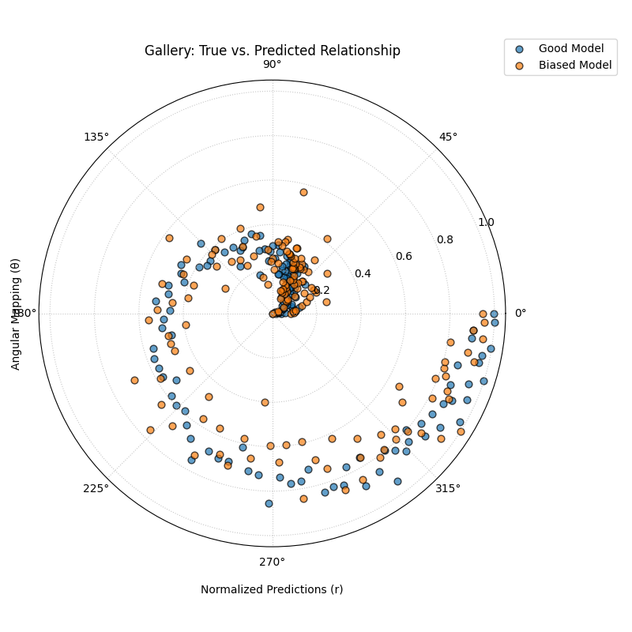
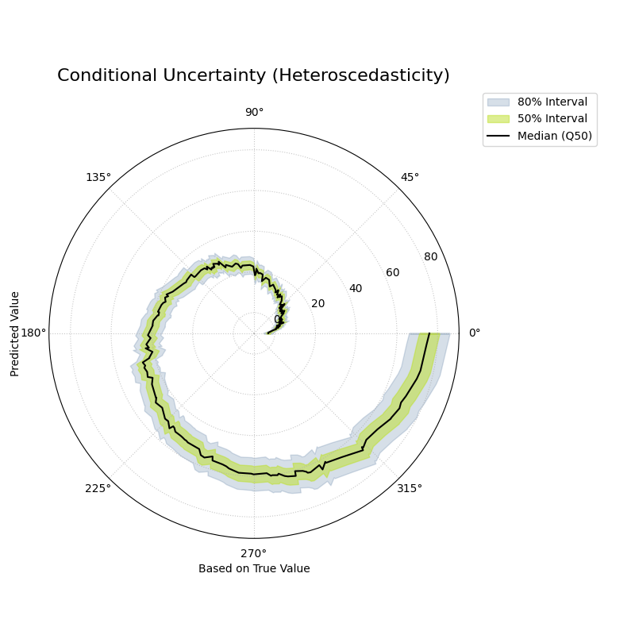
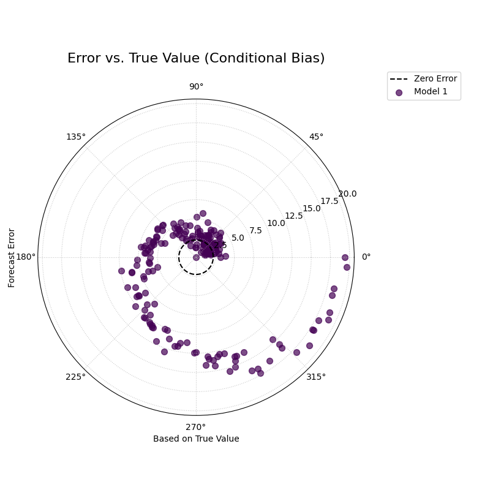
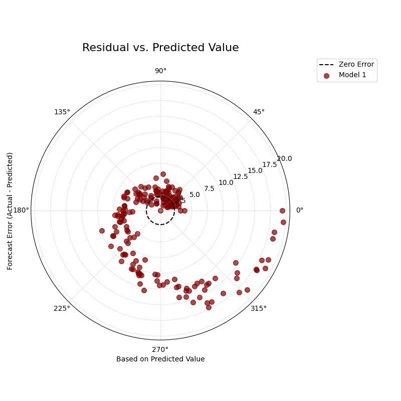

.. _gallery_relationship:

===========================
Relationship Visualization
===========================

This gallery page showcases plots from the ``relationship`` module,
which provide unique polar perspectives on the relationships between
the core components of a forecast: **true values**, **model
predictions**, and **forecast errors**.

These diagnostic plots are designed to reveal complex patterns such as
conditional biases, heteroscedasticity, and non-linear correlations
that are often difficult to see in standard Cartesian plots. This
module is expected to expand with more specialized relationship
diagnostics in the future.

.. note::
   You need to run the code snippets locally to generate the plot
   images referenced below. Ensure the image paths in the
   ``.. image::`` directives match where you save the plots.

.. _gallery_plot_relationship:

----------------------------------
True vs. Predicted Relationship
----------------------------------

Uses :func:`~kdiagram.plot.relationship.plot_relationship` to map
true values to the angular axis and normalized predicted values to the
radial axis. This creates a spiral-like plot that 
reveals the consistency and correlation of model predictions across the entire
range of true values.

.. code-block:: python
   :linenos:

   import kdiagram.plot.relationship as kdr
   import pandas as pd
   import numpy as np
   import matplotlib.pyplot as plt

   # --- Data Generation ---
   np.random.seed(42)
   n_points = 150
   # Create a clear, non-linear true signal
   y_true = np.linspace(0, 10, n_points)**1.5 + np.sin(
       np.linspace(0, 10, n_points)
   ) * 2

   # Model 1: Good fit with some noise
   y_pred1 = y_true + np.random.normal(0, 1.5, n_points)
   # Model 2: Worse fit, under-predicts high values
   y_pred2 = y_true * 0.8 + np.random.normal(0, 2.5, n_points)

   # --- Plotting ---
   kdr.plot_relationship(
       y_true,
       y_pred1,
       y_pred2,
       names=["Good Model", "Biased Model"],
       title="Gallery: True vs. Predicted Relationship",
       theta_scale="proportional",  # Map angle to y_true value
       acov="default",
       s=40,
       # Save the plot (adjust path relative to this file)
       savefig="gallery/images/gallery_plot_relationship.png",
   )
   plt.close()

.. topic:: 🧠 Analysis and Interpretation
   :class: hint

   The **Relationship Plot** offers a novel way to visualize the
   correlation between true values and model predictions, moving beyond
   a standard Cartesian scatter plot.

   **Key Features:**

   * **Angle (θ):** The angular position is directly proportional to the
     **true value** (``y_true``). The plot spirals outwards from the
     lowest true value to the highest.
   * **Radius (r):** The radial distance is the **normalized predicted
     value** (``y_pred``), scaled to the range [0, 1].
   * **Points:** Each point represents a single sample. Different
     colors distinguish between different models.

   **🔍 In this Example:**

   * **Good Model (Blue):** The blue points form a relatively tight,
     consistent spiral. As the angle increases (meaning ``y_true``
     increases), the radius also tends to increase, showing a strong
     positive correlation. The scatter around the spiral path represents
     the prediction noise.
   * **Biased Model (Orange):** The orange points are more scattered and
     form a less defined spiral. Critically, at larger angles (higher
     true values), the orange points are consistently at a smaller
     radius than the blue points, visually demonstrating the model's
     tendency to under-predict high values.

   **💡 When to Use:**

   * To get an intuitive feel for the correlation and consistency of a
     model's predictions across the entire data range.
   * To visually compare the performance of multiple models. A "tighter"
     spiral indicates a better, more consistent model.
   * To identify non-linear biases, where a model might perform well for
     low values but poorly for high values (or vice versa).

   
.. _gallery_plot_conditional_quantiles:

-----------------------------
Conditional Quantile Bands
-----------------------------

Visualizes how the predicted conditional distribution (represented
by quantile bands) changes as a function of the true observed
value. It is a powerful tool for diagnosing heteroscedasticity.

.. code-block:: python
   :linenos:

   import kdiagram as kd
   import pandas as pd
   import numpy as np
   from scipy.stats import norm
   import matplotlib.pyplot as plt

   # --- Data Generation with Heteroscedasticity ---
   np.random.seed(0)
   n_samples = 200
   y_true = np.linspace(0, 20, n_samples)**1.5
   quantiles = np.array([0.1, 0.25, 0.5, 0.75, 0.9])

   # Uncertainty (interval width) increases with the true value
   interval_width = 5 + (y_true / y_true.max()) * 15
   y_preds = np.zeros((n_samples, len(quantiles)))
   y_preds[:, 2] = y_true # Median
   y_preds[:, 1] = y_true - interval_width * 0.25 # Q25
   y_preds[:, 3] = y_true + interval_width * 0.25 # Q75
   y_preds[:, 0] = y_true - interval_width * 0.5  # Q10
   y_preds[:, 4] = y_true + interval_width * 0.5  # Q90

   # --- Plotting ---
   kd.plot_conditional_quantiles(
       y_true,
       y_preds,
       quantiles,
       bands=[80, 50], # Show 80% and 50% intervals
       title="Conditional Uncertainty (Heteroscedasticity)",
       savefig="gallery/images/plot_conditional_quantiles.png"
   )
   plt.close()

.. topic:: 🧠 Analysis and Interpretation
   :class: hint

   The **Conditional Quantile Plot** provides a direct view of a
   model's predicted uncertainty in relation to the true value.

   **Key Features:**

   * **Angle (θ):** Represents the **true value**, spiraling
     outwards from the minimum to the maximum value in the dataset.
   * **Radius (r):** Represents the **predicted value**.
   * **Central Line (Black):** Shows the **median (Q50) forecast**.
     Its alignment with the true value (if it were plotted) would
     show the conditional bias.
   * **Shaded Bands:** Each band represents a prediction interval
     (e.g., the 80% interval between Q10 and Q90). The **width** of
     these bands visualizes the model's uncertainty.

   **🔍 In this Example:**

   * **Heteroscedasticity:** The plot clearly reveals that the model's
     uncertainty is not constant. The shaded bands are very narrow at
     small angles (low true values) and become progressively **wider**
     as the angle increases (high true values). This is a classic
     visual signature of **heteroscedasticity**, where the error
     variance is dependent on the magnitude of the target variable.
   * **Median Forecast:** The central black line shows how the median
     prediction tracks the true value across its range.

   **💡 When to Use:**

   * To diagnose if a model's uncertainty is constant (homoscedastic)
     or if it changes with the magnitude of the target variable
     (heteroscedastic).
   * To visually inspect the full predicted distribution (not just a
     point estimate) across the range of outcomes.
   * To identify if a model is consistently over- or under-confident
     for specific ranges of the true value.

   
.. _gallery_plot_error_relationship:

----------------------------------
Error vs. True Value Relationship
----------------------------------

Visualizes the relationship between the forecast error and the true
observed value. This is a polar version of a classic residual plot,
designed to diagnose conditional biases and heteroscedasticity.

.. code-block:: python
   :linenos:

   import kdiagram as kd
   import pandas as pd
   import numpy as np
   import matplotlib.pyplot as plt

   # --- Data Generation with Conditional Bias ---
   np.random.seed(0)
   n_samples = 200
   y_true = np.linspace(0, 20, n_samples)**1.5
   # Model has a bias that depends on the true value (under-predicts high values)
   bias = -0.1 * y_true
   y_pred = y_true + bias + np.random.normal(0, 2, n_samples)

   # --- Plotting ---
   kd.plot_error_relationship(
       y_true,
       y_pred,
       names=["My Model"],
       title="Error vs. True Value (Conditional Bias)",
       savefig="gallery/images/gallery_error_relationship.png"
   )
   plt.close()

.. topic:: 🧠 Analysis and Interpretation
   :class: hint

   The **Error vs. True Value Plot** provides a powerful diagnostic
   for understanding if a model's errors are correlated with the
   magnitude of the actual outcome.

   **Key Features:**

   * **Angle (θ):** Represents the **true value**, spiraling
     outwards from the minimum to the maximum value.
   * **Radius (r):** Represents the **forecast error**
     (``actual - predicted``). The dashed black circle is the
     "Zero Error" reference line.
   * **Points:** Each point is a single observation. Points outside
     the circle are **under-predictions** (positive error), while
     points inside are **over-predictions** (negative error).

   **🔍 In this Example:**

   * **Conditional Bias:** The plot reveals a clear pattern. For small
     angles (low true values), the points are clustered symmetrically
     around the zero-error line. However, as the angle increases (as
     the true value gets larger), the entire cloud of points drifts
     **outward**, indicating a growing positive error. This is a
     classic sign of **conditional bias**, where the model
     systematically **under-predicts** high values.
   * **Homoscedasticity:** The vertical spread of the points (the
     width of the spiral) remains relatively constant, suggesting
     the variance of the error does not change much with the true
     value (i.e., the errors are homoscedastic).

   **💡 When to Use:**

   * To check the fundamental assumption in many models that errors
     are independent of the true value.
   * To diagnose if a model has a conditional bias (e.g., it only
     performs poorly for high or low values).
   * To visually inspect for heteroscedasticity, where the variance
     of the error changes across the range of true values.

   
.. _gallery_plot_residual_relationship:

------------------------------------
Residual vs. Predicted Relationship
------------------------------------

Visualizes the relationship between the forecast error (residual)
and the predicted value. This is a polar version of a classic
residual plot, designed to diagnose conditional biases and
heteroscedasticity related to the model's own output.

.. code-block:: python
   :linenos:

   import kdiagram as kd
   import pandas as pd
   import numpy as np
   import matplotlib.pyplot as plt

   # --- Data Generation with Heteroscedastic Errors ---
   np.random.seed(0)
   n_samples = 200
   # Predictions follow a non-linear trend
   y_pred = np.linspace(0, 50, n_samples) + np.random.normal(0, 2, n_samples)
   # Error variance increases as the prediction gets larger
   error_variance = (y_pred / y_pred.max())**2 * 10
   errors = np.random.normal(0, np.sqrt(error_variance), n_samples)
   y_true = y_pred + errors

   # --- Plotting ---
   kd.plot_residual_relationship(
       y_true,
       y_pred,
       names=["My Model"],
       title="Residual vs. Predicted Value",
       s=40,
       alpha=0.6,
       savefig="gallery/images/gallery_residual_relationship.png"
   )
   plt.close()

.. topic:: 🧠 Analysis and Interpretation
   :class: hint

   The **Residual vs. Predicted Plot** is a fundamental diagnostic
   for checking if a model's errors are independent of its own
   predictions.

   **Key Features:**

   * **Angle (θ):** Represents the **predicted value**, spiraling
     outwards from the minimum to the maximum prediction.
   * **Radius (r):** Represents the **forecast error**
     (``actual - predicted``). The dashed black circle is the
     "Zero Error" reference line.
   * **Points:** Each point is a single observation. Points outside
     the circle are **under-predictions**, while points inside are
     **over-predictions**.

   **🔍 In this Example:**

   * **Heteroscedasticity:** The plot reveals a clear "cone" or
     "fan" shape. The scatter of the points is very tight at small
     angles (low predicted values) but becomes much wider as the
     angle increases (high predicted values). This is a classic
     sign of **heteroscedasticity**, where the variance of the
     model's error is not constant but grows with the magnitude of
     the forecast.
   * **Bias:** The points are roughly centered on the zero-error
     line across all angles, suggesting the model does not have a
     significant conditional bias related to its predictions.

   **💡 When to Use:**

   * To check if the variance of your model's errors is constant
     (a key assumption for many statistical methods).
   * To diagnose if a model is becoming more or less confident in
     itself as its predictions change.
   * To identify non-linear patterns in the residuals that might
     suggest a missing feature or an incorrect model specification.

.. raw:: html

   
