.. _gallery_spatial:

=================================
Spatial Diagnostic Plots Gallery
=================================

This gallery showcases the complete suite of spatial and polar diagnostic
functions from :mod:`kdiagram.plot.spatial`.  The module bridges the gap
between classical tabular forecast evaluation and geographic insight:
every plot here works with any ``(x, y)`` or ``(longitude, latitude)``
coordinate system — no basemap library required.

The examples are built around a synthetic **land-subsidence monitoring
network** of 120 wells distributed across a coastal urban–peri-urban–rural
gradient (modelled after the Zhongshan, China dataset used in the
k-diagram paper).  Two Gaussian hotspots in the south create elevated
prediction-interval widths and reduced coverage, giving every plot a
non-trivial spatial pattern to reveal.

.. note::

   All code can be run locally.  Save paths in ``savefig=`` must be
   adjusted to your output directory.  Images are referenced from
   ``../images/spatial/`` relative to this file.

.. raw:: html

   

.. _gallery_plot_spatial_scatter:

-------------------------------
Spatial Scatter Plot
-------------------------------

The :func:`~kdiagram.plot.spatial.plot_spatial_scatter` function maps any
numeric metric onto a scatter of geographic coordinates.  It is the
starting point for spatial forecast evaluation: *where* is the model
good, and *where* does it fail?

.. admonition:: Plot Anatomy
   :class: anatomy

   * **Position (x, y):** Geographic or projected coordinates — longitude
     and latitude in the examples below, but any consistent unit works.
   * **Color:** The primary metric encoded on the colormap.  Cold colors
     indicate low values; warm/bright colors indicate high values.
   * **Marker size** (optional): A second numeric column can control bubble
     area, enabling two-dimensional spatial encoding.
   * **Colorbar:** A vertical bar on the right gives the numeric scale.

.. raw:: html

   

**Use Case 1: Where is the anomaly severity highest?**

The simplest and most frequent use is coloring each monitoring station by
a single scalar metric — here the anomaly severity score.  High-severity
clusters immediately reveal geographic regions the model struggles with.

.. code-block:: python
   :linenos:

   import kdiagram as kd
   import numpy as np
   import pandas as pd

   rng = np.random.default_rng(2024)
   N = 120
   # ... (build df with 'lon', 'lat', 'severity' columns)

   ax = kd.plot_spatial_scatter(
       df, "lon", "lat", "severity",
       cmap="hot_r", vmin=0, vmax=4.5,
       s=55, alpha=0.88,
       colorbar_label="Anomaly Severity Score",
       title="Spatial Distribution of Forecast Anomaly Severity (H1)",
       xlabel="Longitude (degrees E)",
       ylabel="Latitude (degrees N)",
   )

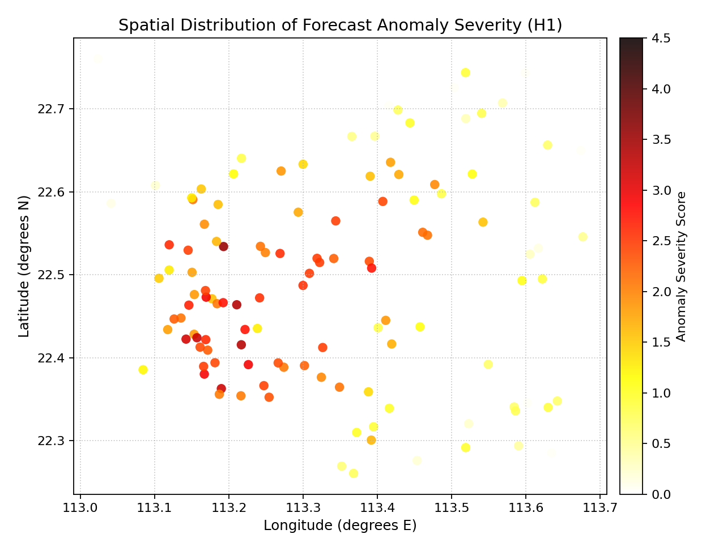

   Hot colors (yellow/white) mark the two high-severity hotspots
   in the southern urban zone.  Northern rural stations are dark
   (low severity).

.. topic:: Analysis and Interpretation
   :class: hint

   The plot immediately reveals **two distinct hotspots** in the south:
   one near (113.20, 22.42) and another at (113.45, 22.52), corresponding
   to the two Gaussian severity peaks injected into the data.  The
   northern peri-urban and rural stations show much lower severity,
   suggesting the model degrades in areas of high urban land-use intensity.
   This spatial concentration would be completely invisible in an aggregate
   coverage score.

.. raw:: html

   

**Use Case 2: Coverage rate and interval width in one view**

By mapping coverage rate to color and interval width to bubble size,
two critical uncertainty dimensions are encoded simultaneously.  A station
with a *small* bubble (narrow interval) and *red* color (low coverage)
is the most dangerous combination — the model is falsely confident.

.. code-block:: python
   :linenos:

   ax = kd.plot_spatial_scatter(
       df, "lon", "lat", "coverage",
       size_col="width_h1",
       size_range=(15, 350),
       cmap="RdYlGn", vmin=0.6, vmax=1.0,
       alpha=0.82, edgecolor="0.3", linewidths=0.4,
       colorbar_label="Empirical Coverage Rate",
       title="Coverage Rate (color) vs Interval Width (size) per Station",
       xlabel="Longitude (degrees E)",
       ylabel="Latitude (degrees N)",
   )

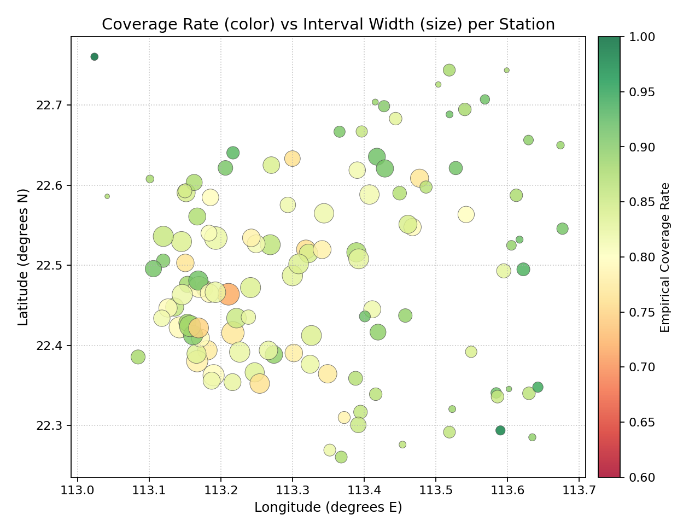

   Large green bubbles (north) = wide intervals with good coverage.
   Small red bubbles (south) = narrow intervals that still under-cover —
   the riskiest calibration profile.

.. topic:: Analysis and Interpretation
   :class: hint

   Southern stations combine **small size** (narrow prediction intervals)
   with **red color** (below-nominal coverage), confirming that the model
   is overconfident in the high-subsidence zone.  Northern stations
   are well-calibrated: wide intervals (large bubbles) with coverage
   rates near or above the 90% nominal (green).  Stations whose bubble
   is *large and red* (over-wide AND under-covering) would indicate a
   different failure mode — the model is simultaneously imprecise and
   unreliable — none appear here, suggesting the failure is one of
   overconfidence, not imprecision.

.. raw:: html

   

.. _gallery_plot_spatial_heatmap:

-------------------------------
Spatial Heatmap
-------------------------------

The :func:`~kdiagram.plot.spatial.plot_spatial_heatmap` function
interpolates the scattered station observations onto a regular 2-D grid
using ``scipy.interpolate.griddata`` and displays the result as a
continuous color surface.  This reveals the spatial *field* underlying
the point measurements, making gradients and transition zones visible.

.. admonition:: Plot Anatomy
   :class: anatomy

   * **Continuous surface:** Interpolated from the scattered point values.
     Regions with dense stations are well-constrained; the surface may
     become less reliable near the edges where stations are sparse.
   * **Scatter overlay:** Optional dots (``scatter_overlay=True``) show the
     exact station locations, helping the reader judge where the surface
     is observation-supported vs. extrapolated.
   * **Iso-contours:** Optional level lines (``contour=True``) draw
     boundaries between equal-metric zones.  Useful for zoning decisions.

.. raw:: html

   

**Use Case 1: Smooth severity field — identifying spatial gradients**

The cubic method produces a smooth, differentiable surface that is ideal
for identifying broad spatial gradients and hotspot boundaries.

.. code-block:: python
   :linenos:

   ax = kd.plot_spatial_heatmap(
       df, "lon", "lat", "severity",
       method="cubic", resolution=250,
       contour=False,
       scatter_overlay=True,
       scatter_s=18, scatter_color="white", scatter_alpha=0.55,
       cmap="hot_r", vmin=0, vmax=4.5,
       colorbar_label="Anomaly Severity Score",
       title="Interpolated Severity Surface (H1) - Cubic Method",
       xlabel="Longitude (degrees E)",
       ylabel="Latitude (degrees N)",
   )

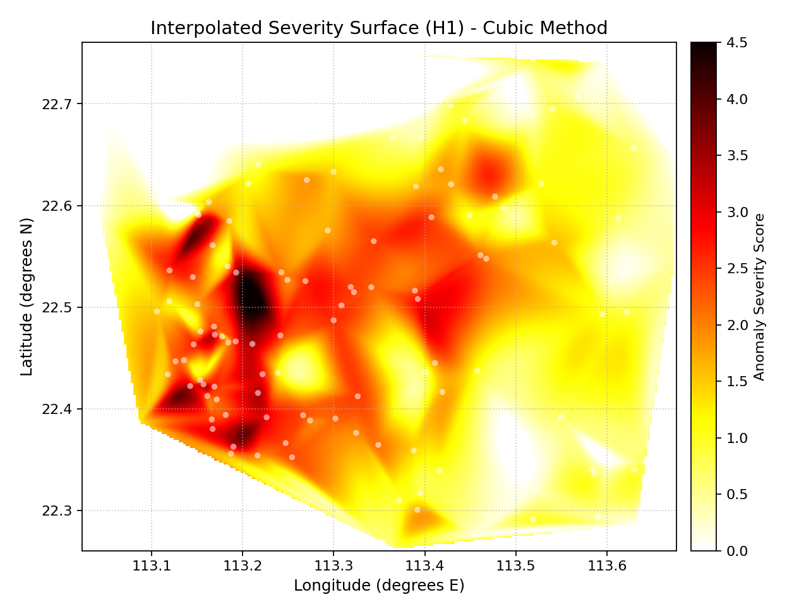

   The cubic surface clearly delineates the two hotspot zones as bright
   islands.  White dots confirm that the surface is well-supported by
   observations throughout the domain.

.. topic:: Analysis and Interpretation
   :class: hint

   The continuous surface makes spatial gradients visible that the scatter
   plot can only imply: the two hotspots show a **smooth peak** (not
   a sharp discontinuity), suggesting the underlying severity is spatially
   autocorrelated — nearby wells share similar model failure profiles.
   The white-dot overlay confirms that the interpolation is well-
   constrained everywhere: there are no large un-observed voids.

.. raw:: html

   

**Use Case 2: Horizon H7 width with iso-contours — zoning for infrastructure**

Iso-contour lines divide the domain into discrete width zones,
directly translating the heatmap into actionable geographic boundaries
(e.g., "Zone A: width > 4 m — elevated monitoring priority").

.. code-block:: python
   :linenos:

   ax = kd.plot_spatial_heatmap(
       df, "lon", "lat", "width_h7",
       method="linear", resolution=220,
       contour=True, contour_levels=7,
       contour_color="white", contour_linewidth=0.9,
       scatter_overlay=True, scatter_s=12,
       cmap="plasma", vmin=0, vmax=6,
       colorbar_label="Interval Width H7 (m)",
       title="H7 Interval Width Surface with Iso-Contours",
       xlabel="Longitude (degrees E)",
       ylabel="Latitude (degrees N)",
   )

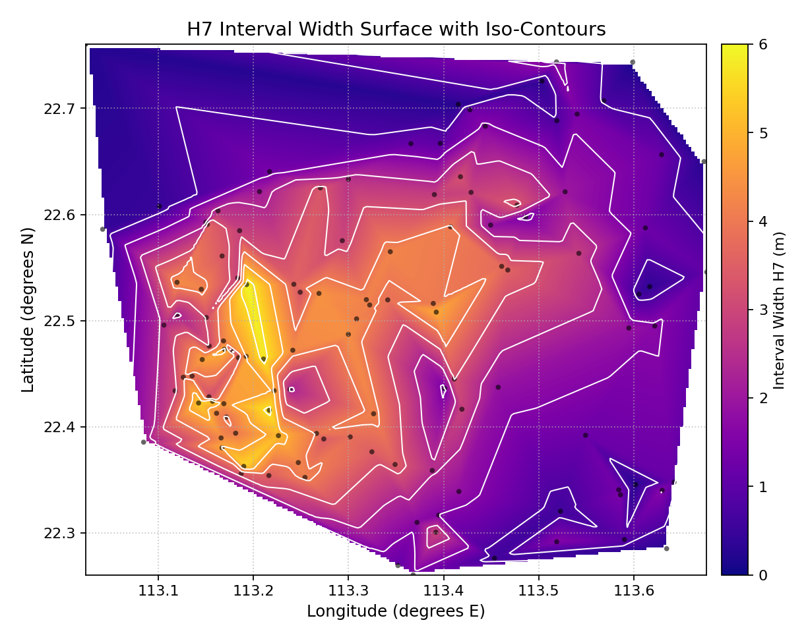

   Plasma colormap + white contour lines divide the domain into
   7 uncertainty bands.  The innermost bright zone marks the
   highest-uncertainty core.

.. topic:: Analysis and Interpretation
   :class: hint

   With seven contour levels the heatmap becomes a **risk-zone map**:
   a decision-maker can immediately identify which stations fall inside
   the highest-uncertainty envelope (bright yellow core) vs. the
   low-uncertainty periphery (dark purple).  The contour spacing is
   also informative — closely-spaced contours in the north indicate
   a steep transition from low to moderate uncertainty, while the
   well-spaced contours around the southern hotspot show a more gradual
   gradient.  The H7 surface is notably broader and brighter than H1,
   confirming that forecast uncertainty grows with horizon across the
   entire domain.

.. raw:: html

   

.. _gallery_plot_spatial_uncertainty:

-------------------------------
Spatial Uncertainty Map
-------------------------------

The :func:`~kdiagram.plot.spatial.plot_spatial_uncertainty` function
aggregates multiple time steps per station and produces a *bubble map*
that simultaneously shows two key uncertainty diagnostics:

* **Bubble size** — the mean prediction-interval width at that location.
* **Bubble color** — the deviation of the empirical coverage rate from
  the nominal level (e.g., 90%).

.. admonition:: Plot Anatomy
   :class: anatomy

   * **Large bubbles** → wide prediction intervals (high uncertainty).
   * **Small bubbles** → narrow intervals (high sharpness — but also high
     risk if coverage is low).
   * **Blue/cool color** → over-coverage (intervals too wide for the nominal
     level; conservative model).
   * **Red/warm color** → under-coverage (intervals too narrow; the model
     is overconfident at this station).
   * **White/neutral color** → coverage close to the nominal level
     (well-calibrated).

.. raw:: html

   

**Use Case 1: Global uncertainty overview — width vs. coverage deviation**

This is the most informative single-plot summary of a probabilistic
forecast evaluated over a spatial network.

.. code-block:: python
   :linenos:

   # df_ts: long-format DataFrame with one row per (station, timestep)
   ax = kd.plot_spatial_uncertainty(
       df_ts, "lon", "lat", "actual", "q10", "q90",
       nominal=0.90,
       cmap="RdBu_r",
       size_range=(20, 450),
       alpha=0.83,
       title="Uncertainty Map: Width (size) vs Coverage Deviation (color)",
       xlabel="Longitude (degrees E)",
       ylabel="Latitude (degrees N)",
   )

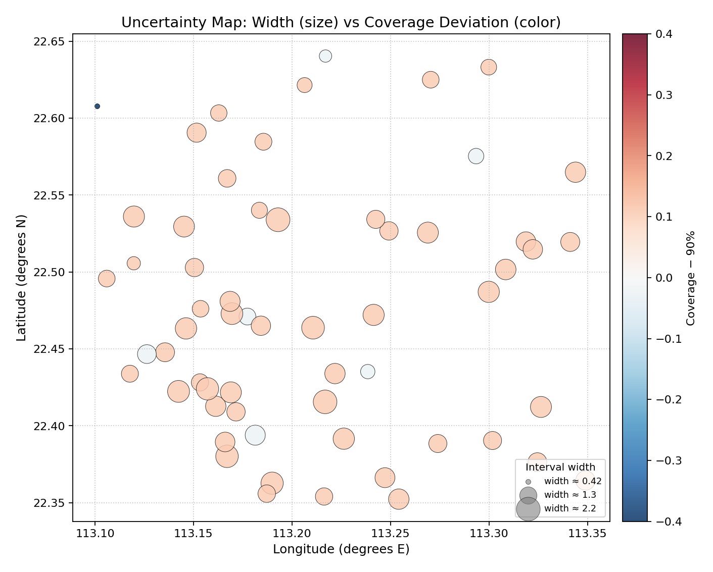

   Red = under-coverage (overconfident station); blue = over-coverage
   (conservative); large bubble = wide interval.  Southern stations
   are red and have small-to-medium bubbles — the dangerous
   overconfident cluster.

.. topic:: Analysis and Interpretation
   :class: hint

   The ideal station would have **white color** (correct coverage) and
   **moderate size** (reasonable sharpness).  The southern cluster shows
   **red + small-to-medium bubbles** — the model is overconfident: the
   intervals are narrow *and* still fail to cover the true value at the
   nominal rate.  Northern stations are closer to white/blue, indicating
   conservative but well-calibrated forecasts.  This plot answers in one
   glance: "Is the calibration failure geographic, and does it coincide
   with the model being sharp or wide?"

.. raw:: html

   

**Use Case 2: Diagnosing a southern under-coverage hotspot**

By amplifying the coverage deficit in southern stations, the plot
isolates the overconfident cluster and makes the geographic boundary
of the failure zone clearly visible.

.. code-block:: python
   :linenos:

   # Tighten intervals for southern stations to amplify the hotspot
   df_ts3 = df_ts.copy()
   south_mask = df_ts3["lat"] < 22.50
   df_ts3.loc[south_mask, "q90"] -= 0.5   # shrink upper bound

   ax = kd.plot_spatial_uncertainty(
       df_ts3, "lon", "lat", "actual", "q10", "q90",
       nominal=0.90,
       cmap="coolwarm",
       size_range=(25, 500),
       alpha=0.80,
       title="Southern Hotspot: Under-Coverage Cluster Revealed",
       xlabel="Longitude (degrees E)",
       ylabel="Latitude (degrees N)",
   )

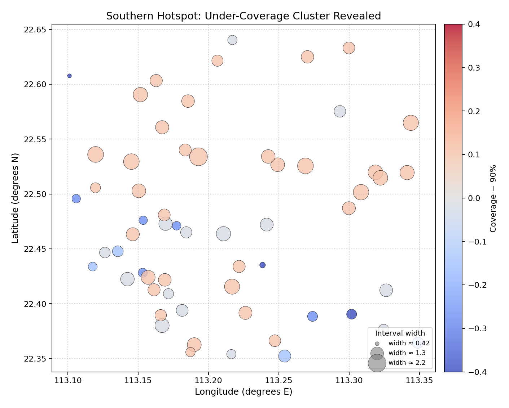

   The southern under-coverage cluster is now clearly separated
   (red, small) from the northern over-coverage zone (blue, larger).
   The transition zone in the middle is visible as white stations.

.. topic:: Analysis and Interpretation
   :class: hint

   The **coolwarm diverging colormap** centered at zero coverage deviation
   makes the geographic split immediately legible: a crisp north–south
   boundary near latitude 22.50 separates the overconfident red south
   from the conservative blue north.  A risk-management team could use
   this boundary to define different monitoring protocols for each zone.

.. raw:: html

   

.. _gallery_plot_spatial_coverage:

-------------------------------
Spatial Coverage Map
-------------------------------

The :func:`~kdiagram.plot.spatial.plot_spatial_coverage` function maps
**pre-computed coverage rates** (one value per station, already
aggregated externally) onto a scatter using a diverging colormap centered
on the nominal level.  An optional tolerance parameter flags stations that
exceed an acceptable deviation with a star marker.

.. admonition:: Plot Anatomy
   :class: anatomy

   * **Color (diverging):** Blue = above-nominal coverage (conservative
     model); red = below-nominal (overconfident); white = exactly nominal.
   * **Star overlay** (``annotate=True``):** Stations outside the
     tolerance band are additionally marked with a star to draw attention.
   * **Colorbar:** Centered on the nominal level; the color scale spans
     deviations in both directions.

.. raw:: html

   

**Use Case 1: Network-wide coverage audit against the 90% nominal**

A single map reveals which stations the model fails to cover at the
contracted reliability level and by how much.

.. code-block:: python
   :linenos:

   ax = kd.plot_spatial_coverage(
       df, "lon", "lat", "coverage",
       nominal=0.90,
       cmap="RdBu",
       s=70, alpha=0.88,
       title="Coverage Rate Deviation from 90% Nominal",
       xlabel="Longitude (degrees E)",
       ylabel="Latitude (degrees N)",
   )

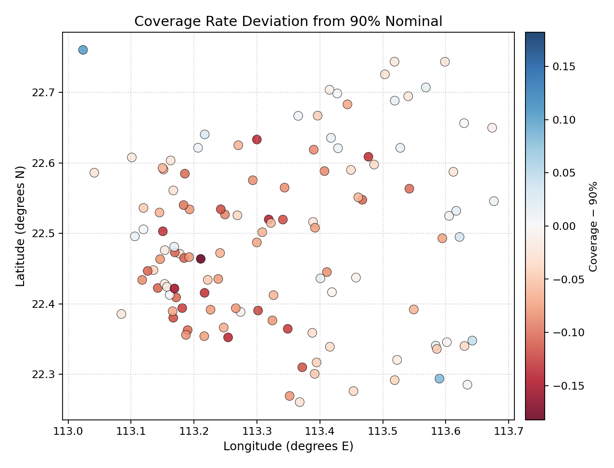

   Red stations (south) are under-covered; blue stations (north)
   are over-covered.  The white band in the middle marks the
   well-calibrated transition zone.

.. topic:: Analysis and Interpretation
   :class: hint

   The diverging colormap centered on 90% makes deviations in *both*
   directions equally legible.  The southern cluster is strongly red,
   indicating systematic under-coverage (the model is overconfident
   in the high-severity zone).  The northern rural stations lean blue
   (slightly over-conservative), but remain close to the nominal.
   No station is perfectly white, confirming that perfect spatial
   calibration is rarely achieved in practice.

.. raw:: html

   

**Use Case 2: Flagging stations that violate a contractual tolerance**

In operational settings a ±8% tolerance is often contractually defined.
Setting ``tol=0.08`` adds a star marker to every station outside this
band, making compliance audits immediate.

.. code-block:: python
   :linenos:

   ax = kd.plot_spatial_coverage(
       df, "lon", "lat", "cov_xtft",   # XTFT model coverage
       nominal=0.90, tol=0.08,
       cmap="RdBu",
       s=65, alpha=0.85,
       annotate=True,
       title="XTFT Coverage: Stations Outside +-8% Tolerance Flagged",
       xlabel="Longitude (degrees E)",
       ylabel="Latitude (degrees N)",
   )

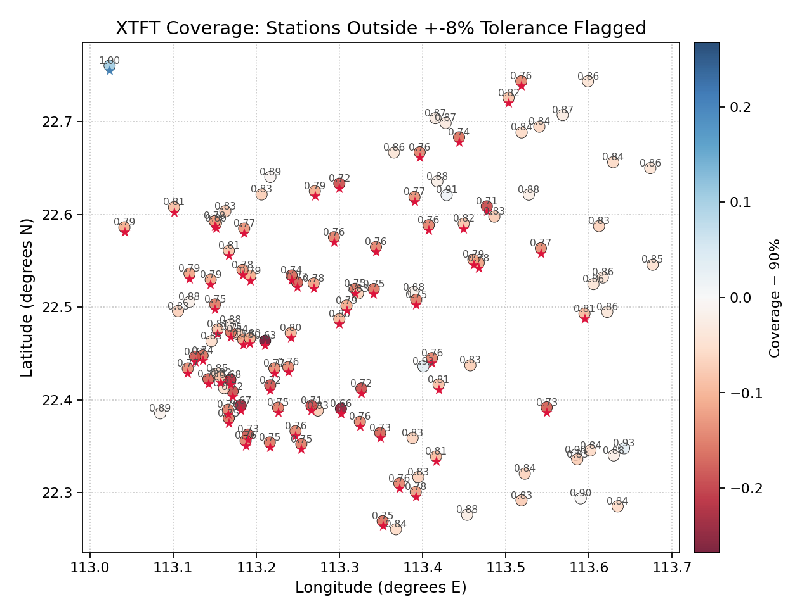

   Star markers identify the XTFT stations that violate the
   +-8% tolerance.  The stars cluster in the south, confirming
   that the coverage failures are geographically concentrated.

.. topic:: Analysis and Interpretation
   :class: hint

   The ``annotate=True`` flag immediately highlights **which stations
   require action**: those with stars must either have their prediction
   intervals recalibrated or be flagged for manual review.  The
   geographic concentration of flagged stations (south) directs the
   recalibration effort precisely — rather than retraining the entire
   model, a spatially-adaptive post-processing step targeting the
   southern zone may be sufficient.

.. raw:: html

   

.. _gallery_plot_spatial_comparison:

-------------------------------
Multi-Model Spatial Comparison
-------------------------------

The :func:`~kdiagram.plot.spatial.plot_spatial_comparison` function
produces an N-panel grid, one panel per model or condition, all on a
**shared color scale**.  It is the standard way to answer: "Which model
has the lowest interval width everywhere?  Are the improvements
geographically uniform?"

.. admonition:: Plot Anatomy
   :class: anatomy

   * **Panel grid:** One panel per model/condition.  Layout controlled by
     ``ncols``.
   * **Shared colorbar:** A single colorbar (right-most column) applies
     to all panels when ``shared_scale=True``, making cross-panel
     comparisons rigorous.
   * **Panel titles:** Derived from the ``names`` list or the raw column
     name if not provided.

.. raw:: html

   

**Use Case 1: Three-model H1 interval width comparison**

Side-by-side maps answer at a glance: "Which model produces the narrowest
prediction intervals, and is the improvement geographically uniform?"

.. code-block:: python
   :linenos:

   axes = kd.plot_spatial_comparison(
       df, "lon", "lat",
       metric_cols=["width_qar", "width_qgbm", "width_xtft"],
       names=["QAR", "QGBM", "XTFT"],
       ncols=3, shared_scale=True,
       cmap="plasma", s=45, alpha=0.85,
       colorbar_label="Interval Width H1 (m)",
   )

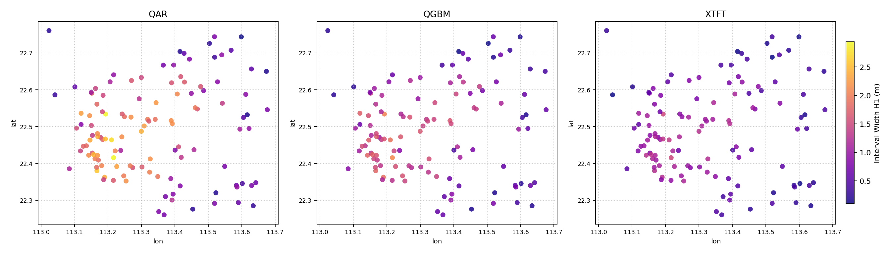

   Left to right: QAR (wide, high coverage), QGBM (balanced),
   XTFT (narrow, sharp).  The hotspot geometry is identical across
   all three models, but the color intensity scales down from left
   to right, confirming XTFT is consistently sharper.

.. topic:: Analysis and Interpretation
   :class: hint

   All three panels share the same hotspot geometry in the south,
   confirming that the geographic challenge is model-agnostic —
   these wells are hard to forecast for any model.  But the
   **color intensity drops systematically** from QAR → QGBM → XTFT,
   proving that XTFT achieves uniformly sharper intervals
   without introducing new geographic biases.  A model that achieved
   sharpness gains only in the north (easy zone) while remaining
   wide in the south would show a different pattern.

.. raw:: html

   

**Use Case 2: Horizon evolution — does uncertainty grow uniformly?**

Using ``metric_cols`` as a list of horizon columns reveals whether the
model's uncertainty growth is spatially uniform or concentrated in
specific areas.

.. code-block:: python
   :linenos:

   axes = kd.plot_spatial_comparison(
       df, "lon", "lat",
       metric_cols=["width_h1", "width_h3", "width_h5", "width_h7"],
       names=["H1", "H3", "H5", "H7"],
       ncols=2, shared_scale=True,
       cmap="viridis", s=40, alpha=0.85,
       colorbar_label="Interval Width (m)",
   )

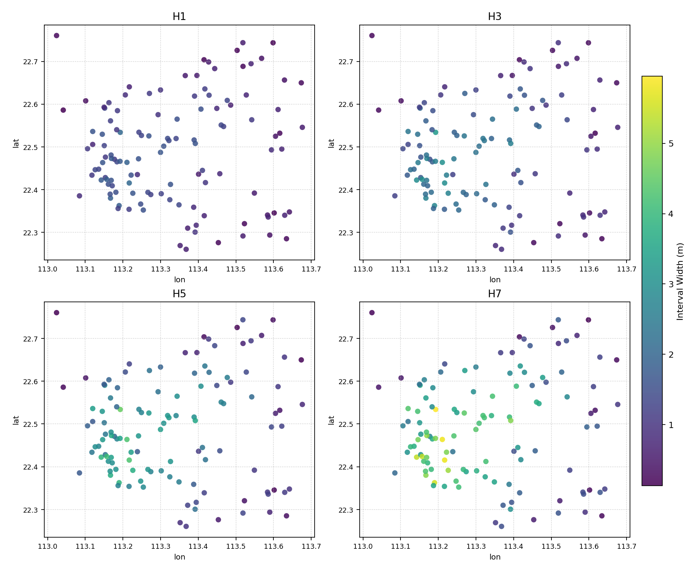

   Top row: H1 (narrow) and H3; bottom: H5 and H7 (wide).
   The southern hotspot grows brighter with horizon, showing that
   uncertainty amplifies most in the already-difficult zone.

.. topic:: Analysis and Interpretation
   :class: hint

   The four panels tell a complete uncertainty story.  At H1 the
   domain is mostly dark (narrow intervals) with only a faint hotspot
   in the south.  By H7 the southern hotspot dominates — the brighter
   colors confirm that **uncertainty growth is spatially non-uniform**:
   it amplifies fastest in the already-difficult zone.  A spatially
   uniform uncertainty growth would produce panels where all regions
   brighten proportionally; instead the south brightens faster,
   signalling a geographic interaction between forecast horizon and
   model accuracy.

.. raw:: html

   

.. _gallery_plot_spatial_ordering:

-------------------------------
Geographic Ordering Map
-------------------------------

The :func:`~kdiagram.plot.spatial.plot_spatial_ordering` function renders
the **site ordering** that underpins the polar diagnostics.  Sites are
ranked 0 → N−1 by a geographic criterion (latitude, longitude, or any
custom column) and color-coded by that rank.  Optional arrows trace the
traversal path so the reader can follow the ordering across the domain.

This plot is the **key** to reading the polar hedgehog diagrams: it
answers the question "which geographic location corresponds to which
polar angle?"

.. admonition:: Plot Anatomy
   :class: anatomy

   * **Color (sequential):** Encodes rank — dark = first site (rank 0),
     bright = last site (rank N−1).
   * **Arrows:** Connect consecutive sites in rank order.  Arrow density
     is controlled by ``arrow_step`` (default N//15).
   * **Annotations:** The ``label_sites`` list marks a subset of sites
     with their 1-based rank number, giving the polar plots a look-up key.

.. raw:: html

   

**Use Case 1: South-to-north ordering by latitude**

The default ordering traverses the domain from the southernmost station
(rank 0, polar angle ~0°) to the northernmost (rank N−1, polar angle
~360°).

.. code-block:: python
   :linenos:

   ax = kd.plot_spatial_ordering(
       df, "lon", "lat",
       order_by="lat", order_ascending=True,
       show_arrows=True, arrow_step=8,
       label_sites=[0, 29, 59, 89, 119],
       colorbar_label="Site order (0 = southernmost)",
       title="Geographic Domain: Site Ordering (South to North)",
       xlabel="Longitude (degrees E)",
       ylabel="Latitude (degrees N)",
   )

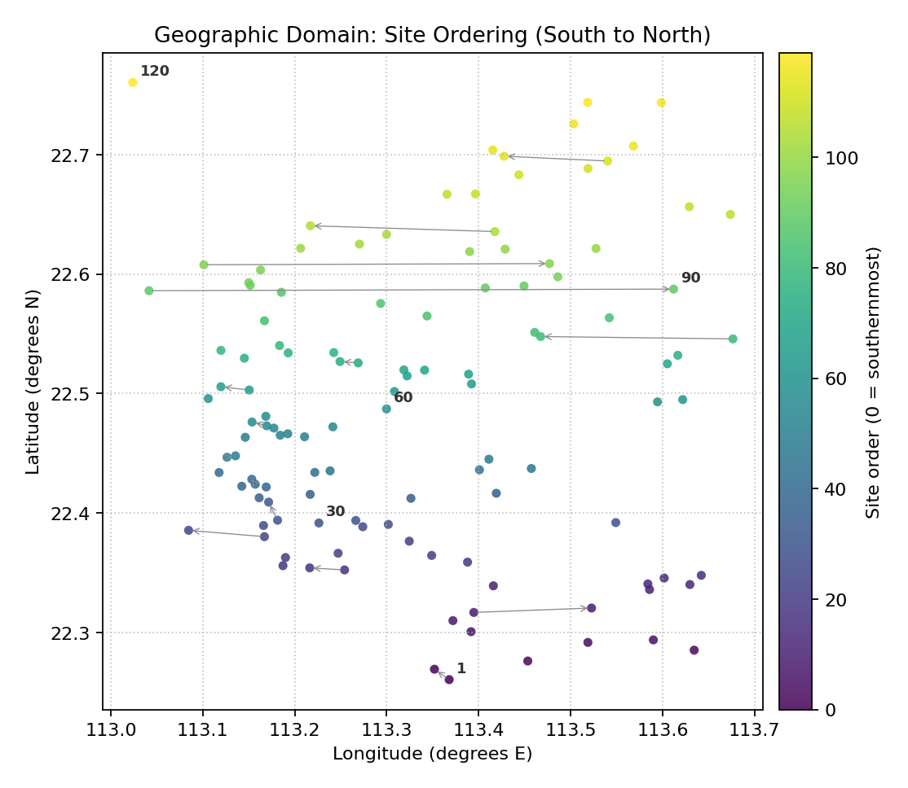

   Dark (low rank) stations are southernmost; bright (high rank)
   are northernmost.  Arrows trace the monotonic south-to-north
   traversal.  Labeled stations 1, 30, 60, 90, 120 map to
   polar angles 0, pi/2, pi, 3*pi/2, 2*pi respectively.

.. topic:: Analysis and Interpretation
   :class: hint

   A smooth color gradient from south to north confirms that the ordering
   faithfully captures the latitudinal structure of the network.  Any
   **color jump** (a dark station embedded in a bright cluster) would
   indicate a station that is geographically isolated from its ranked
   neighbors — worth noting when interpreting gaps in the polar hedgehog.
   The labeled sites provide the exact polar-angle look-up for the
   hedgehog diagrams: station 60 (rank 59) maps to polar angle
   :math:`\approx \pi` (the left side of the hedgehog circle).

.. raw:: html

   

**Use Case 2: West-to-east ordering by longitude**

Switching to ``order_by="lon"`` redefines the polar angle assignment
and produces a completely different polar diagnostic — useful for
comparing the structure of the metric in the two orthogonal spatial
directions.

.. code-block:: python
   :linenos:

   ax = kd.plot_spatial_ordering(
       df, "lon", "lat",
       order_by="lon", order_ascending=True,
       show_arrows=True, arrow_step=8,
       cmap="plasma",
       label_sites=[0, 39, 79, 119],
       colorbar_label="Site order (0 = westernmost)",
       title="Geographic Domain: Site Ordering (West to East)",
       xlabel="Longitude (degrees E)",
       ylabel="Latitude (degrees N)",
   )

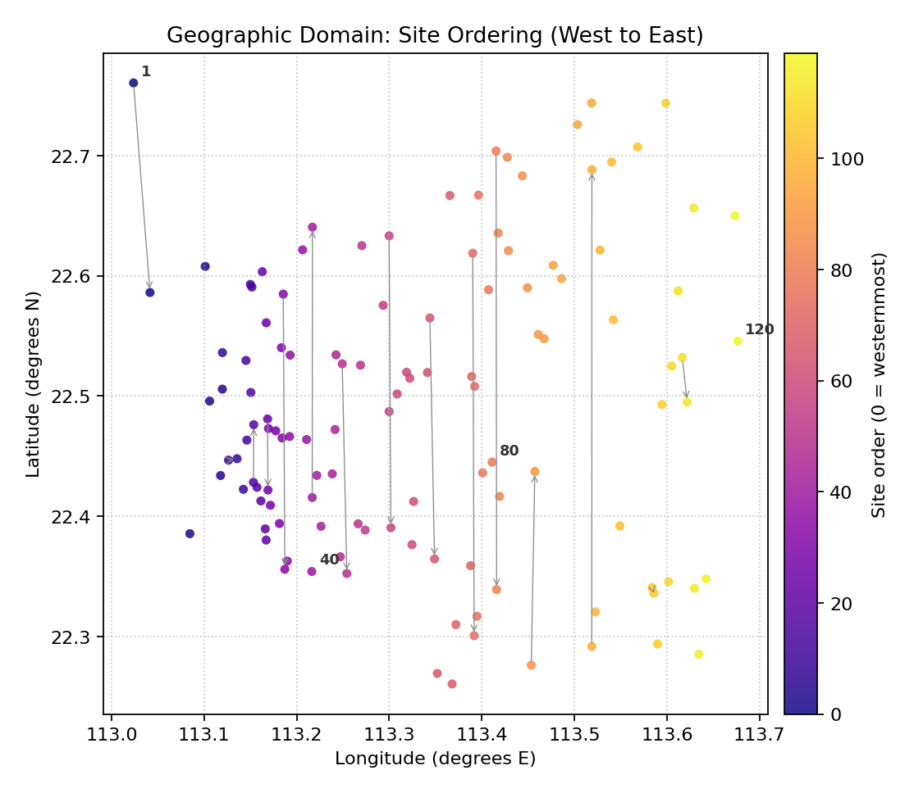

   Plasma colormap; dark = west, bright = east.  Arrows cross
   latitude bands, producing a zigzag traversal rather than the
   monotonic sweep seen in the latitude ordering.

.. topic:: Analysis and Interpretation
   :class: hint

   With longitude ordering the arrows **cross latitude bands**,
   indicating that the traversal zigzags across the domain.  This
   matters for the polar diagnostic: in the latitude-ordered hedgehog
   adjacent spikes correspond to geographically adjacent sites; in the
   longitude-ordered hedgehog adjacent spikes may be far apart
   in latitude.  Comparing the two hedgehogs helps distinguish whether
   a metric cluster is primarily a north–south phenomenon or an
   east–west one.

.. raw:: html

   

.. _gallery_plot_polar_from_spatial:

-----------------------------------
Polar Hedgehog Diagnostic
-----------------------------------

The :func:`~kdiagram.plot.spatial.plot_polar_from_spatial` function is
the **central visualization** of the spatial-polar framework.  Each site
is represented as a radial spike (needle) on a polar plot:

* **Angle** (:math:`\theta_i = 2\pi i / N`) encodes the geographic rank.
* **Radius** encodes the metric value at that site.

Long spikes mark high-metric sites; the angular position tells you
*where* those sites are in the ordering, and by consulting the companion
:ref:`ordering map <gallery_plot_spatial_ordering>` you know *where*
they are geographically.

A second mode (**ring mode**, via ``horizon_cols``) places concentric
rings for multiple horizons or conditions, enabling simultaneous
comparison across the full ordering spectrum.

.. admonition:: Plot Anatomy
   :class: anatomy

   * **Spike angle:** Geographic rank → polar angle.  North (top) = rank 0
     (first site); the angle increases clockwise by default.
   * **Spike length (radius):** Metric value.  Longer = higher metric.
   * **Spike color** (single-horizon): A second column, or the metric
     itself, drives the colormap.
   * **Reference rings:** Faint dashed circles at regular radii help
     read absolute metric values.
   * **Ring labels** (ring mode): The label for each concentric ring is
     placed at a fixed angle for quick identification.

.. raw:: html

   

**Use Case 1: Severity hedgehog — where is the model worst?**

This is the primary use: a compact 360° summary of how severity is
distributed across the ordered sites.  A cluster of long spikes in one
angular arc reveals a geographic concentration of forecast failures.

.. code-block:: python
   :linenos:

   ax = kd.plot_polar_from_spatial(
       df, "lon", "lat", "severity",
       order_by="lat",
       cmap="hot_r",
       n_ring_labels=4,
       colorbar_label="Anomaly Severity Score",
       title="Polar Diagnostic: Severity Distribution Across Ordered Sites",
   )

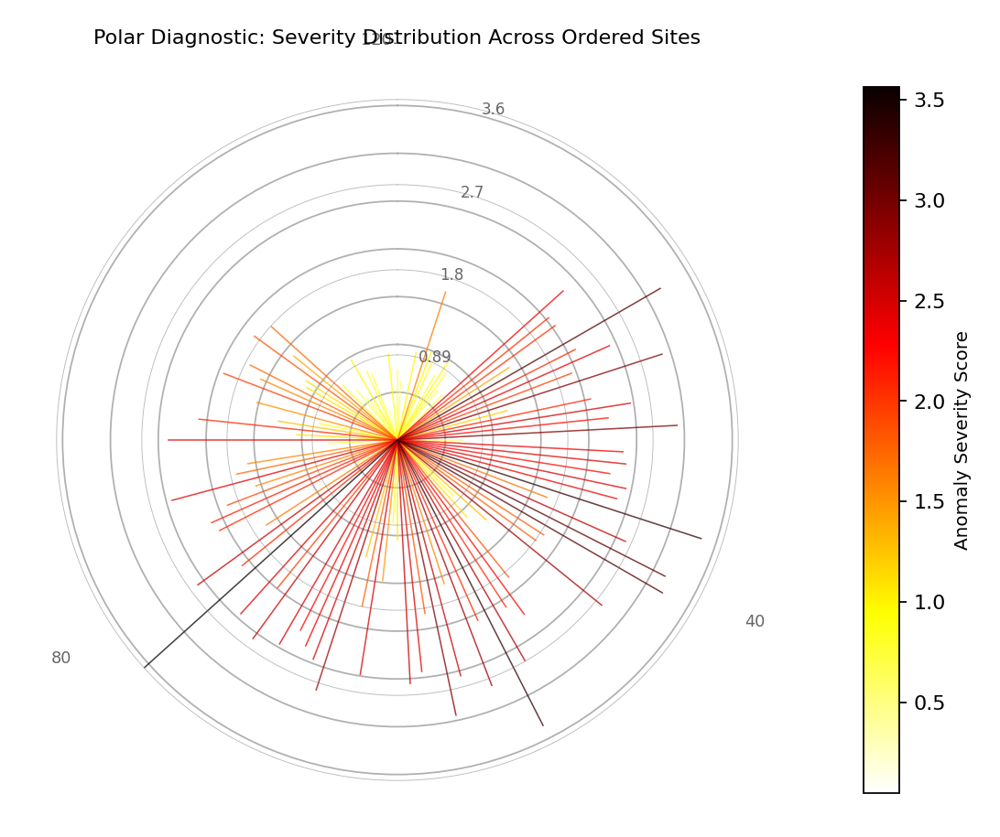

   Long, bright spikes in the lower arc (ranks 0-40, southern sites)
   confirm that severity is concentrated in the south.  Northern
   sites (top arc) have short, dark spikes — the model performs well
   there.

.. topic:: Analysis and Interpretation
   :class: hint

   With latitude ordering, ranks 0-40 map to the **lower half** of the
   polar circle (angles 0 to ~120°).  The concentration of long bright
   spikes in that angular region directly confirms the southern severity
   hotspot seen in the scatter map.  The pattern is **not symmetric**
   around the circle — a symmetric hedgehog would indicate spatially
   uniform severity.  The visible arc-length of the long-spike cluster
   also tells you its geographic extent: an arc spanning ~90° means
   the hotspot covers roughly 25% of the stations.

.. raw:: html

   

**Use Case 2: Multi-horizon ring encoding H1 → H7**

By passing ``horizon_cols`` the function switches to **ring mode**:
each ring corresponds to one forecast horizon, stacked outward from the
center.  This allows the evolution of uncertainty with horizon to be
read at every site simultaneously.

.. code-block:: python
   :linenos:

   ax = kd.plot_polar_from_spatial(
       df, "lon", "lat", "width_h1",
       horizon_cols=["width_h3", "width_h5", "width_h7"],
       horizon_labels=["H1", "H3", "H5", "H7"],
       horizon_colors=["#4393c3", "#f4a582", "#d6604d", "#a50026"],
       order_by="lat",
       title="Multi-Horizon Ring: Uncertainty Growth from H1 (inner) to H7 (outer)",
   )

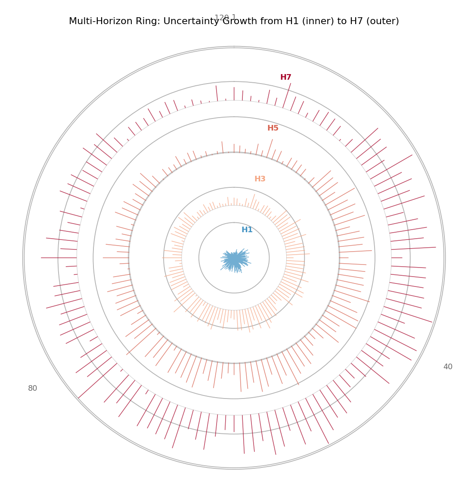

   Four concentric rings: H1 (innermost blue) to H7 (outermost red).
   The southern arc shows the largest radial growth from H1 to H7 —
   uncertainty amplifies most where the model is already weakest.

.. topic:: Analysis and Interpretation
   :class: hint

   Reading this diagram at a single angle (site) traces the
   *horizon profile* of uncertainty for that location.  Sites in the
   southern arc show large radial growth: the H7 spike extends much
   further than the H1 spike, indicating **rapidly growing uncertainty
   with horizon**.  Northern sites show smaller, more uniform rings —
   the uncertainty still grows, but proportionally less.  This
   confirms a spatially non-uniform horizon sensitivity:
   long-horizon forecasts are especially unreliable in the
   high-severity zone.

.. raw:: html

   

**Use Case 3: Decoupled color and radius — severity on width spikes**

Setting ``color_col`` to a different column from ``metric_col`` encodes
two independent spatial patterns on the same hedgehog: spike *length*
shows one metric (interval width) while spike *color* shows another
(anomaly severity).

.. code-block:: python
   :linenos:

   ax = kd.plot_polar_from_spatial(
       df, "lon", "lat", "width_h1",
       color_col="severity",         # severity drives color
       order_by="lat",
       cmap="RdYlGn_r",
       colorbar_label="Anomaly Severity (color)",
       title="Polar Diagnostic: Width (radius) vs Severity (color)",
   )

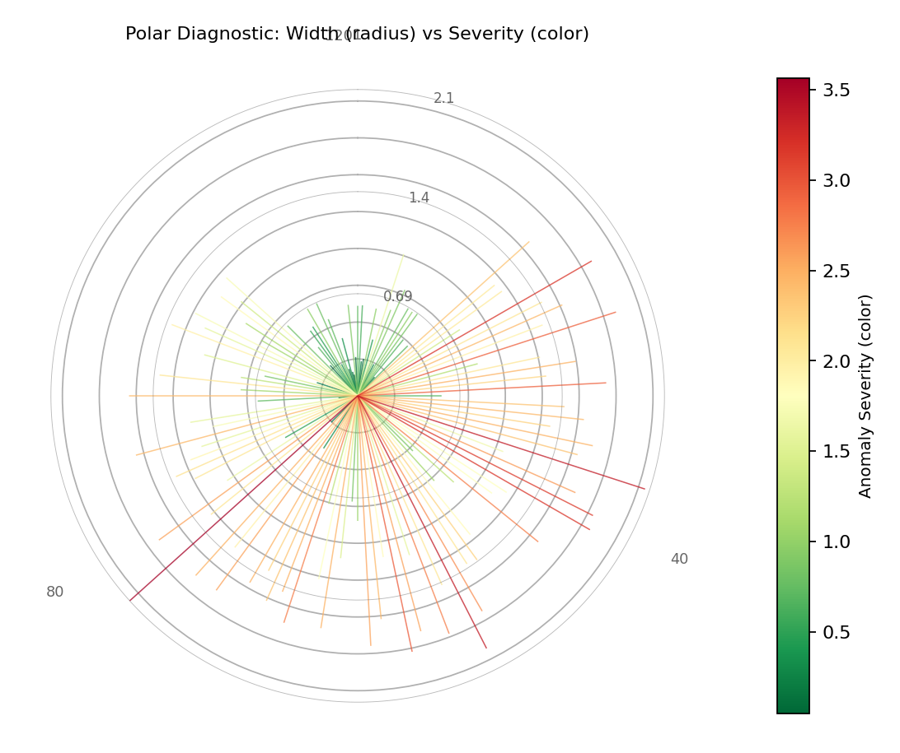

   Long AND bright (red) spikes mark the most problematic sites:
   wide prediction intervals AND high severity.  Long but green spikes
   indicate wide but well-placed intervals.

.. topic:: Analysis and Interpretation
   :class: hint

   This dual-encoding hedgehog reveals four quadrants of model
   behavior at once.  **Long + red** spikes (south): the model produces
   wide intervals that still fail to contain the true value — the worst
   outcome.  **Short + green** spikes (north): narrow intervals that
   remain well-covered — the ideal outcome.  **Long + green** or
   **short + red** spikes indicate intermediate cases.  The fact that
   most long spikes are also red (south) confirms that the calibration
   failure is strongly correlated with the model's overconfidence in
   the high-severity zone.

.. raw:: html

   

.. _gallery_plot_paired_spatial_polar:

-----------------------------------
Paired Spatial + Polar Diagnostic
-----------------------------------

The :func:`~kdiagram.plot.spatial.plot_paired_spatial_polar` function
creates the **two-panel composite** that is the signature figure of the
k-diagram spatial-polar framework.  It directly reproduces the paired
(a)+(b) and (c)+(d) panel layouts of the paper's Figures 2 and 5:

* **Left panel:** Geographic scatter map colored by the metric.
* **Right panel:** Polar hedgehog diagnostic with the same metric and
  colormap.

Both panels share the same colormap, making the correspondence between
geographic location and polar angle immediately readable.

.. admonition:: Plot Anatomy
   :class: anatomy

   * **Left — geographic map:** Color = metric value.  Optional site
     labels (``map_label_sites``) and ordering arrows allow the reader
     to trace polar angle back to geography.
   * **Right — hedgehog:** Angle = latitude rank; radius = metric.
     Site labels at the circle perimeter (``label_n_sites``) cross-
     reference the map labels.
   * **Shared colorbar:** One colorbar on the map panel applies to both.

.. raw:: html

   

**Use Case 1: Single-horizon H1 paired view (replicates paper Fig 2)**

The canonical paired view for a single forecast horizon.  Three sites
are annotated on the map so the reader can locate them in the polar
diagnostic by their polar angle.

.. code-block:: python
   :linenos:

   axes = kd.plot_paired_spatial_polar(
       df, "lon", "lat", "width_h1",
       order_by="lat",
       cmap="YlOrRd",
       colorbar_label="Interval Width H1 (m)",
       map_label_sites={0: "S1", 59: "S2", 119: "S3"},
       title="Paired View: H1 Interval Width (map + polar diagnostic)",
       figsize=(13, 6),
   )

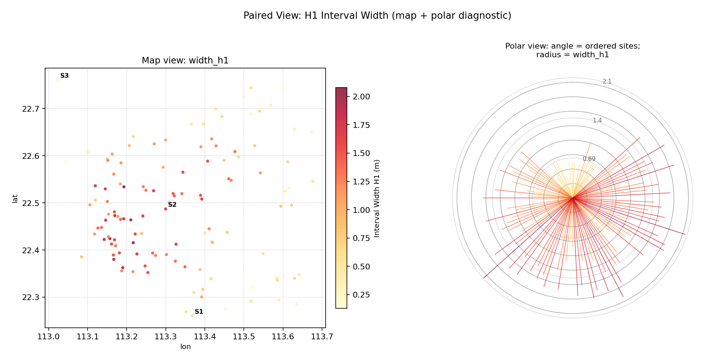

   Left: scatter map of H1 width.  Right: polar hedgehog.  Site S1
   (southernmost, rank 0) maps to the top of the polar circle; S3
   (northernmost, rank 119) maps to just before the top after a full
   revolution.  Long red spikes in the south confirm the hotspot.

.. topic:: Analysis and Interpretation
   :class: hint

   Reading both panels together:

   1. **Find a cluster** in the map (e.g., the red-orange stations in the
      south-west near 113.20, 22.42).
   2. **Identify their latitude ranks** — roughly ranks 0–30, placing them
      at polar angles 0°–90° (top-right arc of the circle).
   3. **Locate those angles** in the hedgehog — the 0°–90° arc shows the
      longest, brightest spikes, confirming the map cluster.

   This two-step reading is more powerful than either panel alone: the
   map shows *where*, the hedgehog shows *how severe* and *what fraction*
   of all sites share that profile.

.. raw:: html

   

**Use Case 2: Multi-horizon paired view (replicates paper Fig 5)**

Activating ``horizon_cols`` in the paired view places concentric
rings in the polar panel while keeping the geographic scatter as the
companion reference.

.. code-block:: python
   :linenos:

   axes = kd.plot_paired_spatial_polar(
       df, "lon", "lat", "width_h1",
       horizon_cols=["width_h3", "width_h5", "width_h7"],
       horizon_labels=["H1", "H3", "H5", "H7"],
       horizon_colors=["#4393c3", "#f4a582", "#d6604d", "#a50026"],
       order_by="lat",
       cmap="viridis",
       title="Multi-Horizon Paired View (H1 inner ring to H7 outer ring)",
       figsize=(13, 6),
   )

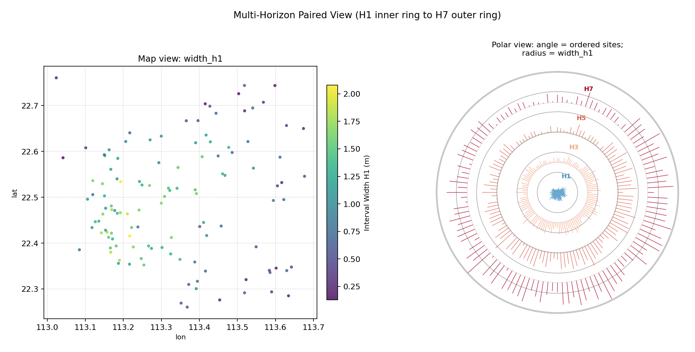

   The polar panel shows four concentric rings (H1 blue inner to H7
   red outer).  Southern sites show dramatic outward ring growth;
   northern sites have thin, uniform rings.  The map confirms which
   geographic cluster is responsible.

.. topic:: Analysis and Interpretation
   :class: hint

   The multi-horizon paired view answers the question "does uncertainty
   grow uniformly across the domain with forecast horizon?" in a single
   figure.  The map (left) identifies the high-metric zone geographically;
   the ring diagram (right) shows that this zone also has the **largest
   horizon sensitivity** — the southern arc of the polar diagram is
   dominated by the wide red H7 ring, while the northern arc has thin,
   nearly equal rings across all horizons.  This spatially non-uniform
   horizon growth is a key insight for model developers: improving
   long-horizon forecasts in the south requires a fundamentally different
   approach than improving short-horizon forecasts in the north.

.. raw:: html

   

.. _gallery_spatial_application:

---------------------------------------------------------------------
Application: Complete Spatial Forecast Evaluation Dashboard
---------------------------------------------------------------------

In production, all eight spatial-polar functions combine into a single
**evaluation dashboard** that guides the full diagnostic workflow:

1. **Orient** — the ordering map tells you how geography maps to polar angle.
2. **Locate** — the scatter / heatmap identifies where the metric is high.
3. **Quantify** — the polar hedgehog summarises the distribution of every
   site simultaneously.
4. **Diagnose** — the paired view reads map and hedgehog in tandem.
5. **Compare** — the comparison panel evaluates multiple models or horizons.

The following code assembles a compact 4-panel dashboard combining four
of these views for the land-subsidence network.

.. code-block:: python
   :linenos:

   import kdiagram as kd
   import matplotlib.pyplot as plt
   import numpy as np
   import pandas as pd

   # ... (build df with lon, lat, severity, width_h1-h7 columns)

   fig = plt.figure(figsize=(15, 12))
   fig.suptitle(
       "Land Subsidence Forecast Evaluation Dashboard\n"
       "Spatial Map + Polar Diagnostics + Multi-Horizon Ring",
       fontsize=13,
   )

   ax_map  = fig.add_subplot(2, 2, 1)
   ax_pol  = fig.add_subplot(2, 2, 2, projection="polar")
   ax_ord  = fig.add_subplot(2, 2, 3)
   ax_pol2 = fig.add_subplot(2, 2, 4, projection="polar")

   # (A) Severity scatter map
   kd.plot_spatial_scatter(
       df, "lon", "lat", "severity",
       cmap="hot_r", vmin=0, vmax=4.5, s=35, alpha=0.85,
       colorbar_label="Severity", ax=ax_map,
       title="(A) Severity Map",
       xlabel="Longitude", ylabel="Latitude",
   )

   # (B) Single-horizon polar hedgehog
   kd.plot_polar_from_spatial(
       df, "lon", "lat", "severity",
       order_by="lat", cmap="hot_r",
       colorbar=False, label_n_sites=5,
       title="(B) Polar Diagnostic (H1)",
       ax=ax_pol,
   )

   # (C) Site ordering reference map
   kd.plot_spatial_ordering(
       df, "lon", "lat", order_by="lat",
       show_arrows=True, arrow_step=10,
       label_sites=[0, 59, 119],
       colorbar=False,
       title="(C) Site Ordering (S to N)",
       xlabel="Longitude", ylabel="Latitude",
       ax=ax_ord,
   )

   # (D) Multi-horizon ring diagram
   kd.plot_polar_from_spatial(
       df, "lon", "lat", "width_h1",
       horizon_cols=["width_h3", "width_h5", "width_h7"],
       horizon_labels=["H1", "H3", "H5", "H7"],
       horizon_colors=["#4393c3", "#f4a582", "#d6604d", "#a50026"],
       order_by="lat", n_ring_labels=0, label_n_sites=4,
       title="(D) Multi-Horizon Rings",
       ax=ax_pol2,
   )

   fig.tight_layout()
   fig.savefig("dashboard.png", dpi=150, bbox_inches="tight")

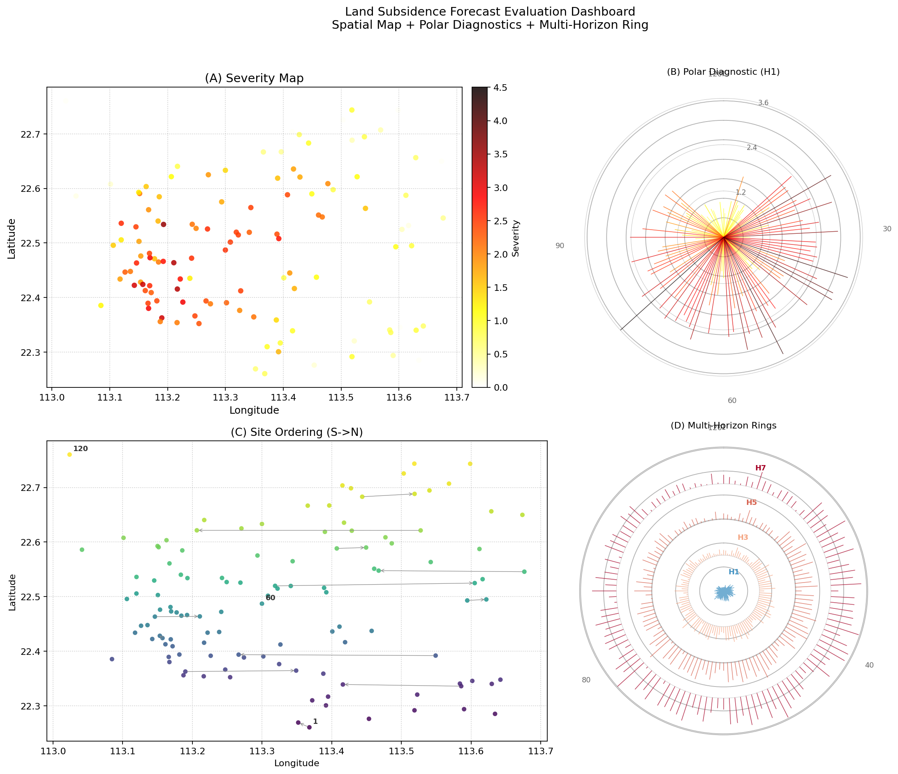

   (A) Severity map — geographic hotspot in the south.
   (B) Polar hedgehog — the southern arc (low ranks) has long, bright spikes.
   (C) Ordering map — ranks 0-40 map to the southern cluster in (A).
   (D) Multi-horizon rings — the southern arc shows the steepest
   radial growth from H1 to H7.  All four panels confirm the same
   finding from different angles.

.. topic:: Analysis and Interpretation
   :class: hint

   Reading the four panels clockwise:

   1.  **(A) Severity map** identifies the **spatial location** of the
       failure hotspot: two bright clusters in the southern urban zone.

   2.  **(C) Ordering map** maps the ordering traversal onto the geographic
       coordinates: ranks 0–40 correspond to the southern cluster, so
       those sites will appear at polar angles 0°–120° in the hedgehog.

   3.  **(B) Polar hedgehog** confirms that the **long, hot-colored spikes
       are indeed concentrated in the 0°–120° arc** — consistent with the
       southern-cluster spatial assignment shown in (C).

   4.  **(D) Multi-horizon rings** reveals that this same arc also shows
       the fastest uncertainty growth with horizon — the H7 red ring
       dominates the south while remaining thin in the north.

   Together the four panels deliver a complete, evidence-based narrative:
   *the model's failures are geographically concentrated in the southern
   urban zone, they are already the worst at H1, and they grow
   disproportionately fast with forecast horizon.*  A single aggregate
   coverage score would have hidden all of this structure.

.. admonition:: Best Practice
   :class: hint

   Always present the **ordering map** (C) alongside the **polar hedgehog**
   (B/D).  Without (C) the reader cannot know which angular arc
   corresponds to which geographic region.  The paired view
   (:func:`~kdiagram.plot.spatial.plot_paired_spatial_polar`) automates
   this pairing, but the standalone ordering map is useful when the
   domain layout itself needs to be explained in detail.

.. raw:: html

   

For the mathematical background of the spatial-polar mapping,
please refer to :ref:`userguide_polar_from_spatial`.
For the API reference of all functions, see :doc:`../api`.
