.. _userguide_datasets:

============
Datasets 
============

The :mod:`kdiagram.datasets` module provides convenient functions
to access sample datasets included with the package (like the
Zhongshan subsidence data) and to generate various synthetic datasets
on the fly.

These datasets are invaluable for:

* Running examples provided in the documentation and gallery.
* Testing `k-diagram`'s plotting functions with predictable data structures.
* Exploring different scenarios of uncertainty, drift, or model comparison.

Most functions allow you to retrieve data either as a standard
:class:`pandas.DataFrame` or as a :class:`~kdiagram.bunch.Bunch` object
(using the ``as_frame`` parameter). The Bunch object conveniently packages
the DataFrame along with metadata like feature/target names, relevant
column lists, and a description of the dataset's origin or generation
parameters.

Function Summary
----------------

.. list-table:: Dataset Loading and Generation Functions
   :widths: 35 65
   :header-rows: 1

   * - Function
     - Description
   * - :func:`~kdiagram.datasets.load_uncertainty_data`
     - Generates synthetic multi-period quantile data with trends,
       noise, and anomalies. Ideal for drift/consistency plots.
   * - :func:`~kdiagram.datasets.load_zhongshan_subsidence`
     - Loads the included Zhongshan subsidence prediction sample dataset.
   * - :func:`~kdiagram.datasets.make_taylor_data`
     - Generates a reference series and multiple prediction series with
       controlled correlation/standard deviation for Taylor Diagrams.
   * - :func:`~kdiagram.datasets.make_multi_model_quantile_data`
     - Generates quantile predictions from multiple simulated models
       for a single time period. Useful for model comparison plots.
   * - :func:`~kdiagram.datasets.make_cyclical_data`
     - Generates data with true and predicted series exhibiting
       cyclical/seasonal patterns.
   * - :func:`~kdiagram.datasets.make_fingerprint_data`
     - Generates a synthetic feature importance matrix for feature
       fingerprint (radar) plots.

Usage Examples
----------------

Below are examples demonstrating how to use each function.

Loading Synthetic Uncertainty Data
~~~~~~~~~~~~~~~~~~~~~~~~~~~~~~~~~~~~~
Generates multi-period quantile data, returned as a Bunch object
by default.

.. code-block:: python
   :linenos:

   from kdiagram.datasets import load_uncertainty_data

   # Generate as Bunch (default)
   data_bunch = load_uncertainty_data(
       n_samples=10, n_periods=2, seed=1, prefix="flow"
       )

   print("--- Bunch Object ---")
   print(f"Keys: {list(data_bunch.keys())}")
   print(f"Description:\n{data_bunch.DESCR[:200]}...") # Print start of DESCR
   print("\nDataFrame Head:")
   print(data_bunch.frame.head(3))
   print("\nQ10 Columns:")
   print(data_bunch.q10_cols)

.. code-block:: text
   :caption: Example Output (Structure)

   --- Bunch Object ---
   Keys: ['frame', 'feature_names', 'target_names', 'target', 'quantile_cols', 'q10_cols', 'q50_cols', 'q90_cols', 'n_periods', 'prefix', 'start_year', 'DESCR']
   Description:
   Synthetic Multi-Period Uncertainty Dataset for k-diagram

   **Description:**
   Generates synthetic data simulating quantile forecasts (Q10,
   Q50, Q90) for 'flow' over 2 periods starting
   from 2022 across 10 samples/lo...

   DataFrame Head:
      location_id  longitude   latitude   elevation  flow_actual  ...
   0            0 -116.8388    35.094262  366.807627    16.816179  ...
   1            1 -117.8696    34.045590  247.216119     9.508103  ...
   2            2 -119.749534  35.488999  353.628218     5.439137  ...

   Q10 Columns:
   ['flow_2022_q0.1', 'flow_2023_q0.1']

Loading Zhongshan Subsidence Data
~~~~~~~~~~~~~~~~~~~~~~~~~~~~~~~~~~~
Loads the packaged sample dataset. This example loads it as a
DataFrame and selects only data for specific years and quantiles.

.. code-block:: python
   :linenos:

   from kdiagram.datasets import load_zhongshan_subsidence
   import warnings

   # Suppress potential download warnings if data exists locally
   warnings.filterwarnings("ignore", message=".*already exists.*")

   # Load as DataFrame, subsetting years and quantiles
   try:
       df_zhongshan_subset = load_zhongshan_subsidence(
           as_frame=True,
           years=[2023, 2025],
           quantiles=[0.1, 0.9],
           include_target=False, # Exclude 'subsidence_YYYY' cols
           download_if_missing=True # Allow download if not packaged/cached
       )
       print("Loaded Zhongshan Subset DataFrame:")
       print(df_zhongshan_subset.head(3))
       print("\nColumns:")
       print(df_zhongshan_subset.columns)

   except FileNotFoundError as e:
       print(f"Error loading Zhongshan data: {e}")
       print("Ensure the package data was installed correctly or "
             "download is enabled/possible.")
   except Exception as e:
        print(f"An unexpected error occurred: {e}")

.. code-block:: text
   :caption: Example Output (Structure, assuming load successful)

   Loaded Zhongshan Subset DataFrame:
        longitude   latitude  subsidence_2023_q0.1  subsidence_2023_q0.9  subsidence_2025_q0.1  subsidence_2025_q0.9
   0   113.237984  22.494591              ...              ...              ...              ...
   1   113.220802  22.513592              ...              ...              ...              ...
   2   113.225632  22.530231              ...              ...              ...              ...

   Columns:
   Index(['longitude', 'latitude', 'subsidence_2023_q0.1',
          'subsidence_2023_q0.9', 'subsidence_2025_q0.1',
          'subsidence_2025_q0.9'], dtype='object')

Generating Taylor Diagram Data
~~~~~~~~~~~~~~~~~~~~~~~~~~~~~~~~~
Uses :func:`~kdiagram.datasets.make_taylor_data` to generate a
reference series and multiple prediction series suitable for Taylor
diagrams. Returns a Bunch containing arrays and calculated stats.

.. code-block:: python
   :linenos:

   from kdiagram.datasets import make_taylor_data

   taylor_data = make_taylor_data(n_models=2, n_samples=50, seed=101)

   print("--- Taylor Data Bunch ---")
   print(f"Reference shape: {taylor_data.reference.shape}")
   print(f"Number of prediction series: {len(taylor_data.predictions)}")
   print(f"Prediction shapes: {[p.shape for p in taylor_data.predictions]}")
   print("\nCalculated Stats:")
   print(taylor_data.stats)
   print(f"\nActual Reference Std Dev: {taylor_data.ref_std:.4f}")

.. code-block:: text
   :caption: Example Output

   --- Taylor Data Bunch ---
   Reference shape: (50,)
   Number of prediction series: 2
   Prediction shapes: [(50,), (50,)]

   Calculated Stats:
              stddev  corrcoef
   Model_A  0.729855  0.835114
   Model_B  1.029889  0.508220

   Actual Reference Std Dev: 0.9404

Generating Multi-Model Quantile Data
~~~~~~~~~~~~~~~~~~~~~~~~~~~~~~~~~~~~~~
Uses :func:`~kdiagram.datasets.make_multi_model_quantile_data` to
simulate quantile predictions from different models for the same
target variable.

.. code-block:: python
   :linenos:

   from kdiagram.datasets import make_multi_model_quantile_data

   # Get as DataFrame
   df_multi_model = make_multi_model_quantile_data(
       n_samples=5, n_models=2, seed=5, as_frame=True,
       quantiles=[0.1, 0.5, 0.9]
   )

   print("--- Multi-Model Quantile DataFrame ---")
   print(df_multi_model)

.. code-block:: text
   :caption: Example Output

   --- Multi-Model Quantile DataFrame ---
      y_true  feature_1  feature_2  pred_Model_A_q0.1  pred_Model_A_q0.5  pred_Model_A_q0.9  pred_Model_B_q0.1  pred_Model_B_q0.5  pred_Model_B_q0.9
   0  50.853502   0.533165   5.108194          43.514661          49.740457          54.158097          36.189075          46.430960          58.077600
   1  46.300911   0.639037   1.962088          41.607881          45.545123          51.889254          35.546803          41.932122          51.628643
   2  44.874897   0.138801   5.689870          42.241030          44.652911          49.972431          37.209904          42.587300          50.182159
   3  52.396877   0.948104   2.990119          45.163347          52.437158          57.719859          45.359873          54.715327          60.382700
   4  53.938741   0.776598   5.808982          43.275494          53.397751          61.104506          39.947971          52.309521          63.340564

Generating Cyclical Data
~~~~~~~~~~~~~~~~~~~~~~~~~~
Uses :func:`~kdiagram.datasets.make_cyclical_data` to create time
series with seasonal or cyclical patterns, useful for visualizing
relationships where angle represents phase.

.. code-block:: python
   :linenos:

   from kdiagram.datasets import make_cyclical_data

   # Get as Bunch
   cycle_bunch = make_cyclical_data(
       n_samples=12, n_series=1, cycle_period=12, seed=5,
       amplitude_true=5, offset_true=10
   )

   print("--- Cyclical Data Bunch ---")
   print(f"Frame shape: {cycle_bunch.frame.shape}")
   print(f"Series names: {cycle_bunch.series_names}")
   print(cycle_bunch.frame[['time_step', 'y_true', 'model_A']].head())

.. code-block:: text
   :caption: Example Output

   --- Cyclical Data Bunch ---
   Frame shape: (12, 3)
   Series names: ['model_A']
      time_step     y_true    model_A
   0          0   9.830655   9.801473
   1          1  14.369168  14.775036
   2          2  14.989960  15.554347
   3          3   9.668771  10.262745
   4          4   4.783064   5.812793

Generating Fingerprint Data
~~~~~~~~~~~~~~~~~~~~~~~~~~~~~~
Uses :func:`~kdiagram.datasets.make_fingerprint_data` to generate
a matrix of feature importances across multiple layers, suitable
for :func:`~kdiagram.plot.feature_based.plot_feature_fingerprint`.

.. code-block:: python
   :linenos:

   from kdiagram.datasets import make_fingerprint_data

   # Get as DataFrame
   fp_df = make_fingerprint_data(
       n_layers=3, n_features=5, seed=303, as_frame=True,
       sparsity=0.2, add_structure=True
   )

   print("--- Fingerprint Data Frame ---")
   print(fp_df)

.. code-block:: text
   :caption: Example Output

   --- Fingerprint Data Frame ---
              Feature_1  Feature_2  Feature_3  Feature_4  Feature_5
   Layer_A     0.941006   0.000000   0.000000   0.000000   0.000000
   Layer_B     0.130220   0.870414   0.456472   0.769115   0.322668
   Layer_C     0.391512   0.139630   1.022977   0.000000   0.000000

Integrated Plotting Example
------------------------------

This example shows how to generate a dataset using a `load_` or
`make_` function (requesting the DataFrame directly with
``as_frame=True``) and immediately pass it to a relevant `k-diagram`
plotting function. Here, we generate uncertainty data and create an
anomaly magnitude plot.

.. code-block:: python
   :linenos:

   import kdiagram as kd # Assuming plots accessible via top-level
   import matplotlib.pyplot as plt

   # 1. Generate data as DataFrame
   df = kd.datasets.load_uncertainty_data(
       as_frame=True,
       n_samples=200,
       n_periods=1, # Only need first period for this plot
       anomaly_frac=0.2, # Ensure anomalies exist
       prefix="flow",
       start_year=2024,
       seed=99
   )

   # 2. Create the plot using the generated DataFrame
   ax = kd.plot_anomaly_magnitude(
       df=df,
       actual_col='flow_actual',
       q_cols=['flow_2024_q0.1', 'flow_2024_q0.9'],
       title="Anomaly Magnitude on Generated Data",
       cbar=True,
       savefig="../images/dataset_plot_example_anomaly.png"
   )
   plt.close() # Close plot after saving

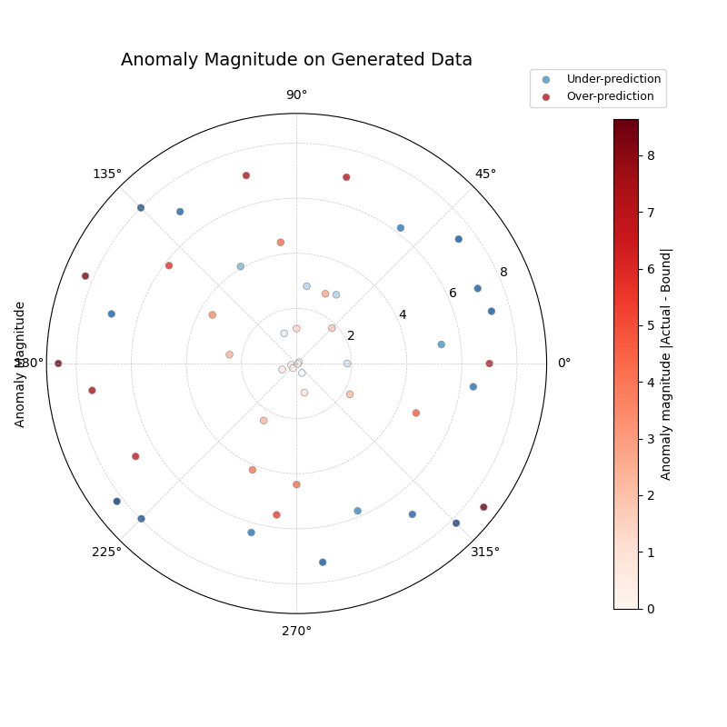

Generating Taylor Data and Plotting
~~~~~~~~~~~~~~~~~~~~~~~~~~~~~~~~~~~~~~
This example generates data suitable for Taylor diagrams using
:func:`~kdiagram.datasets.make_taylor_data` and plots it using
:func:`~kdiagram.plot.evaluation.plot_taylor_diagram`. The data is
retrieved as a Bunch object, and relevant attributes are passed to the
plot function.

.. code-block:: python
   :linenos:

   import kdiagram as kd # Assuming top-level access or specific imports
   import matplotlib.pyplot as plt

   # 1. Generate data as Bunch object
   taylor_data = kd.datasets.make_taylor_data(
       n_models=4,
       n_samples=150,
       seed=101,
       corr_range=(0.6, 0.98),
       std_range=(0.8, 1.2)
   )

   # 2. Create the plot using data from the Bunch
   # Assuming plot function is kd.plot_taylor_diagram
   ax = kd.plot_taylor_diagram(
       *taylor_data.predictions, # Unpack list of prediction arrays
       reference=taylor_data.reference,
       names=taylor_data.model_names,
       title="Taylor Diagram on Generated Data",
       acov='half_circle',
       # Save the plot
       savefig="../images/dataset_plot_example_taylor.png"
   )
   plt.close() # Close plot after saving

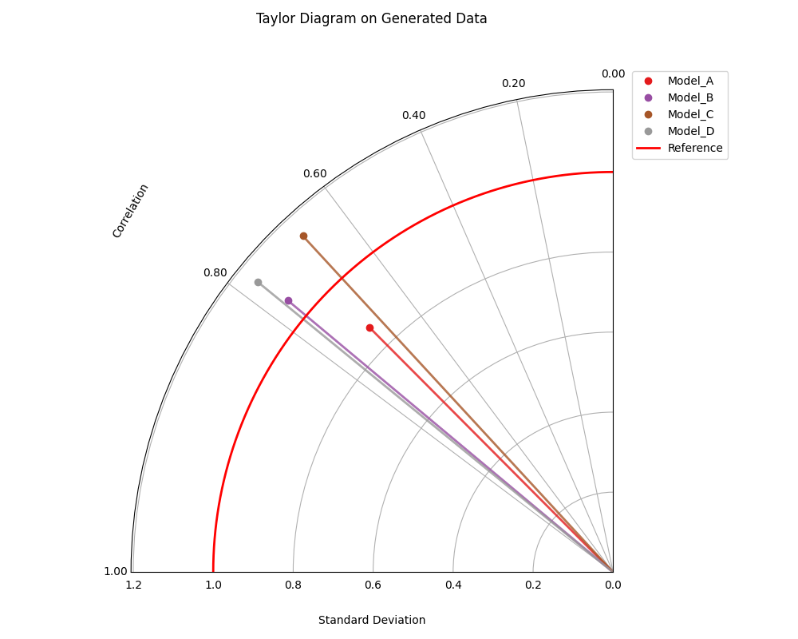

Generating Fingerprint Data and Plotting
~~~~~~~~~~~~~~~~~~~~~~~~~~~~~~~~~~~~~~~~~~
This example uses :func:`~kdiagram.datasets.make_fingerprint_data`
to generate a feature importance matrix (returned directly as a
DataFrame using ``as_frame=True``) and visualizes it with
:func:`~kdiagram.plot.feature_based.plot_feature_fingerprint`.

.. code-block:: python
   :linenos:

   import kdiagram as kd # Assuming top-level access or specific imports
   import matplotlib.pyplot as plt

   # 1. Generate data as DataFrame
   fp_df = kd.datasets.make_fingerprint_data(
       n_layers=4,
       n_features=7,
       layer_names=['SVM', 'RF', 'MLP', 'XGB'],
       feature_names=['F1', 'F2', 'F3', 'F4', 'F5', 'F6', 'F7'],
       seed=303,
       as_frame=True, # Get DataFrame directly
   )

   # 2. Create the plot using the generated DataFrame
   # plot_feature_fingerprint takes the importance matrix (df/array),
   # features (list/df.columns), and labels (list/df.index)
   ax = kd.plot_feature_fingerprint(
       importances=fp_df, # Pass DataFrame directly
       features=fp_df.columns.tolist(), # Get features from columns
       labels=fp_df.index.tolist(),     # Get labels from index
       title="Feature Fingerprint on Generated Data",
       fill=True,
       cmap='Accent',
       # Save the plot
       savefig="../images/dataset_plot_example_fingerprint.png"
   )
   plt.close() # Close plot after saving

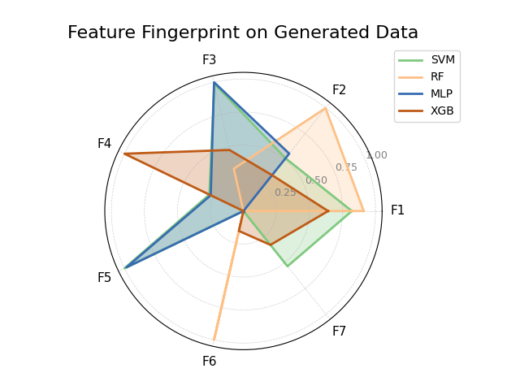

Generating Cyclical Data and Plotting Relationship
~~~~~~~~~~~~~~~~~~~~~~~~~~~~~~~~~~~~~~~~~~~~~~~~~~~~
This example generates data with cyclical patterns using
:func:`~kdiagram.datasets.make_cyclical_data` (as a DataFrame) and
then plots the relationship between the true values (mapped to angle)
and the normalized predictions (mapped to radius) using
:func:`~kdiagram.plot.relationship.plot_relationship`.

.. code-block:: python
   :linenos:

   import kdiagram as kd # Assuming top-level access or specific imports
   import matplotlib.pyplot as plt
   import numpy as np 

   # 1. Generate cyclical data as DataFrame
   cycle_df = kd.datasets.make_cyclical_data(
       n_samples=365, # Simulate daily data for a year
       n_series=2,
       cycle_period=365,
       pred_bias=[0.5, -0.5],
       pred_phase_shift=[0, np.pi / 12], # Second model lags slightly
       seed=404,
       as_frame=True # Get DataFrame directly
   )

   # 2. Create the plot using the generated DataFrame
   ax = kd.plot_relationship(
       cycle_df['y_true'],
       cycle_df['model_A'], # Access generated prediction columns
       cycle_df['model_B'],
       names=['Model A', 'Model B'], # Use generated names
       title="Relationship Plot on Generated Cyclical Data",
       theta_scale='uniform', # Use uniform angle spacing (like time steps)
       acov='default',      # Full circle
       s=15, alpha=0.6,
       # Save the plot
       savefig="../images/dataset_plot_example_cyclical.png"
   )
   plt.close() # Close plot after saving

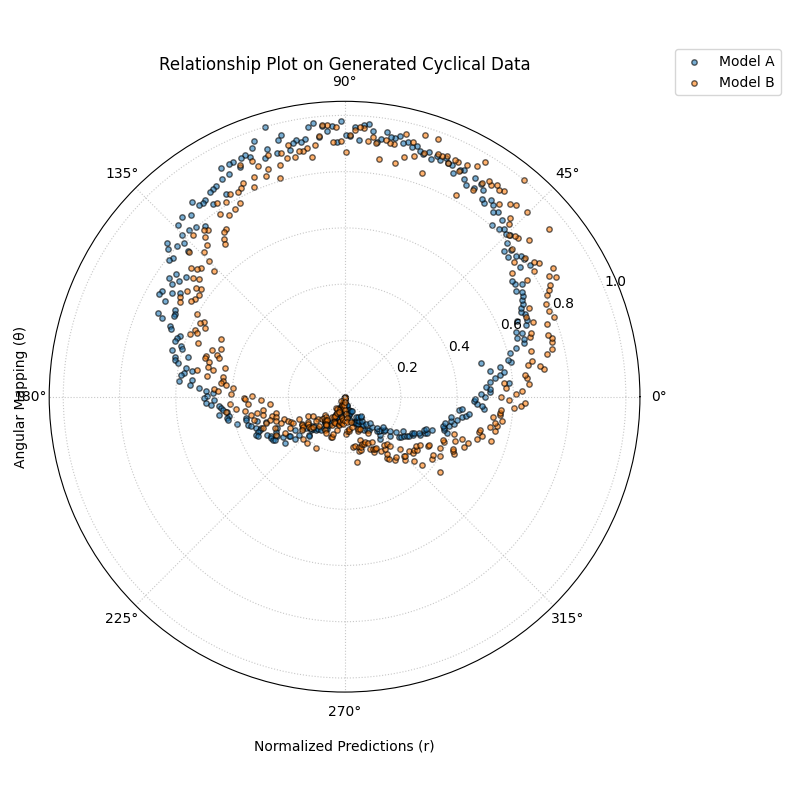

Loading Uncertainty Data for Model Drift Plot
~~~~~~~~~~~~~~~~~~~~~~~~~~~~~~~~~~~~~~~~~~~~~~~
This example generates synthetic multi-period data using
:func:`~kdiagram.datasets.load_uncertainty_data` (returned as a Bunch
object) and visualizes the uncertainty drift across horizons using
:func:`~kdiagram.plot.uncertainty.plot_model_drift`. The Bunch object
makes accessing the required column lists straightforward.

.. code-block:: python
   :linenos:

   import kdiagram as kd # Assuming plots and datasets accessible
   import matplotlib.pyplot as plt

   # 1. Generate data as Bunch object
   # Generate 5 periods for a clearer drift visual
   data = kd.datasets.load_uncertainty_data(
       as_frame=False, # Get Bunch object
       n_samples=100,
       n_periods=5,
       prefix='drift_val',
       start_year=2020,
       interval_width_trend=0.8, # Make width increase over time
       seed=50
   )

   # 2. Prepare arguments for the plot function from Bunch attributes
   # Ensure horizon labels match the generated periods
   horizons = [str(data.start_year + i) for i in range(data.n_periods)]

   # 3. Create the plot using the generated data and extracted info
   ax = kd.plot_model_drift(
       df=data.frame,          # The DataFrame within the Bunch
       q10_cols=data.q10_cols, # List of Q10 columns from Bunch
       q90_cols=data.q90_cols, # List of Q90 columns from Bunch
       horizons=horizons,      # Generated horizon labels
       title="Model Drift on Generated Data",
       acov='quarter_circle',
       # Save the plot
       savefig="../images/dataset_plot_example_drift.png"
   )
   plt.close() # Close plot after saving

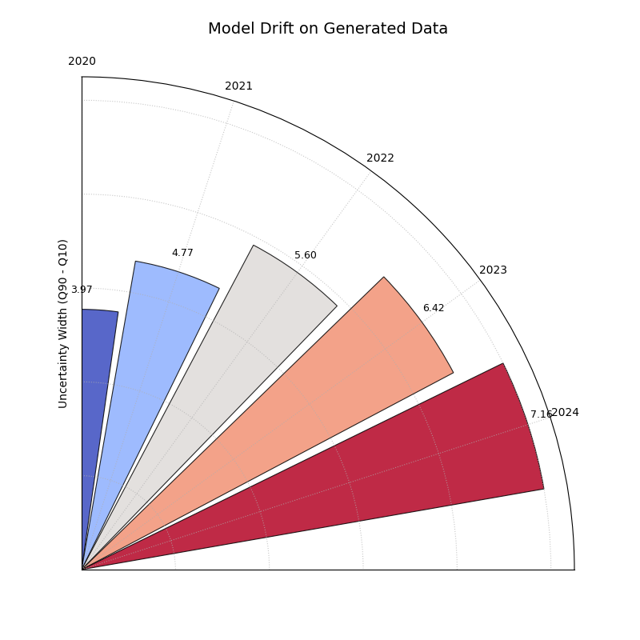

Loading Zhongshan Data for Interval Consistency Plot
~~~~~~~~~~~~~~~~~~~~~~~~~~~~~~~~~~~~~~~~~~~~~~~~~~~~~~~~
This example demonstrates loading the packaged Zhongshan dataset using
:func:`~kdiagram.datasets.load_zhongshan_subsidence` (as a Bunch object)
and analyzing the temporal consistency of its prediction interval widths
using :func:`~kdiagram.plot.uncertainty.plot_interval_consistency`. Includes
basic error handling in case the data cannot be loaded.

.. code-block:: python
   :linenos:

   import kdiagram as kd
   import matplotlib.pyplot as plt
   import warnings
   import pandas as pd # Used by the function internally

   # Suppress potential download warnings if data exists locally
   warnings.filterwarnings("ignore", message=".*already exists.*")

   ax = None # Initialize ax
   try:
       # 1. Load data as Bunch, allow download if missing
       data = kd.datasets.load_zhongshan_subsidence(
           as_frame=False,
           download_if_missing=True, 
       )

       # 2. Check if data loaded and has necessary columns
       if (data is not None and hasattr(data, 'frame')
               and data.q10_cols and data.q50_cols and data.q90_cols):

           print(f"Loaded Zhongshan data with {len(data.frame)} samples.")
           print(f"Plotting consistency for {len(data.q10_cols)} periods.")

           # 3. Create the Interval Consistency plot
           ax = kd.plot_interval_consistency(
               df=data.frame,
               qlow_cols=data.q10_cols,
               qup_cols=data.q90_cols,
               q50_cols=data.q50_cols, # Use Q50 for color context
               use_cv=True,           # Use Coefficient of Variation
               title="Zhongshan Interval Consistency (CV)",
               cmap='plasma',
               s=15, alpha=0.7, 
               acov='eighth_circle', 
               mask_angle=True, 
               # Save the plot
               savefig="../images/dataset_plot_example_zhongshan_consistency.png"
           )
           plt.close() # Close plot after saving
       else:
           print("Loaded data object missing required attributes (frame/cols).")

   except FileNotFoundError as e:
       print(f"ERROR - Zhongshan data not found: {e}")
   except Exception as e:
       print(f"An unexpected error occurred during plotting: {e}")

   if ax is None:
       print("Plot generation skipped due to data loading issues.")

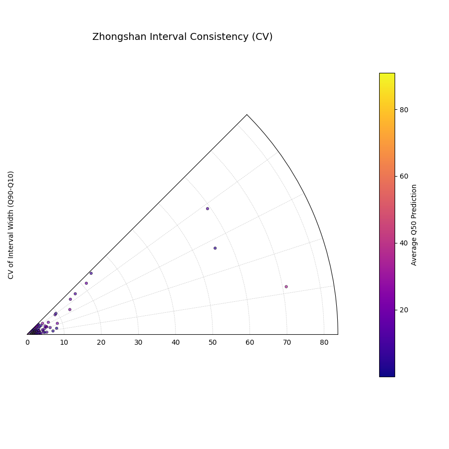

Loading Zhongshan Data for Coverage Diagnostic (Specific Year)
~~~~~~~~~~~~~~~~~~~~~~~~~~~~~~~~~~~~~~~~~~~~~~~~~~~~~~~~~~~~~~~~
This example loads the Zhongshan dataset, subsets it to a specific
year (2023) and relevant quantiles (Q10, Q90) during the load step,
and then uses :func:`~kdiagram.plot.uncertainty.plot_coverage_diagnostic`
to visualize point-wise coverage for that year.

.. code-block:: python
   :linenos:

   import kdiagram as kd
   import matplotlib.pyplot as plt
   import warnings
   import pandas as pd

   # Suppress potential download warnings
   warnings.filterwarnings("ignore", message=".*already exists.*")

   ax = None
   try:
       # 1. Load data as Bunch, selecting only 2023 data and Q10/Q90
       # Also ensure the target column for 2023 is included.
       # Note: Target column name is 'subsidence_2023' in this dataset.
       data = kd.datasets.load_zhongshan_subsidence(
           as_frame=False,
           years=[2023],            # Select only year 2023
           quantiles=[0.1, 0.9],    # Select only Q10 and Q90
           include_target=True,     # Ensure target column is kept
           download_if_missing=True
       )

       # 2. Check data and identify columns for plotting
       actual_col = 'subsidence_2023' # Known target column for 2023
       q_cols_plot = []
       if data is not None and actual_col in data.frame.columns:
            if data.q10_cols: q_cols_plot.append(data.q10_cols[0])
            if data.q90_cols: q_cols_plot.append(data.q90_cols[0])

       if len(q_cols_plot) == 2:
           print(f"Loaded Zhongshan data for {actual_col}.")
           print(f"Plotting coverage diagnostic using: {q_cols_plot}")

           # 3. Create the Coverage Diagnostic plot
           ax = kd.plot_coverage_diagnostic(
               df=data.frame,
               actual_col=actual_col,
               q_cols=q_cols_plot, # Should contain 2023 Q10 & Q90 cols
               title="Zhongshan Coverage Diagnostic (2023)",
               as_bars=False, # Use scatter points
               fill_gradient=True,
               verbose=1, # Print overall coverage rate
               # Save the plot
               savefig="../images/dataset_plot_example_zhongshan_coverage.png"
           )
           plt.close()
       else:
            print("Required columns ('subsidence_2023', Q10, Q90) "
                  "not found in loaded data.")

   except FileNotFoundError as e:
       print(f"ERROR - Zhongshan data not found: {e}")
   except Exception as e:
       print(f"An unexpected error occurred: {e}")

   if ax is None:
       print("Plot generation skipped.")

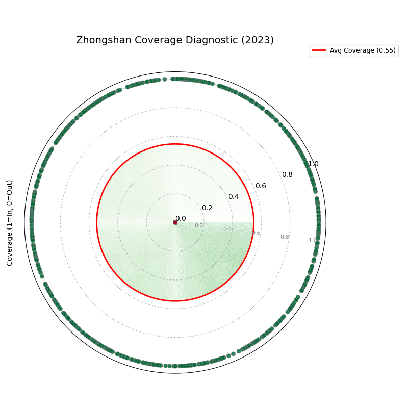

Zhongshan Data: Velocity Plot (Default Coverage)
~~~~~~~~~~~~~~~~~~~~~~~~~~~~~~~~~~~~~~~~~~~~~~~~~~
Load Zhongshan data (as Bunch) and visualize the average velocity
of the median (Q50) predictions using the full 360-degree view
(`acov='default'`). Color represents the average Q50 magnitude.

.. code-block:: python
   :linenos:

   import kdiagram as kd
   import matplotlib.pyplot as plt
   import warnings
   import pandas as pd

   warnings.filterwarnings("ignore", message=".*already exists.*")
   ax = None
   try:
       # 1. Load data as Bunch
       data = kd.datasets.load_zhongshan_subsidence(
           as_frame=False, download_if_missing=True
           )

       # 2. Check data
       if data is not None and data.q50_cols:
           print(f"Loaded Zhongshan data with {len(data.frame)} samples.")
           print(f"Plotting velocity using {len(data.q50_cols)} periods.")

           # 3. Create the Velocity plot
           ax = kd.plot_velocity(
               df=data.frame,
               q50_cols=data.q50_cols,
               title="Zhongshan Q50 Prediction Velocity",
               acov='default',       # Full circle coverage
               use_abs_color=True,   # Color by Q50 magnitude
               normalize=True,       # Normalize radius
               cmap='jet_r',
               cbar=True, s=80, alpha=0.8,
               mask_angle=True, 
               # Save the plot
               savefig="../images/dataset_plot_example_zhongshan_velocity.png"
           )
           plt.close()
       else:
           print("Loaded data object missing required attributes.")

   except FileNotFoundError as e:
       print(f"ERROR - Zhongshan data not found: {e}")
   except Exception as e:
       print(f"An unexpected error occurred: {e}")

   if ax is None: print("Plot generation skipped.")

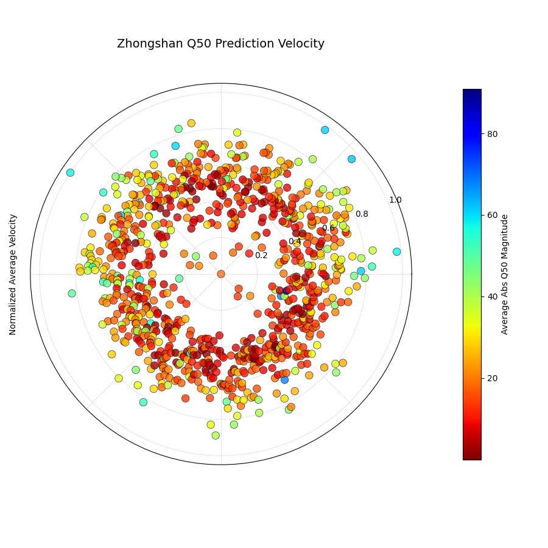

Zhongshan Data: Interval Consistency Plot (Half Circle)
~~~~~~~~~~~~~~~~~~~~~~~~~~~~~~~~~~~~~~~~~~~~~~~~~~~~~~~~~
*(This example repeats the previous consistency plot but explicitly sets
acov='half_circle')*
Load Zhongshan data (as Bunch) and plot interval consistency (using
coefficient of variation for radius) restricted to a 180-degree view.

.. code-block:: python
   :linenos:

   import kdiagram as kd
   import matplotlib.pyplot as plt
   import warnings
   import pandas as pd

   warnings.filterwarnings("ignore", message=".*already exists.*")
   ax = None
   try:
       # 1. Load data as Bunch
       data = kd.datasets.load_zhongshan_subsidence(
           as_frame=False, download_if_missing=True
           )

       # 2. Check data
       if (data is not None and hasattr(data, 'frame')
               and data.q10_cols and data.q50_cols and data.q90_cols):
           print(f"Plotting interval consistency for Zhongshan.")

           # 3. Create the Interval Consistency plot
           ax = kd.plot_interval_consistency(
               df=data.frame,
               qlow_cols=data.q10_cols,
               qup_cols=data.q90_cols,
               q50_cols=data.q50_cols, # Use Q50 for color context
               use_cv=True,           # Use Coefficient of Variation
               acov='half_circle',    # <<< Use 180 degree view
               title="Zhongshan Interval Consistency (CV, 180°)",
               cmap='Purples',
               s=15, alpha=0.7,
               # Save the plot
               savefig="../images/dataset_plot_example_zhongshan_consistency_half.png"
           )
           plt.close()
       else:
           print("Loaded data object missing required attributes.")

   except FileNotFoundError as e:
       print(f"ERROR - Zhongshan data not found: {e}")
   except Exception as e:
       print(f"An unexpected error occurred: {e}")

   if ax is None: print("Plot generation skipped.")

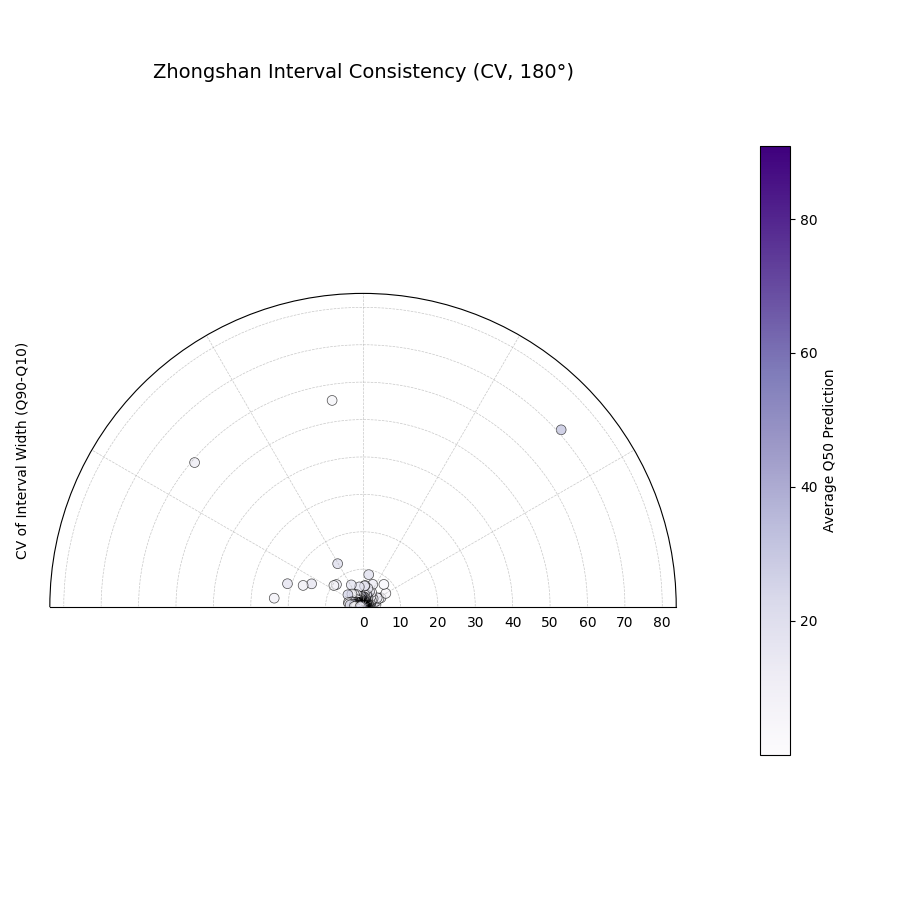

Zhongshan Data: Interval Width Plot (2022, Eighth Circle)
~~~~~~~~~~~~~~~~~~~~~~~~~~~~~~~~~~~~~~~~~~~~~~~~~~~~~~~~~~~~
Load Zhongshan data, select the Q10, Q50, and Q90 columns for the
first available year (assumed 2022), and plot the interval width
using :func:`~kdiagram.plot.uncertainty.plot_interval_width` with
Q50 for color, restricted to a 45-degree view (`acov='eighth_circle'`).

.. code-block:: python
   :linenos:

   import kdiagram as kd
   import matplotlib.pyplot as plt
   import warnings
   import pandas as pd

   warnings.filterwarnings("ignore", message=".*already exists.*")
   ax = None
   try:
       # 1. Load data as Bunch
       data = kd.datasets.load_zhongshan_subsidence(
           as_frame=False, download_if_missing=True
           )

       # 2. Check data and extract columns for the first year (e.g., 2022)
       if (data is not None and hasattr(data, 'frame')
               and data.q10_cols and data.q50_cols and data.q90_cols):

           q10_col_first = data.q10_cols[0] # Assumes list is ordered
           q50_col_first = data.q50_cols[0]
           q90_col_first = data.q90_cols[0]
           year_first = str(data.start_year) # Assumes start_year attr exists

           print(f"Plotting interval width for Zhongshan, year {year_first}")

           # 3. Create the Interval Width plot
           ax = kd.plot_interval_width(
               df=data.frame,
               q_cols=[q10_col_first, q90_col_first], # Q10, Q90 for one year
               z_col=q50_col_first,       # Color by Q50 of that year
               acov='eighth_circle',      # <<< Use 45 degree view
               title=f"Zhongshan Interval Width ({year_first}, 45°)",
               cmap='YlGnBu',
               cbar=True, s=55, alpha=0.85, mask_angle=True,
               # Save the plot
               savefig="../images/dataset_plot_example_zhongshan_width_45deg.png"
           )
           plt.close()
       else:
           print("Loaded data object missing required attributes.")

   except FileNotFoundError as e:
       print(f"ERROR - Zhongshan data not found: {e}")
   except Exception as e:
       print(f"An unexpected error occurred: {e}")

   if ax is None: print("Plot generation skipped.")

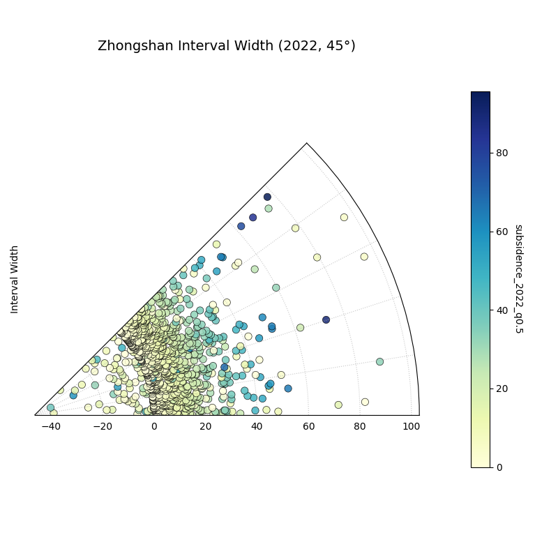

Zhongshan Data: Uncertainty Drift Plot (Quarter Circle)
~~~~~~~~~~~~~~~~~~~~~~~~~~~~~~~~~~~~~~~~~~~~~~~~~~~~~~~~~~
Load Zhongshan data (as Bunch) and visualize the temporal drift of
uncertainty patterns using concentric rings with
:func:`~kdiagram.plot.uncertainty.plot_uncertainty_drift`, restricted
to a 90-degree view (`acov='quarter_circle'`).

.. code-block:: python
   :linenos:

   import kdiagram as kd
   import matplotlib.pyplot as plt
   import warnings
   import pandas as pd

   warnings.filterwarnings("ignore", message=".*already exists.*")
   ax = None
   try:
       # 1. Load data as Bunch
       data = kd.datasets.load_zhongshan_subsidence(
           as_frame=False, download_if_missing=True
           )

       # 2. Check data and prepare labels
       if (data is not None and hasattr(data, 'frame')
               and data.q10_cols and data.q90_cols
               and hasattr(data, 'start_year') and hasattr(data, 'n_periods')):

           horizons = [str(data.start_year + i) for i in range(data.n_periods)]
           print(f"Plotting uncertainty drift for Zhongshan: {horizons}")

           # 3. Create the Uncertainty Drift plot
           ax = kd.plot_uncertainty_drift(
               df=data.frame,
               qlow_cols=data.q10_cols,
               qup_cols=data.q90_cols,
               dt_labels=horizons,
               acov='quarter_circle', # <<< Use 90 degree view
               title="Zhongshan Uncertainty Drift (90°)",
               cmap='viridis',
               show_legend=True, mask_angle=True,
               # Save the plot
               savefig="../images/dataset_plot_example_zhongshan_uncertainty_drift.png"
           )
           plt.close()
       else:
           print("Loaded data object missing required attributes.")

   except FileNotFoundError as e:
       print(f"ERROR - Zhongshan data not found: {e}")
   except Exception as e:
       print(f"An unexpected error occurred: {e}")

   if ax is None: print("Plot generation skipped.")

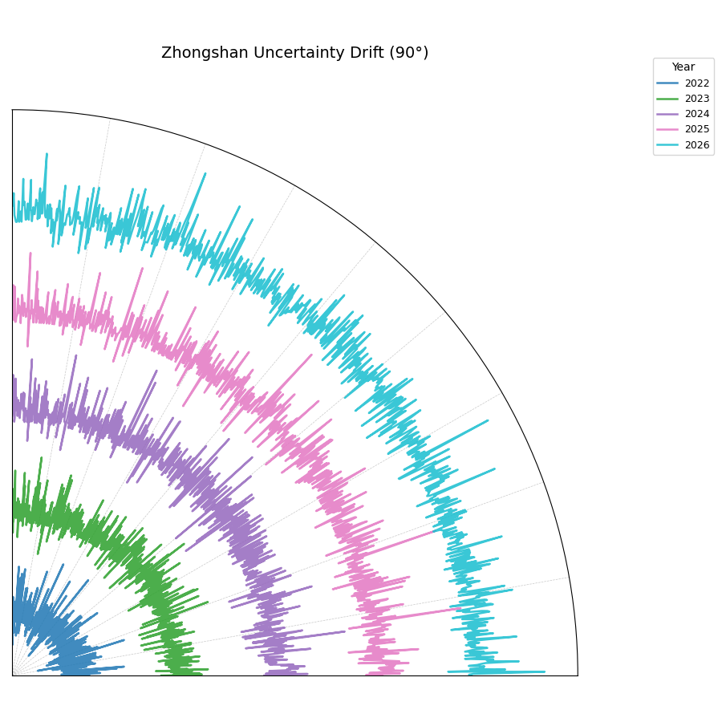

.. raw:: html

    
