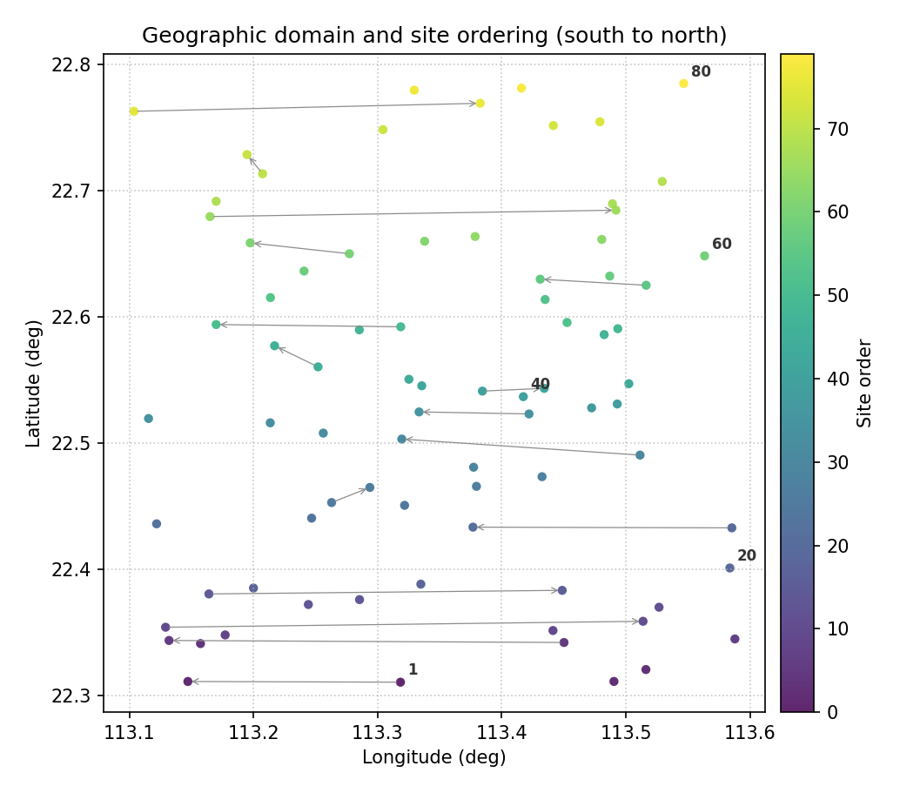
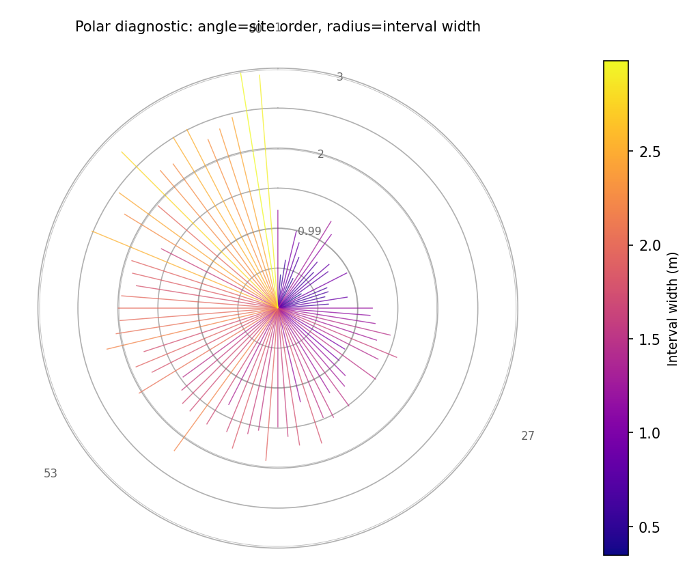
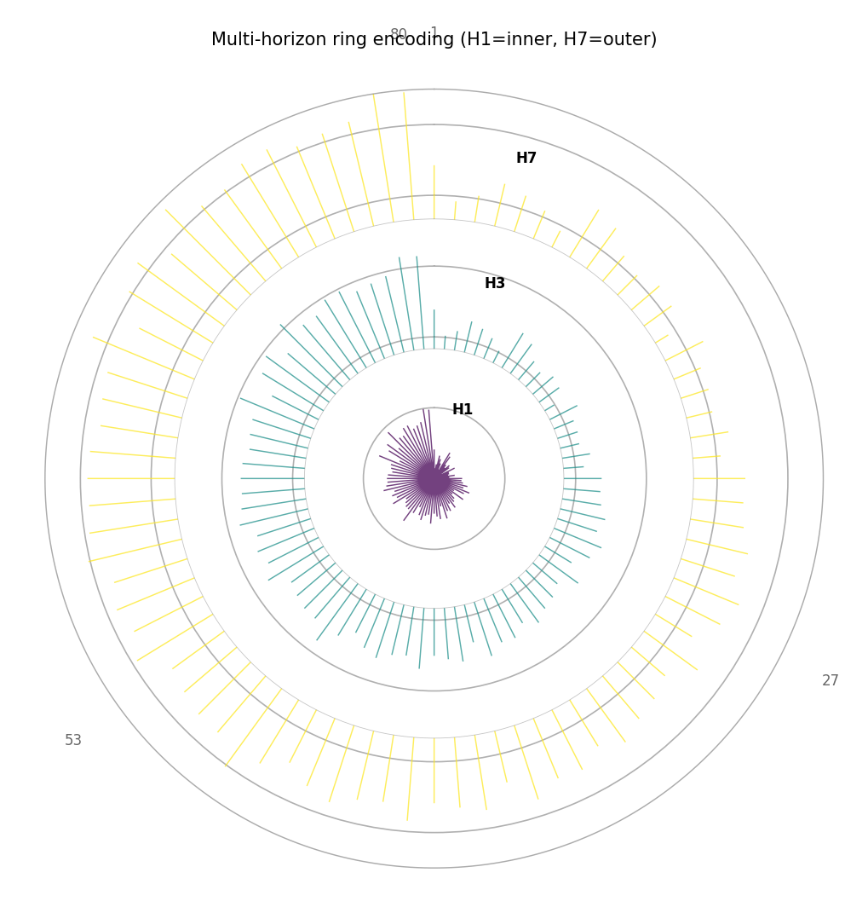
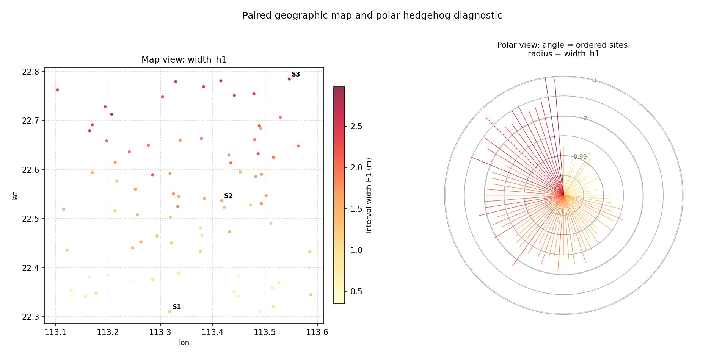
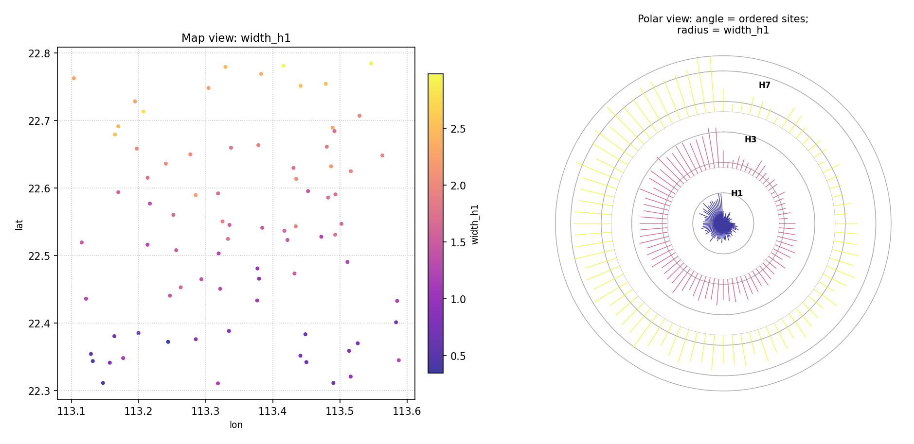

.. _userguide_spatial:

========================================
Spatial Diagnostic Plots
========================================

Forecasting models are increasingly applied to problems where
observations are tied to geographic or projected coordinates —
ground-subsidence monitoring wells, meteorological stations, river
gauges, or any network of sensors distributed across a 2-D domain.
Evaluating such models requires not only the standard temporal
diagnostics but also the ability to ask: *where* does the model
fail?  *Which locations* have under-covered prediction intervals?
*Does the uncertainty correlate with geography?*

The :mod:`kdiagram.plot.spatial` module provides a suite of
Cartesian (non-polar) diagnostic functions that map prediction
metrics, interval uncertainty, and multi-model comparisons onto any
``(x, y)`` or ``(longitude, latitude)`` coordinate space, together
with a family of **polar-from-spatial** functions that implement the
spatial-polar diagnostic paradigm introduced in
:footcite:t:`kouadio_envsoft_2026`.  No basemap dependency is
required; all plots are pure Matplotlib and follow the same
consistent, DataFrame-centric API as the rest of `k-diagram`.

.. note::

   An optional ``add_basemap=True`` parameter is accepted by all
   functions.  It overlays a web tile basemap using
   `contextily <https://contextily.readthedocs.io>`_ when that
   package is installed (``pip install contextily``).  If
   ``contextily`` is not available the parameter is silently
   ignored and the plot renders without a basemap.

Summary of Spatial Plotting Functions
--------------------------------------

.. list-table:: Spatial Diagnostic Functions
   :widths: 40 60
   :header-rows: 1

   * - Function
     - Description
   * - :func:`~kdiagram.plot.spatial.plot_spatial_scatter`
     - Color-coded scatter plot of any numeric metric (e.g. CAS,
       CRPS, interval width) at arbitrary spatial locations.
       An optional second column controls bubble size.
   * - :func:`~kdiagram.plot.spatial.plot_spatial_heatmap`
     - Interpolates scattered point data onto a regular grid with
       ``scipy.interpolate.griddata`` and displays the result as a
       continuous color surface with optional iso-contours.
   * - :func:`~kdiagram.plot.spatial.plot_spatial_uncertainty`
     - Bubble map where marker *size* encodes the mean prediction-
       interval width per location and marker *color* encodes the
       deviation of the empirical coverage from the nominal level.
   * - :func:`~kdiagram.plot.spatial.plot_spatial_coverage`
     - Scatter map of pre-computed coverage rates using a diverging
       colormap centered on the nominal level.  Optionally flags
       stations that exceed a tolerance threshold with a star.
   * - :func:`~kdiagram.plot.spatial.plot_spatial_comparison`
     - Multi-panel grid that plots the same metric for :math:`N`
       models or conditions side-by-side on a shared color scale.
   * - :func:`~kdiagram.plot.spatial.plot_spatial_ordering`
     - Geographic scatter map color-coded by site order index, with
       optional arrows showing the traversal path.  The companion key
       to the polar hedgehog diagrams.
   * - :func:`~kdiagram.plot.spatial.plot_polar_from_spatial`
     - **Core polar diagnostic**: angle = spatially-ordered site rank,
       radius = metric value.  Supports single-horizon (colored spikes)
       and multi-horizon ring encoding (concentric rings per horizon).
   * - :func:`~kdiagram.plot.spatial.plot_paired_spatial_polar`
     - Two-panel composite: geographic scatter map (left) paired with
       polar hedgehog diagnostic (right), sharing colormap and scale.
       Reproduces the paired panel layout of the k-diagram paper.

.. _spatial_common_params:

Common Spatial Parameters
--------------------------

All functions share a consistent set of parameters.

.. list-table:: Shared Parameters
   :widths: 25 75
   :header-rows: 1

   * - Parameter
     - Description
   * - ``df``
     - The input :class:`pandas.DataFrame`.
   * - ``x_col``, ``y_col``
     - Column names for the horizontal and vertical coordinates.
       Any coordinate system (projected meters, decimal degrees,
       arbitrary units) is accepted.
   * - ``title``, ``xlabel``, ``ylabel``
     - Strings for the plot title and axis labels.  Column names
       are used as defaults when not provided.
   * - ``cmap``
     - Matplotlib colormap name.
   * - ``alpha``
     - Marker or image transparency (0–1).
   * - ``colorbar``
     - Whether to draw a colorbar (default ``True``).
   * - ``colorbar_label``
     - Label for the colorbar axis.
   * - ``show_grid`` / ``grid_props``
     - Grid visibility and styling forwarded to
       :func:`~kdiagram.utils.plot.set_axis_grid`.
   * - ``figsize``
     - Figure size in inches as ``(width, height)``.
   * - ``dpi``
     - Figure resolution when saving.
   * - ``ax``
     - An existing :class:`~matplotlib.axes.Axes` to draw on.
       A new figure is created when ``None``.
   * - ``savefig``
     - File path for saving.  Interactive display when ``None``.
   * - ``add_basemap``
     - Overlay a web tile basemap via ``contextily``
       (requires ``pip install contextily``).

.. raw:: html

   

.. _ug_plot_spatial_scatter:

Metric Scatter Map (:func:`~kdiagram.plot.spatial.plot_spatial_scatter`)
~~~~~~~~~~~~~~~~~~~~~~~~~~~~~~~~~~~~~~~~~~~~~~~~~~~~~~~~~~~~~~~~~~~~~~~~~

**Purpose**

This is the primary spatial diagnostic function.  It creates a
color-coded scatter plot where each row in ``df`` is rendered as a
marker positioned at ``(x_col, y_col)`` and colored by the value
of ``metric_col``.  An optional ``size_col`` encodes a *second*
numeric dimension as the marker area (bubble chart), making it
possible to visualize two independent metrics simultaneously —
for example, the CAS score as color and the prediction-interval
width as bubble size.

**Key Parameters**

In addition to the :ref:`shared spatial parameters <spatial_common_params>`,
this function uses:

* **``metric_col``**: The column whose values drive the point
  color.  Any numeric metric is accepted: CAS, CRPS, interval
  width, coverage rate, model rank, etc.
* **``size_col``**: Optional column to control marker size.
  Values are linearly rescaled to ``size_range``.
* **``s``**: Fixed marker size in points² when ``size_col`` is
  ``None`` (default ``80``).
* **``size_range``**: ``(min, max)`` marker area in points²
  when ``size_col`` is given.
* **``vmin`` / ``vmax``**: Color scale limits.  Inferred from
  the data when not provided.
* **``annotate``**: If ``True``, annotates every point with the
  value in ``annotation_col`` (or the metric value if that
  parameter is omitted).
* **``edgecolor`` / ``linewidths``**: Marker border color and
  line width.
* **``marker``**: Marker symbol (default ``'o'``).

**Conceptual Basis**

Let :math:`\mathcal{S} = \{(x_i, y_i, m_i)\}_{i=1}^{N}` be a
set of :math:`N` spatial observations where :math:`(x_i, y_i)`
are the coordinates and :math:`m_i` is the metric value for
location :math:`i`.  The function renders each observation as a
point:

.. math::

   \text{color}_i = \mathcal{C}(m_i;\, v_{\min}, v_{\max})

where :math:`\mathcal{C}` is the chosen colormap normalised over
:math:`[v_{\min}, v_{\max}]`.

When a ``size_col`` :math:`w_i` is provided the marker area is
linearly rescaled to ``size_range`` :math:`[s_{\min}, s_{\max}]`:

.. math::

   \text{size}_i = s_{\min} + \frac{w_i - \min_j w_j}
                                   {\max_j w_j - \min_j w_j}
                               (s_{\max} - s_{\min})

**Interpretation**

* **Color clusters**: Spatial regions of similar color indicate
  consistent model behavior across nearby stations.  An isolated
  bright spot in a sea of cool colors flags a single problematic
  location.
* **Color gradients**: A smooth gradient often reflects a
  physical driver — e.g. increasing CAS towards the coast or
  along a fault line.
* **Bubble size (when ``size_col`` is used)**: Larger bubbles
  simultaneously encode a second dimension.  Wide intervals with
  high CAS (large and bright) identify stations where the model
  is both uncertain *and* poorly calibrated.

**Use Cases**

* Quickly mapping any per-station metric (CAS, CRPS, MAE, …)
  to reveal geographic patterns.
* Comparing model errors across monitoring networks.
* Identifying spatial hotspots of high uncertainty or low
  coverage that require targeted investigation.

.. admonition:: Practical Example

   A network of 35 ground-subsidence monitoring wells is spread
   across an urban area.  Each well has been assigned a CAS score
   (higher = more clustered violations) and a mean prediction-
   interval width.  We plot both simultaneously: color encodes CAS
   and bubble size encodes interval width.

   .. code-block:: pycon

      >>> import numpy as np
      >>> import pandas as pd
      >>> import kdiagram as kd
      >>>
      >>> # --- 1. Build a dataset of 35 monitoring stations ---
      >>> rng = np.random.default_rng(2025)
      >>> N = 35
      >>> lons = rng.uniform(113.15, 113.45, N)
      >>> lats = rng.uniform(22.38,  22.68,  N)
      >>>
      >>> # CAS highest near the south-east hot-spot
      >>> dx, dy = lons - 113.38, lats - 22.45
      >>> cas = np.clip(
      ...     0.15 + 0.70 * np.exp(-(dx**2 + dy**2) / 0.008)
      ...     + rng.uniform(0, 0.12, N), 0, 1
      ... )
      >>> width = 0.4 + 1.4 * np.exp(-(dx**2 + dy**2) / 0.015)
      >>>
      >>> df = pd.DataFrame({
      ...     "lon": lons, "lat": lats,
      ...     "cas": cas, "interval_width": width,
      ... })
      >>>
      >>> # --- 2. Generate the plot ---
      >>> ax = kd.plot_spatial_scatter(
      ...     df, "lon", "lat", "cas",
      ...     size_col="interval_width",
      ...     size_range=(30, 320),
      ...     cmap="plasma",
      ...     alpha=0.88,
      ...     edgecolor="white",
      ...     linewidths=0.6,
      ...     title="CAS Score per Monitoring Station (QAR)",
      ...     xlabel="Longitude (E)",
      ...     ylabel="Latitude (N)",
      ...     colorbar_label="CAS",
      ... )

   .. figure:: ../images/userguide_spatial_scatter.png
      :align: center
      :width: 80%
      :alt: Spatial scatter map of CAS scores per monitoring station.

      CAS scores for 35 ground-subsidence monitoring wells, color-
      coded by severity and scaled in size by prediction-interval
      width.  A spatial cluster of high-CAS, wide-interval stations
      is visible in the south-east of the domain.

   **Quick Interpretation:**
    The plot reveals an immediate spatial pattern: the brightest,
    largest bubbles are concentrated in the south-east corner,
    identifying a geographic cluster where the model produces both
    wide intervals *and* highly clustered violations.  This kind
    of spatial cluster is missed entirely by aggregate CAS scores
    averaged over all stations.

**Example:**
See the gallery: :ref:`gallery_plot_spatial_scatter`.

.. raw:: html

   

.. _ug_plot_spatial_heatmap:

Interpolated Spatial Heatmap (:func:`~kdiagram.plot.spatial.plot_spatial_heatmap`)
~~~~~~~~~~~~~~~~~~~~~~~~~~~~~~~~~~~~~~~~~~~~~~~~~~~~~~~~~~~~~~~~~~~~~~~~~~~~~~~~~~~

**Purpose**

This function converts scattered ``(x, y, metric)`` data into a
continuous 2-D color surface by interpolating the values onto a
regular grid.  The result is a smooth heatmap that is easier to
read than a scatter of isolated dots when the domain is densely
sampled or when the spatial pattern is the primary interest.
Optional iso-contour lines and an original-data overlay are
supported.

**Key Parameters**

In addition to the :ref:`shared spatial parameters <spatial_common_params>`:

* **``method``**: Interpolation algorithm forwarded to
  :func:`scipy.interpolate.griddata`.  Options are ``'linear'``
  (default), ``'cubic'`` (smoother, can overshoot), and
  ``'nearest'`` (blocky but robust).
* **``resolution``**: Number of grid points per axis (default
  ``200``).  Higher values give finer surfaces at a slight speed
  cost.
* **``contour``**: Draw iso-lines on top of the surface
  (default ``False``).
* **``contour_levels``**: Number of contour levels.
* **``scatter_overlay``**: Overlay the original data points on
  top of the heatmap (default ``True``).
* **``scatter_s`` / ``scatter_color`` / ``scatter_alpha``**:
  Appearance of the overlay markers.
* **``vmin`` / ``vmax``**: Color scale limits.

**Mathematical Concept**

Given :math:`N` scattered observations
:math:`\{(x_i, y_i, z_i)\}_{i=1}^{N}`, the function builds a
regular :math:`M \times M` grid
:math:`\{(x_j^*, y_k^*)\}_{j,k=1}^{M}` over the bounding box
of the data and evaluates

.. math::

   z^*(x_j^*, y_k^*) = \mathcal{I}\!\bigl(\{(x_i,y_i,z_i)\};
                                          \; x_j^*, y_k^*\bigr)

where :math:`\mathcal{I}` is the chosen interpolation operator
(piecewise linear, natural cubic, or nearest-neighbor).
Grid cells that fall outside the convex hull of the observation
points are automatically masked (``NaN``), so the heatmap never
extrapolates beyond the data boundary.

The :math:`M` grid points per axis are spaced uniformly:

.. math::

   x_j^* = x_{\min} + \frac{j-1}{M-1}(x_{\max} - x_{\min}),
   \quad j = 1, \ldots, M

**Interpretation**

* **Hot regions**: High values of the interpolated surface
  identify areas of elevated metric (e.g. high CAS or CRPS).
* **Iso-contours**: Lines of equal value make it easy to quantify
  "how far" a region extends beyond a threshold.
* **Data overlay**: The original station points (white dots by
  default) show where the interpolation is well-supported by
  data and where it is extrapolating between sparse observations.
* **Method choice**: Use ``cubic`` for smooth surfaces when
  stations are dense; use ``nearest`` when the spatial pattern
  is expected to be discontinuous or stations are very sparse.

**Use Cases**

* Producing publication-quality maps of per-station metrics.
* Identifying spatial gradients or hotspots that are not visible
  from a scatter of dots.
* Supporting decisions about where to add new monitoring stations
  (gaps in the surface with few supporting points).

.. admonition:: Practical Example

   Using the same 35-station dataset, we now produce a smooth
   surface to reveal the spatial gradient in CAS more clearly.
   Cubic interpolation and iso-contour lines highlight the
   concentration of high CAS in the south-east.

   .. code-block:: pycon

      >>> ax = kd.plot_spatial_heatmap(
      ...     df, "lon", "lat", "cas",
      ...     method="cubic",
      ...     resolution=150,
      ...     contour=True,
      ...     contour_levels=6,
      ...     contour_color="white",
      ...     scatter_overlay=True,
      ...     scatter_s=18,
      ...     scatter_color="white",
      ...     cmap="YlOrRd",
      ...     colorbar_label="CAS (QAR)",
      ...     title="CAS Spatial Distribution - Interpolated Surface",
      ... )

   .. figure:: ../images/userguide_spatial_heatmap.png
      :align: center
      :width: 80%
      :alt: Interpolated heatmap of CAS scores across the study domain.

      Cubic-interpolated CAS surface for the subsidence monitoring
      network.  White iso-contour lines and station markers are
      overlaid.  The south-east hot-spot emerges clearly as a
      well-defined peak surrounded by lower-severity regions.

   **Quick Interpretation:**
    The smooth surface makes the spatial gradient immediately
    legible: CAS increases from roughly 0.2 in the north-west
    to over 0.7 near the south-east hot-spot.  The iso-contour
    lines show that the high-severity region covers roughly a
    quarter of the monitoring domain — a finding that aggregate
    CAS statistics cannot convey.

**Example:**
See the gallery: :ref:`gallery_plot_spatial_heatmap`.

.. raw:: html

   

.. _ug_plot_spatial_uncertainty:

Uncertainty Bubble Map (:func:`~kdiagram.plot.spatial.plot_spatial_uncertainty`)
~~~~~~~~~~~~~~~~~~~~~~~~~~~~~~~~~~~~~~~~~~~~~~~~~~~~~~~~~~~~~~~~~~~~~~~~~~~~~~~~~

**Purpose**

This function provides a simultaneous view of *two* interval
diagnostics per spatial location: the **mean prediction-interval
width** (encoded as marker size) and the **deviation of the
empirical coverage from the nominal level** (encoded as color).
It directly answers the questions: *"Which stations have
excessively wide or narrow intervals?"* and *"Which stations are
chronically under- or over-covered?"* — both mapped to space in
one compact diagram.

When the input DataFrame contains multiple rows per location
(e.g. one row per time step or forecast horizon), the function
aggregates automatically by ``(x_col, y_col)``.

**Key Parameters**

In addition to the :ref:`shared spatial parameters <spatial_common_params>`:

* **``actual_col``**: Observed values.
* **``q_low_col``** / **``q_up_col``**: Lower and upper bounds of
  the prediction interval.
* **``nominal``**: Target coverage level, e.g. ``0.9`` for a 90 %
  PI (default ``0.9``).
* **``size_range``**: ``(min, max)`` bubble area in points²
  across all locations.
* **``legend``**: Display a size legend for the interval-width
  scale (default ``True``).

**Mathematical Concept**

For each observation :math:`i` at location :math:`s`, the
function computes:

.. math::

   w_i = q^{\text{up}}_i - q^{\text{low}}_i
   \quad \text{(interval width)}

.. math::

   c_i = \mathbf{1}\!\left[q^{\text{low}}_i \le y_i
                            \le q^{\text{up}}_i\right]
   \quad \text{(coverage indicator)}

After grouping by location :math:`s`, the per-station statistics are:

.. math::

   \bar{w}_s = \frac{1}{|s|}\sum_{i \in s} w_i,
   \quad
   \hat{c}_s = \frac{1}{|s|}\sum_{i \in s} c_i

The *coverage deviation* from the nominal level :math:`\alpha` is:

.. math::

   \delta_s = \hat{c}_s - \alpha

A diverging colormap is centered at :math:`\delta_s = 0` so that
stations on-target appear neutral, under-covered stations
(:math:`\delta_s < 0`) appear red, and over-covered stations
(:math:`\delta_s > 0`) appear blue.  Marker area is linearly
proportional to :math:`\bar{w}_s`.

**Interpretation**

* **Large, red bubbles**: Wide intervals *and* under-coverage —
  the worst outcome: the model's interval is not only wide but
  still fails to contain the observations.
* **Small, red bubbles**: Narrow intervals and under-coverage —
  over-confident predictions that consistently miss.
* **Large, blue bubbles**: Wide intervals and over-coverage —
  conservative (too wide) intervals that cover more than needed.
* **Small, neutral bubbles**: Narrow, well-calibrated intervals —
  the ideal.
* **Size legend**: The legend shows example bubble sizes
  corresponding to the minimum, median, and maximum interval
  widths across all stations.

**Use Cases**

* Identifying which monitoring stations have calibration
  problems vs. which are merely uncertain.
* Diagnosing whether model failure is due to interval width
  or interval placement.
* Targeting stations for model refinement or for additional
  physical data collection.

.. admonition:: Practical Example

   We simulate 20 time steps of forecast data for each of the 35
   monitoring wells.  The south-east hot-spot cluster is made
   slightly under-covered to mirror a realistic calibration issue.

   .. code-block:: pycon

      >>> # --- 1. Build a multi-row dataset (35 stations x 20 steps) ---
      >>> N_STEPS = 20
      >>> lons_r = np.repeat(lons, N_STEPS)
      >>> lats_r = np.repeat(lats, N_STEPS)
      >>> y_obs  = rng.normal(0, 1, N * N_STEPS)
      >>> iw_r   = np.repeat(width, N_STEPS) * rng.uniform(0.8, 1.2, N*N_STEPS)
      >>> q10 = y_obs - iw_r / 2
      >>> q90 = y_obs + iw_r / 2
      >>> # Slightly inflate observations in the hot-spot -> under-coverage
      >>> hspot = np.repeat(np.exp(-(dx**2+dy**2)/0.008), N_STEPS) > 0.5
      >>> y_obs[hspot] += rng.uniform(0.3, 0.7, hspot.sum())
      >>>
      >>> df_unc = pd.DataFrame({
      ...     "lon": lons_r, "lat": lats_r,
      ...     "y": y_obs, "q10": q10, "q90": q90,
      ... })
      >>>
      >>> # --- 2. Generate the plot ---
      >>> ax = kd.plot_spatial_uncertainty(
      ...     df_unc, "lon", "lat", "y", "q10", "q90",
      ...     nominal=0.90,
      ...     size_range=(25, 420),
      ...     cmap="RdBu_r",
      ...     title="Interval Width and Coverage Deviation per Station",
      ... )

   .. figure:: ../images/userguide_spatial_uncertainty.png
      :align: center
      :width: 80%
      :alt: Bubble map of interval width and coverage deviation per station.

      Bubble map for 35 monitoring wells.  Bubble area is proportional
      to the mean 90 % PI width; color encodes coverage deviation from
      the 90 % nominal level (red = under-covered, blue = over-covered).

   **Quick Interpretation:**
    The south-east cluster of large, reddish bubbles shows exactly
    the expected pattern: those stations have the widest prediction
    intervals yet are still under-covered relative to the 90 %
    nominal level.  The north-west stations (smaller, neutral or
    slightly blue) are better calibrated and have narrower intervals.
    This combined view is impossible to obtain from a single tabular
    metric.

**Example:**
See the gallery: :ref:`gallery_plot_spatial_uncertainty`.

.. raw:: html

   

.. _ug_plot_spatial_coverage:

Coverage Deviation Map (:func:`~kdiagram.plot.spatial.plot_spatial_coverage`)
~~~~~~~~~~~~~~~~~~~~~~~~~~~~~~~~~~~~~~~~~~~~~~~~~~~~~~~~~~~~~~~~~~~~~~~~~~~~~~

**Purpose**

This function produces a spatial scatter plot of pre-computed
empirical coverage rates using a **diverging colormap centered on
the nominal level** :math:`\alpha`.  It is complementary to
:func:`~kdiagram.plot.spatial.plot_spatial_uncertainty`: where
that function accepts raw forecasts and computes coverage
internally, this function accepts a column of already-aggregated
coverage rates — suitable when coverage has been calculated
externally, stored in a metrics table, or averaged over a specific
subset of horizons.

An optional ``tol`` threshold flags stations whose deviation
exceeds the tolerance with a star marker ``★``, providing an
immediate visual audit of which locations need attention.

**Key Parameters**

In addition to the :ref:`shared spatial parameters <spatial_common_params>`:

* **``coverage_col``**: Column with empirical coverage rates
  (values in [0, 1]).
* **``nominal``**: Nominal target coverage (default ``0.9``).
* **``tol``**: If given, stations where
  :math:`|\hat{c}_s - \alpha| > \text{tol}` are annotated with
  a star.
* **``annotate``**: If ``True``, print the coverage value next
  to each point.
* **``fmt``**: Format string for annotation values (default
  ``'.2f'``).

**Mathematical Concept**

The color of each point encodes:

.. math::

   \delta_s = \hat{c}_s - \alpha

A :class:`~matplotlib.colors.TwoSlopeNorm` is constructed with
``vmin = -|\delta|_{\max}``, ``vcenter = 0``, and
``vmax = +|\delta|_{\max}`` so that the neutral color always
corresponds exactly to :math:`\delta_s = 0` regardless of the
data range.

The star flag is added for any station :math:`s` where:

.. math::

   |\hat{c}_s - \alpha| > \text{tol}

Flagged under-covered stations (:math:`\delta_s < 0`) are
annotated in crimson; over-covered stations in steel-blue.

**Interpretation**

* **Blue points**: Coverage above nominal — intervals are
  conservative (too wide for the required coverage level).
* **Red points**: Coverage below nominal — the prediction
  interval fails to contain the observation at the required
  rate.
* **Deep red**: Serious under-coverage; the model is
  over-confident at this location.
* **Star ``★`` flags**: Stations that exceed the ``tol``
  threshold and warrant immediate investigation.
* **Uniform neutral**: If all points are the same neutral color
  the model is well-calibrated everywhere.

**Use Cases**

* Quality-control audit of a forecast model across all
  monitoring locations.
* Spatial reporting of coverage metrics in a paper or dashboard.
* Identifying geographic clusters of calibration failure
  (contiguous red regions).

.. admonition:: Practical Example

   We use the per-station coverage rates already attached to
   ``df_stations``.  A ``tol=0.08`` flag identifies stations
   that deviate from 90 % by more than 8 percentage points.

   .. code-block:: pycon

      >>> df_stations["coverage"] = np.clip(
      ...     0.90 - 0.25 * np.exp(-(dx**2 + dy**2) / 0.010)
      ...     + rng.normal(0, 0.04, N), 0.55, 0.99
      ... )
      >>>
      >>> ax = kd.plot_spatial_coverage(
      ...     df_stations, "lon", "lat", "coverage",
      ...     nominal=0.90,
      ...     tol=0.08,
      ...     cmap="RdBu",
      ...     s=95,
      ...     title="Empirical Coverage vs. 90% Nominal Level",
      ...     xlabel="Longitude (E)",
      ...     ylabel="Latitude (N)",
      ... )

   .. figure:: ../images/userguide_spatial_coverage.png
      :align: center
      :width: 80%
      :alt: Spatial coverage deviation map with star-flagged outlier stations.

      Per-station empirical coverage rates for a 35-well network.
      Colors diverge from the 90 % nominal level (neutral = on-
      target, red = under-covered, blue = over-covered).  Star
      markers flag stations whose deviation exceeds 8 percentage
      points.

   **Quick Interpretation:**
    The south-east corner shows a cluster of red points, confirming
    that those stations consistently fall below the 90 % coverage
    target.  Several of these are flagged with a star ``★``,
    indicating deviations larger than 8 percentage points.  The
    north-west stations are largely neutral or slightly blue, meaning
    the model is well-calibrated or slightly conservative there.

**Example:**
See the gallery: :ref:`gallery_plot_spatial_coverage`.

.. raw:: html

   

.. _ug_plot_spatial_comparison:

Multi-Model Spatial Comparison (:func:`~kdiagram.plot.spatial.plot_spatial_comparison`)
~~~~~~~~~~~~~~~~~~~~~~~~~~~~~~~~~~~~~~~~~~~~~~~~~~~~~~~~~~~~~~~~~~~~~~~~~~~~~~~~~~~~~~~~

**Purpose**

This function generates an :math:`N`-panel grid that plots the
*same spatial metric* for :math:`N` different models, conditions,
or forecast horizons side-by-side.  When ``shared_scale=True``
(the default), all panels use a single, synchronized colormap
range, making direct visual comparison across panels meaningful
and reliable.

This is the spatial equivalent of a multi-column comparison
table: instead of rows of numbers, each "cell" is a full spatial
scatter map.

**Key Parameters**

In addition to the :ref:`shared spatial parameters <spatial_common_params>`:

* **``metric_cols``**: List of column names — one column per
  panel.  Also accepts a comma-separated string
  (e.g. ``"cas_qar,cas_qgbm"``).
* **``names``**: Panel subtitles.  Defaults to the column names.
* **``ncols``**: Number of columns in the panel grid (default
  ``2``).  Rows are added automatically.
* **``shared_scale``**: Synchronize the colormap range across
  all panels (default ``True``).
* **``vmin`` / ``vmax``**: Override the shared scale limits.

**Mathematical Concept**

When ``shared_scale=True`` the global range is computed across
all panels before any plotting occurs:

.. math::

   v_{\min} = \min_{k=1}^{N} \min_i\, m_i^{(k)},
   \quad
   v_{\max} = \max_{k=1}^{N} \max_i\, m_i^{(k)}

Every scatter in panel :math:`k` uses the same normalization:

.. math::

   \text{color}_i^{(k)} = \mathcal{C}\!\left(
       \frac{m_i^{(k)} - v_{\min}}{v_{\max} - v_{\min}}
   \right)

This guarantees that identical colors across panels correspond to
identical metric values, enabling direct, pixel-level comparison
between models.

When ``shared_scale=False`` each panel is normalized
independently, which is useful when comparing metrics with very
different ranges (e.g. CAS of a weak model vs. CAS of a strong
model where the strong model's variation would be invisible on
the weak model's scale).

**Interpretation**

* **Shared scale (recommended for ranking)**: A panel that is
  uniformly lighter than the others contains lower metric values
  everywhere — indicating a better (or worse, depending on the
  metric) model across the entire domain.
* **Residual patterns**: Look for panels that share the same
  hot-spot geography vs. panels where the hot-spot moves or
  disappears — this reveals which spatial failure modes are
  model-specific vs. data-driven.
* **Single shared colorbar**: The right-side colorbar applies to
  all panels, so any given color has the same numeric meaning
  throughout the figure.

**Use Cases**

* Side-by-side comparison of CAS, CRPS, or coverage for
  multiple competing models.
* Comparing the same model across different forecast horizons.
* Generating a single, journal-ready figure that replaces
  multiple individual maps.

.. admonition:: Practical Example

   Three quantile-regression models — QAR, QGBM, and XTFT —
   have been evaluated on the same 35-station network.  Their
   CAS scores are stored as separate columns.  We compare them
   in a single 1×3 figure.

   .. code-block:: pycon

      >>> df_stations["cas_qar"]  = cas_qar    # from earlier
      >>> df_stations["cas_qgbm"] = cas_qgbm
      >>> df_stations["cas_xtft"] = cas_xtft
      >>>
      >>> axes = kd.plot_spatial_comparison(
      ...     df_stations, "lon", "lat",
      ...     ["cas_qar", "cas_qgbm", "cas_xtft"],
      ...     names=["QAR", "QGBM", "XTFT"],
      ...     ncols=3,
      ...     shared_scale=True,
      ...     cmap="plasma",
      ...     colorbar_label="CAS",
      ...     figsize=(14, 4.5),
      ... )

   .. figure:: ../images/userguide_spatial_comparison.png
      :align: center
      :width: 95%
      :alt: Three-panel spatial comparison of CAS scores for QAR, QGBM, and XTFT.

      Side-by-side CAS maps for three quantile-regression models
      evaluated on the same 35-well network.  All three panels
      share a single color scale, making direct comparisons valid.
      The south-east hot-spot persists across all models but is
      most severe for QAR.

   **Quick Interpretation:**
    All three panels share the same spatial pattern — the south-
    east cluster — confirming that the hot-spot is driven by
    data characteristics rather than a specific model's behavior.
    However, the QAR panel (leftmost) is clearly brighter in
    the hot-spot region than QGBM and XTFT, indicating that QAR
    produces the most severe clustered violations there.  XTFT
    (rightmost) is the lightest overall, suggesting the best
    spatial calibration across the network.

**Example:**
See the gallery: :ref:`gallery_plot_spatial_comparison`.

.. raw:: html

   

.. _userguide_spatial_ordering:

``plot_spatial_ordering`` — Geographic ordering map
----------------------------------------------------

**Purpose**

:func:`~kdiagram.plot.spatial.plot_spatial_ordering` renders a
geographic scatter map in which each site is color-coded by its
*position in the ordering sequence* — the rank used to define polar
angle in the hedgehog diagnostic plots.  Optional arrows connect
consecutive sites to make the traversal path legible.

This plot is the essential *key* to reading
:func:`~kdiagram.plot.spatial.plot_polar_from_spatial`: it answers
the question "which geographic location corresponds to which polar
angle?"

**Key Parameters**

.. list-table::
   :widths: 28 72
   :header-rows: 1

   * - Parameter
     - Purpose
   * - ``order_by``
     - ``'lat'`` (default) / ``'lon'``: the spatial criterion used to
       rank sites 0 → N−1.  Accepts any column name in *df*.
   * - ``order_col``
     - Pre-computed ordering column (overrides ``order_by``).
   * - ``show_arrows``
     - Draw directional arrows between consecutive sites.
   * - ``arrow_step``
     - Draw one arrow every *k* sites (default N//15).
   * - ``label_sites``
     - List of 0-based indices to annotate with a 1-based site number.

**Mathematical Concept**

The ordering criterion maps the 2-D coordinate of each site to a
scalar rank :math:`i \in \{0, 1, \ldots, N-1\}`.  This rank is
later mapped linearly to polar angle:

.. math::

   \theta_i = \frac{2\pi\,i}{N}

The geographic ordering map shows the spatial layout of that mapping so
the reader can trace any spike in the polar hedgehog back to its
physical location.

**Interpretation**

* Sites near the **bottom** of the colorbar (dark) appear near polar
  angle 0 (top of the circle); sites near the **top** appear near
  2π (full circle).
* A smooth color gradient means the ordering traverses the domain
  monotonically — any abrupt color jumps indicate sites that are
  spatially isolated from their numerical neighbors.

**Example**

.. code-block:: python

   >>> import numpy as np, pandas as pd
   >>> from kdiagram.plot.spatial import plot_spatial_ordering
   >>> rng = np.random.default_rng(42)
   >>> n = 80
   >>> df = pd.DataFrame({
   ...     "lon": rng.uniform(113.1, 113.6, n),
   ...     "lat": rng.uniform(22.3, 22.8, n),
   ... })
   >>> ax = plot_spatial_ordering(
   ...     df, "lon", "lat",
   ...     order_by="lat",
   ...     show_arrows=True,
   ...     label_sites=[0, 19, 39, 59, 79],
   ...     title="Geographic domain and site ordering (south to north)",
   ... )

   Color encodes site order (0 = first, N−1 = last).  Arrows show the
   south-to-north traversal path; labeled ticks mark key waypoints that
   map to specific polar angles.

**Quick Interpretation**

Sites are ordered south-to-north (low latitude → high latitude).
The smooth color gradient confirms a monotonic traversal of the domain.
Site 1 (rank 0) maps to polar angle 0 (North pole of the circle);
site 80 (rank 79) maps to ≈ 2π.

.. raw:: html

   

.. _userguide_polar_from_spatial:

``plot_polar_from_spatial`` — Core polar hedgehog diagnostic
-------------------------------------------------------------

**Purpose**

:func:`~kdiagram.plot.spatial.plot_polar_from_spatial` is the **central
visualization** of the k-diagram spatial-polar framework
:footcite:p:`kouadio_envsoft_2026`.  It converts
a spatially ordered set of sites into a *hedgehog polar diagram* where:

* **Angle** (:math:`\theta`) encodes the geographic ordering rank of
  the site — sites are distributed uniformly around the full circle.
* **Radius** (*r*) encodes the metric value at that site (interval
  width, CAS score, CRPS, coverage deviation, etc.).

A thin radial spike — or *needle* — is drawn for each site.  Clusters
of long spikes reveal geographic clusters of high metric values;
clusters of short spikes reveal well-calibrated or low-error regions.

The function also supports a **ring (multi-horizon) mode**: when
``horizon_cols`` is given, concentric rings are stacked outward, one
ring per forecast horizon (or any discrete grouping), so the evolution
of the metric across horizons can be read at every site simultaneously.

**Key Parameters**

.. list-table::
   :widths: 28 72
   :header-rows: 1

   * - Parameter
     - Purpose
   * - ``metric_col``
     - Column whose values become the spike radius.
   * - ``horizon_cols``
     - Additional columns for multi-horizon rings.  ``metric_col`` is
       the innermost ring (H1); subsequent elements add outer rings.
   * - ``horizon_labels``
     - Label for each ring (e.g. ``['H1', 'H3', 'H7']``).
   * - ``color_col``
     - Column that drives spike color (single-horizon mode only).
       Defaults to ``metric_col``.
   * - ``order_by``
     - Spatial ordering criterion (``'lat'`` / ``'lon'``).
   * - ``zero_loc``
     - Where rank 0 appears on the circle: ``'N'`` = top (default).
   * - ``clockwise``
     - If ``True`` (default), rank increases clockwise.
   * - ``label_n_sites``
     - Number of angular site-index labels.

**Mathematical Concept**

Let sites be ordered by latitude, yielding ranks
:math:`i = 0, 1, \ldots, N-1`.  The polar coordinates of site *i* are:

.. math::

   \theta_i = \frac{2\pi\,i}{N}, \qquad
   r_i = v_i

where :math:`v_i` is the metric value at site *i* (e.g. interval
width).  The spike for site *i* is the segment from the origin to
:math:`(r_i, \theta_i)`.

In ring mode with *K* horizons, the :math:`k`-th ring spans radii:

.. math::

   r_{\text{base},k} = k \cdot \Delta, \quad
   r_{\text{top},k}  = r_{\text{base},k} + \frac{v_{i,k}}{v_{\max}} \cdot \Delta

where :math:`\Delta = v_{\max} / K` normalises all rings to the same
radial budget.

**Interpretation**

* **Long spikes** → high metric value (e.g. wide prediction interval,
  high error) at that geographic location.
* **Symmetric hedgehog** → metric is roughly uniform across the domain.
* **Asymmetric hedgehog** → metric concentrates in one arc, revealing
  a geographic cluster of difficult-to-predict sites.
* In **ring mode**: rings that grow outward toward larger radii
  indicate the metric worsens at longer horizons; rings of similar
  height indicate horizon-robust calibration.

**Example — single horizon**

.. code-block:: python

   >>> import numpy as np, pandas as pd
   >>> from kdiagram.plot.spatial import plot_polar_from_spatial
   >>> rng = np.random.default_rng(42)
   >>> n = 80
   >>> df = pd.DataFrame({
   ...     "lon": rng.uniform(113.1, 113.6, n),
   ...     "lat": rng.uniform(22.3, 22.8, n),
   ...     "width_h1": rng.uniform(0.3, 3.0, n),
   ... })
   >>> ax = plot_polar_from_spatial(
   ...     df, "lon", "lat", "width_h1",
   ...     order_by="lat",
   ...     cmap="plasma",
   ...     colorbar_label="Interval width H1 (m)",
   ... )

   Single-horizon hedgehog.  Angle = latitude-ordered site rank;
   radius = interval width.  Spikes are colored by width value
   (plasma colormap).  Concentric reference circles aid reading.

**Example — multi-horizon rings**

.. code-block:: python

   >>> df["width_h3"] = df["width_h1"] * 1.35
   >>> df["width_h7"] = df["width_h1"] * 1.85
   >>> ax = plot_polar_from_spatial(
   ...     df, "lon", "lat", "width_h1",
   ...     horizon_cols=["width_h3", "width_h7"],
   ...     horizon_labels=["H1", "H3", "H7"],
   ...     order_by="lat",
   ... )

   Ring mode with three forecast horizons (H1 inner, H7 outer).
   At every polar angle (site), the three spikes show how uncertainty
   grows with horizon.  Sites where the H7 spike is much longer than
   the H1 spike have strongly horizon-dependent calibration.

**Quick Interpretation**

The example shows a gradient from shorter spikes at small polar angles
(southern sites, moderate uncertainty) to longer spikes at large polar
angles (northern sites, higher uncertainty).  The multi-horizon plot
reveals that the uncertainty growth is consistent across all sites —
the rings scale uniformly outward.

.. raw:: html

   

.. _userguide_paired_spatial_polar:

``plot_paired_spatial_polar`` — Paired map + polar diagnostic
-------------------------------------------------------------

**Purpose**

:func:`~kdiagram.plot.spatial.plot_paired_spatial_polar` combines the
geographic scatter map and the polar hedgehog into a single side-by-side
figure that directly reproduces the paired panel layouts of the k-diagram
paper :footcite:p:`kouadio_envsoft_2026` (figures 2 and 5:
panels (a)+(b), (c)+(d), etc.).

The left panel is a geographic scatter map colored by the metric.
The right panel is the polar hedgehog diagnostic.
Both panels share the same colormap and, optionally, the same color
scale, making the correspondence between geographic location and polar
angle immediately readable without switching between separate figures.

**Key Parameters**

.. list-table::
   :widths: 28 72
   :header-rows: 1

   * - Parameter
     - Purpose
   * - ``map_label_sites``
     - Dict ``{order_index: label_str}`` — annotates specific sites on
       the geographic map so the reader can trace them to their polar
       angle.
   * - ``show_ordering_arrows``
     - Draw direction arrows on the map to visualize the traversal path.
   * - ``horizon_cols``
     - Enables multi-ring mode in the polar panel.
   * - ``map_title``, ``polar_title``
     - Individual panel titles (override defaults).
   * - ``title``
     - Super-title for the full figure.

**Interpretation**

Read both panels in tandem:

1. Find a site in the **left map** (e.g. a cluster of large dots in a
   specific geographic corner).
2. Identify that site's latitude rank to determine its polar angle.
3. Locate the corresponding spike in the **right hedgehog** to read the
   exact metric value.
4. The pattern of long spikes in the hedgehog directly maps back to a
   spatial cluster of high-metric sites in the map.

This paired reading makes it possible to communicate both the *spatial
pattern* and the *magnitude distribution* of any forecast metric in a
single compact figure.

**Example**

.. code-block:: python

   >>> import numpy as np, pandas as pd
   >>> from kdiagram.plot.spatial import plot_paired_spatial_polar
   >>> rng = np.random.default_rng(42)
   >>> n = 80
   >>> df = pd.DataFrame({
   ...     "lon": rng.uniform(113.1, 113.6, n),
   ...     "lat": rng.uniform(22.3, 22.8, n),
   ...     "width_h1": rng.uniform(0.3, 3.0, n),
   ...     "width_h3": rng.uniform(0.3, 3.0, n) * 1.35,
   ...     "width_h7": rng.uniform(0.3, 3.0, n) * 1.85,
   ... })
   >>> axes = plot_paired_spatial_polar(
   ...     df, "lon", "lat", "width_h1",
   ...     order_by="lat",
   ...     cmap="YlOrRd",
   ...     colorbar_label="Interval width H1 (m)",
   ...     map_label_sites={0: "S1", 39: "S2", 79: "S3"},
   ...     title="Paired map and polar diagnostic (H1)",
   ... )

   Single-horizon paired layout.  Left: geographic scatter colored by
   interval width.  Right: polar hedgehog with angle = latitude order.
   Sites S1, S2, S3 are annotated on the map; they appear at the
   corresponding polar angles 0°, 180°, and ~360° in the hedgehog.

**Example — multi-horizon paired**

.. code-block:: python

   >>> axes = plot_paired_spatial_polar(
   ...     df, "lon", "lat", "width_h1",
   ...     horizon_cols=["width_h3", "width_h7"],
   ...     horizon_labels=["H1", "H3", "H7"],
   ...     order_by="lat",
   ...     cmap="plasma",
   ...     title="Paired maps: multi-horizon ring encoding",
   ... )

   Multi-horizon paired layout.  The polar panel now shows three
   concentric rings (H1 inner, H7 outer) at every site angle.  Sites
   with strongly growing rings have rapidly increasing uncertainty
   with forecast horizon.

**Quick Interpretation**

The map (left) shows a mild south-to-north gradient in interval width.
The hedgehog (right) confirms this: spikes near angle 0 (southern sites)
are shorter than spikes near angle 2π (northern sites).  The multi-horizon
version further reveals that this geographic gradient is amplified at
longer horizons — the H7 ring is noticeably longer than H1 for northern
sites.

.. raw:: html

   

.. rubric:: References

.. footbibliography::
