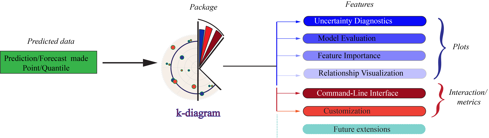

# Summary

`k-diagram` is an open-source Python package designed for the in-depth 
interpretation and diagnosis of probabilistic forecasts. Moving beyond 
traditional aggregate metrics, the package provides a suite of novel 
visualization tools, primarily based on polar coordinate systems, 
to dissect the complex spatiotemporal structure of forecast uncertainty. 
By mapping statistical properties such as sharpness, reliability, and 
temporal stability onto intuitive geometric representations, `k-diagram` 
enables researchers and practitioners to identify model biases, understand 
forecast degradation over time, and communicate uncertainty characteristics 
more effectively. The package is designed to be a practical extension 
to the standard forecasting workflow [@Hong2025], providing the visual evidence needed 
for more robust model evaluation and trustworthy, context-aware 
decision-making.

# Statement of Need

The evaluation of probabilistic forecasts has a rigorous theoretical 
foundation based on concepts of calibration and sharpness, which are 
jointly assessed using proper scoring rules [@Gneiting2007b]. However, 
these scores are typically aggregated into a single value, which can 
obscure vital information about a model's performance in heterogeneous 
spatiotemporal settings. This is a critical limitation, as modern machine 
learning models, such as Temporal Fusion Transformers [@Lim2021], 
are increasingly applied to complex, high-dimensional problems where 
understanding the local and temporal behavior of uncertainty is paramount. 
A growing body of applied research highlights this challenge in fields as 
diverse as predictive policing [@Rummens2021], energy forecasting [@Liu2021], 
climatology [@Baillie2002] and geohazard [@Liu2024].

While standard visualization tools exist, they are often not well-suited for the 
specific task of diagnosing high-dimensional forecast uncertainty. 
General-purpose libraries like matplotlib [@Hunter:2007] and seaborn 
[@Waskom2021] provide the building blocks but lack dedicated functions 
for these specialized diagnostics. Even established forecasting visualizations 
like fan charts, which have seen recent innovations [@Sokol2025], are 
primarily designed for single time series and do not scale well to 
problems involving thousands of simultaneous forecasts. This creates a 
critical gap between the generation of complex probabilistic forecasts 
and the ability to interpret them effectively.

`k-diagram` addresses this gap by providing a scalable and intuitive 
toolkit designed specifically for the visual diagnosis of spatiotemporal 
probabilistic forecasts [@Liu2024]. The package's novelty lies in its use of polar 
coordinates to map different dimensions of forecast performance—such as 
uncertainty magnitude, reliability, and temporal stability—onto angle and 
radius. This approach provides compact overviews that reveal patterns 
obscured in traditional Cartesian plots. By providing clear visual 
answers to key diagnostic questions (e.g., "Where is a forecast least certain?", 
"How is its uncertainty evolving?"), `k-diagram` serves as an essential tool 
for any researcher or practitioner seeking to move beyond aggregate metrics 
and gain a deeper, more actionable understanding of their forecasting models.

# Functionality


`k-diagram` is implemented in Python [@python3; @10.5555/1593511],, leveraging core scientific libraries
including `numpy` [@harris2020array], `pandas` [@mckinney-proc-scipy-2010;
@reback2020pandas], `matplotlib` [@Hunter:2007], `scipy` [@2020SciPy-NMeth],
and `scikit-learn` [@scikit-learn]. The core functionality is organized around diagnosing 
key aspects of forecast quality \autoref{fig1:workflow}:

* **Uncertainty Diagnostics:** A collection of polar plots under
    `kdiagram.plot.uncertainty` for visualizing:
    * Prediction interval coverage (point-wise diagnostics and overall scores).
    * Anomaly magnitude (severity and type of interval failures).
    * Interval width (magnitude and consistency over time/samples).
    * Model drift (average uncertainty increase over forecast horizons).
    * Uncertainty drift (evolution of uncertainty patterns using concentric rings).
    * Prediction velocity (rate of change of central forecasts).
* **Model Evaluation:** Functions under `kdiagram.plot.evaluation` for
    generating standard and enhanced Taylor Diagrams [@Taylor2001] to compare
    models based on correlation, standard deviation, and RMSD relative to a
    reference.
* **Feature Importance:** Radar charts under `kdiagram.plot.feature_based`
    for visualizing and comparing feature importance profiles ("fingerprints")
    across different models or contexts.
* **Relationship Visualization:** Polar scatter plots under
    `kdiagram.plot.relationship` mapping true values to angle and
    (normalized) predictions to radius.
* **Data Utilities:** Helper functions under `kdiagram.utils` for detecting,
    validating, and reshaping pandas DataFrames containing quantile-based
    forecast data, facilitating data preparation for the plotting functions.
* **Command-Line Interface (CLI):** A `k-diagram` command allowing users
    to generate key plots directly from CSV files without writing Python scripts.
* **Customization:** Plots offer various parameters for adjusting appearance,
    angular coverage (`acov`), colormaps, normalization, and labeling.



The package is designed for ease of use and customization, allowing users to 
control plot aesthetics, angular coverage, and color mapping to tailor the 
visualizations for their specific domain. Figure \@ref(fig:performance) demonstrates some of these key diagnostic plots.


### Installation 

The latest stable release of `k-diagram` is available on the Python Package 
Index (PyPI) and can be installed using pip:

```bash
pip install k-diagram
````
Detailed installation instructions are available in the documentation.

### Documentation

Comprehensive documentation, including a User Guide explaining the concepts 
behind the plots, a gallery of examples, and a detailed API reference, 
is hosted on ReadTheDocs: [https://k-diagram.readthedocs.io/](https://k-diagram.readthedocs.io/).

### License

`k-diagram` is made available under the OSI-approved Apache License 2.0. The 
full license text can be found in the [LICENSE](https://github.com/earthai-tech/k-diagram/blob/main/LICENSE) file in the root of the repository.


### Example Application
The visualization methods implemented in k-diagram were developed alongside research 
applying deep learning models to complex environmental forecasting challenges [@kouadiob2025]. Specifically, 
these polar diagnostics were utilized to analyze and interpret the uncertainty associated 
with land subsidence predictions using an Extreme Temporal Fusion Transformer 
model [@Kouadio2025] in Zhongshan city, China.

Full usage examples and a gallery of all plot types are available in the official 
documentation [gallery section](https://k-diagram.readthedocs.io/en/latest/gallery/uncertainty.html).


### Contributing

Contributions to `k-diagram` are highly encouraged\! We welcome bug reports, 
feature requests, documentation improvements, and code contributions. 
Please refer to the `CONTRIBUTING.rst` guide in the documentation (or repository) 
for detailed guidelines on how to contribute. Development discussions and 
issue tracking occur on the [GitHub repository](https://github.com/earthai-tech/k-diagram/issues).

### Acknowledgements

We extend our sincere gratitude to the anonymous colleagues who provided 
invaluable feedback during the development of `k-diagram`, as well as those 
who rigorously tested its early iterations. Their insights and dedication 
were instrumental in refining the software.

We also appreciate the constructive feedback from early users and 
reviewers, whose contributions have significantly enhanced the quality 
and usability of the project.


### References

