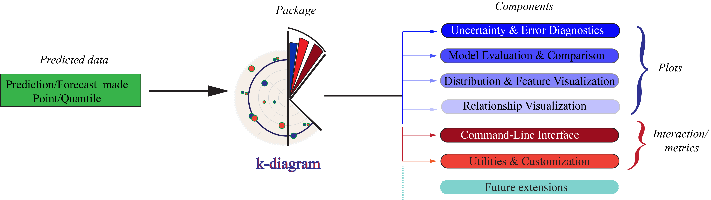

# Summary

`k-diagram` is an open-source Python package designed for the in-depth 
interpretation and diagnosis of probabilistic forecasts. Moving beyond 
traditional aggregate metrics, the package provides a suite of novel 
visualization tools, primarily based on polar coordinate systems, 
to dissect the complex spatiotemporal structure of forecast uncertainty and 
errors. By mapping statistical properties such as sharpness, reliability, 
and temporal stability onto intuitive geometric representations, `k-diagram` 
enables researchers and practitioners to identify model biases, understand 
forecast degradation over time, and communicate uncertainty characteristics 
more effectively. The package is designed to be a practical extension 
to the standard forecasting workflow, providing the visual evidence needed 
for more robust model evaluation and trustworthy, context-aware 
decision-making.

# Statement of Need

The evaluation of probabilistic forecasts has a rigorous theoretical 
foundation based on concepts of calibration and sharpness, which are 
jointly assessed using proper scoring rules [@Gneiting2007b]. However, 
these scores are typically aggregated into a single value, which can 
obscure vital information about a model's performance in heterogeneous 
spatiotemporal settings. This is a critical limitation, as modern machine 
learning models, such as Temporal Fusion Transformers [@Lim2021], 
are increasingly applied to complex, high-dimensional problems where 
understanding the local and temporal behavior of uncertainty is paramount. 
A growing body of applied research highlights this challenge in fields as 
diverse as predictive policing [@Rummens2021], energy forecasting [@Liu2021], 
chaotic market dynamics [@Caulk2022], climatology [@Baillie2002] 
and geohazard [@Liu2024].

While an ecosystem of open-source forecasting tools exists, many focus 
on specific modeling or post-processing tasks, such as forecast 
reconciliation [@Biswas2025], or provide verification suites for specific 
domains like climate science [@Brady2021]. General-purpose libraries like 
matplotlib [@Hunter:2007] and seaborn [@Waskom2021] provide the building blocks 
but lack dedicated functions for the specialized diagnostics needed for 
high-dimensional uncertainty. Even established visualizations like fan charts, 
which have seen recent innovations [@Sokol2025], are primarily designed for 
single time series and do not scale well to problems involving thousands of 
simultaneous forecasts [@Hong2025]. This creates a critical gap between the 
generation of complex probabilistic forecasts and the ability to interpret 
them effectively.

`k-diagram` addresses this gap by providing a scalable and intuitive 
toolkit designed specifically for the visual diagnosis of spatiotemporal 
probabilistic forecasts [@Liu2024; @kouadiob2025]. Furthermore, in modern deployments, 
a single run may yield thousands to millions of (location, horizon) forecasts; 
`k-diagram` is designed to compress these large spatiotemporal distributions into stable, 
comparable views that preserve geography and lead-time structure.
The package's novelty lies in its use of polar coordinates to map different dimensions of forecast 
performance, such as uncertainty magnitude, reliability, and temporal stability, onto 
angle and radius. This approach provides compact overviews that reveal patterns 
obscured in traditional Cartesian plots. By providing clear visual 
answers to key diagnostic questions (e.g., "Where is a forecast least certain?", 
"How is its uncertainty evolving?"), `k-diagram` serves as an essential tool 
for any researcher or practitioner seeking to move beyond aggregate metrics 
and gain a deeper, more actionable understanding of their forecasting models.

# Functionality

`k-diagram` is implemented in Python [@python3; @pythonbook], leveraging
core scientific libraries including `numpy` [@harris2020array],
`pandas` [@mckinney-proc-scipy-2010; @reback2020pandas],
`matplotlib` [@Hunter:2007], `scipy` [@2020SciPy-NMeth], and
`scikit-learn` [@scikit-learn]. The core functionality is organized
around a cohesive API designed to diagnose key aspects of forecast
quality through four primary pillars of analysis 
(see \autoref{fig1:workflow}).

The first and primary contribution of `k-diagram` is a suite of novel
polar visualizations for **Uncertainty and Error Diagnostics**
[@kouadiob2025]. The `kdiagram.plot.uncertainty`,
`kdiagram.plot.errors`, and `kdiagram.plot.probabilistic` modules
provide a comprehensive toolkit for dissecting forecast performance.
This includes functions to evaluate prediction **interval performance** by
visualizing coverage, the magnitude of anomalous failures, and the
temporal consistency of interval widths. Furthermore, the package
introduces innovative methods for visualizing **error distributions**,
such as polar error bands to separate systemic bias from random
error, and polar violins, a novel adaptation of the traditional violin
plot [@Hintze1998], to compare the full error profiles of multiple
models. For a complete assessment of the predictive distribution, a
dedicated suite of **probabilistic diagnostics** offers Polar 
Probability Integral Transform Histograms for calibration, 
Sharpness Diagrams for precision, and Continuous Ranked Probability 
Score plots for overall skill, based on the foundational concepts 
of probabilistic forecasting [@Gneiting2007b].

Building on this, the second pillar focuses on established methods for
**Model Evaluation and Comparison**. The package implements well-regarded
evaluation techniques, adapting them for enhanced clarity. Functions in
`kdiagram.plot.evaluation` generate **Taylor Diagrams**, based on the
original formulation by [@Taylor2001], to holistically compare models
on correlation, standard deviation, and Root-Mean-Square Deviation. 
Complementing this, the `kdiagram.plot.comparison` module provides standard 
**Reliability Diagrams** for assessing probability calibration, 
a cornerstone of forecast verification [@Jolliffe2012].

The third pillar of functionality addresses **Distribution and Feature
Visualization**. `k-diagram` provides utilities for plotting 1D
distributions and Kernel Density Estimates (KDEs) [@Silverman1986] in
both Cartesian and innovative polar ring formats. To facilitate model
interpretability, the `kdiagram.plot.feature_based` module offers
radar charts to visualize and compare feature importance profiles,
creating unique model "fingerprints".

Finally, the package provides tools for **Relationship Visualization**,
where polar plots in `kdiagram.plot.relationship` offer a novel
perspective on the correlation between true and predicted values by
mapping them to angle and radius. All functionalities are supported by
a set of helper utilities and a command-line interface (CLI) for
generating key plots directly from data files. 

# Engineering - API and Extensibility

`k-diagram` is designed as a **small stack of composable layers** rather than a
monolithic script. This architecture is directly reflected in its public API,
which is **data-first**, **predictable**, and geared toward **integration** with the
scientific Python ecosystem.

The primary API entry points are the `plot_*` functions. These functions are
designed to be thin, predictable wrappers that accept data in common
formats—either a tidy `pandas` DataFrame with explicit column selectors
(e.g., `q_cols=('q10','q50','q90')`, `y_true='actual'`) or plain `numpy` arrays.
In either case, inputs are **validated early** to provide clear error messages.
A core feature of the API is its **explicit "polar grammar"**. Users have direct
control over the geometry of their plots through parameters like `acov`
(angular coverage), `zero_at` (orientation), and `clockwise` (direction).
For periodic data, this grammar extends to human-readable labels via
`theta_ticks` and `theta_ticklabels`, allowing axes to show "Monday" instead
of "0.0 radians." These controls are paired with shared display options
like `show_grid` to ensure a consistent look and feel.

Crucially, every plotting function in `k-diagram` **returns a standard
Matplotlib `Axes` object. This is the package's **most important contract**:
it **does not hide the figure** or return a custom object. This design choice
ensures that users can immediately apply their existing Matplotlib knowledge
to annotate, combine subplots, or save figures in a standard, compositional
workflow. Indeed, the proposed API is supported by an **internal utility layer** that handles the
heavy lifting. The layer manages column detection, quantile pairing,
angular mapping (`map_theta_to_span`), and color handling. This separation
keeps the user-facing plot logic (the **"'what to draw'"**) independent from the
rendering and validation logic (the **"'how to draw'"**). **Cross-cutting concerns**,
like ensuring consistent polar grids (`setup_polar_axes`) or managing
compatibility shims (`kdiagram.compat`), are **centralized**.

Furthermore, the layered design yields significant benefits in **performance and testability**.
Data transformations are **vectorized using NumPy and Pandas**, and **no hidden
global state** is used. Each function depends only on its arguments, making
its behavior **pure and easy to test**. Transforms and validators are unit-tested
for correctness, while the rendering pipeline is exercised with **headless smoke tests** 
that assert on labels and returned object types rather than
fragile pixel comparisons. The CLI simply wraps this
same public API, guaranteeing identical figures from both scripts and
interactive sessions.

Finally, the composable structure makes the package **straightforward to extend**.
Adding a new diagnostic follows a **consistent pattern**: transform the input
data, lay out the coordinate system using the **shared helpers**, and render
with standard Matplotlib primitives. Because the shared helpers manage the
complex parts of polar geometry and styling, new plot functions remain
small and readable. Therefore, this flexibility even allows a single data transform
to back both a polar and a Cartesian renderer, which is exposed in some
functions via the `kind="polar"|"cartesian"` toggle.
The full [development page](https://k-diagram.readthedocs.io/en/latest/development.html)
describes these conventions in detail, allowing external contributors to add
new diagnostics without guessing at internal idioms.

# Illustrative Diagnostics and Application

The practical utility of `k-diagram` is best demonstrated through its key 
diagnostic plots, which are grounded in clear statistical concepts and reveal 
model behaviors often hidden by aggregate metrics (see \autoref{fig2:performance}).

For instance, the **Coverage Evaluation** plot in \autoref{fig2:performance}a provides a 
point-wise diagnostic of interval performance. For each observation $y_i$ 
and its corresponding prediction interval $[L_i, U_i]$, a binary 
coverage value $c_i$ is determined as:

$$
c_i = \mathbf{1}\!\left( L_i \le y_i \le U_i \right) \label{eq:coverage}
$$

where $\mathbf{1}(\cdot)$ is the indicator function. The plot visualizes each $c_i$, 
allowing for a granular analysis of where interval failures occur. The 
average of these outcomes provides the overall empirical coverage, which 
at 81.1% is close to the nominal 80% for the Q10-Q90 interval shown.

The **Model Error Distributions** diagram (\autoref{fig2:performance}b) 
offers a comparative view by visualizing the full error distribution for 
multiple models. It uses polar violins, where the shape of each violin is 
determined by the KDE of the model's errors [@Silverman1986]. 
The resulting diagram clearly distinguishes a "Good Model" (unbiased and narrow) 
from a "Biased Model" (shifted from the zero-error line) and an "Inconsistent Model" 
(wide and dispersed), revealing performance trade-offs that a single 
error score would miss.

Finally, the **Forecast Horizon Drift** diagram (\autoref{fig2:performance}c) 
visualizes how uncertainty evolves over time. For each forecast horizon $j$, 
it calculates the mean interval width, $\bar{w}_j$, across all $N$ spatial 
locations as:

$$
\bar{w}_{j} = \frac{1}{N} \sum_{i=1}^{N} \left( U_{i,j} - L_{i,j} \right) \label{eq:width}
$$

The increasing height of the bars from 2023 to 2026 provides an immediate 
and intuitive confirmation that the model's uncertainty grows as it forecasts 
further into the future.

![Model performance evaluation. (a) Coverage Evaluation: radial plot comparing empirical coverage against nominal quantile levels (average coverage = 0.811). (b) Model Error Distributions: The radial axis represents the error value, with the dashed circle indicating zero error. The width of each violin shows the density of errors, revealing that the "Good Model" is unbiased and consistent, the "Biased Model" consistently under-predicts, and the "Inconsistent Model" has high variance. (c) Forecast Horizon Drift: radial bar chart of uncertainty width (Q90–Q10) for forecast years 2023–2026, illustrating increasing prediction uncertainty.\label{fig2:performance}](docs/source/_static/paper_fig2.png)

These visualization methods were developed alongside research applying 
advanced deep learning models, such as physics-informed deep learning[^1], 
to complex environmental forecasting challenges. Specifically, 
these polar diagnostics were utilized to analyze and interpret the uncertainty 
associated with land subsidence predictions using an Extreme Temporal 
Fusion Transformer model [@Kouadio2025] in Nansha city, China.

Full usage examples and a gallery of all plot types are available in the official 
documentation's [gallery section](https://k-diagram.readthedocs.io/en/latest/gallery/index.html).
For a deeper understanding of the mathematical concepts and interpretation guides, please 
refer to the detailed [User Guide](https://k-diagram.readthedocs.io/en/latest/user_guide/index.html). 
The complete mathematical foundations and derivations for all visualizations are provided in the official 
Technical Report [@kouadiob2025].

[^1]: For an overview of the concepts behind Physics-Informed Neural
      Networks, see:
      <https://fusion-lab.readthedocs.io/en/latest/user_guide/models/pinn/index.html>
 

# Availability and Community

The latest stable release of `k-diagram` is available on the Python Package 
Index and can be installed via `pip install k-diagram`. The package 
is distributed under the OSI-approved [Apache License 2.0](https://github.com/earthai-tech/k-diagram/blob/main/LICENSE). 
Comprehensive documentation, including a user guide, an example gallery, and a detailed 
API reference, is hosted at [https://k-diagram.readthedocs.io/](https://k-diagram.readthedocs.io/). 
I welcome contributions from the community; bug reports, feature requests, 
and development discussions occur on the [GitHub repository](https://github.com/earthai-tech/k-diagram/issues). 
Detailed [guidelines](https://k-diagram.readthedocs.io/en/latest/contributing.html) 
for contributors can be found in the documentation.
     
# Acknowledgements

I extend my sincere gratitude to the anonymous colleagues who provided 
invaluable feedback during the development of `k-diagram`, as well as those 
who rigorously tested its early iterations. Their insights and dedication 
were instrumental in refining the software.
I also appreciate the constructive feedback from reviewers and early users, 
whose contributions have significantly enhanced the quality and usability 
of the project.

# References

